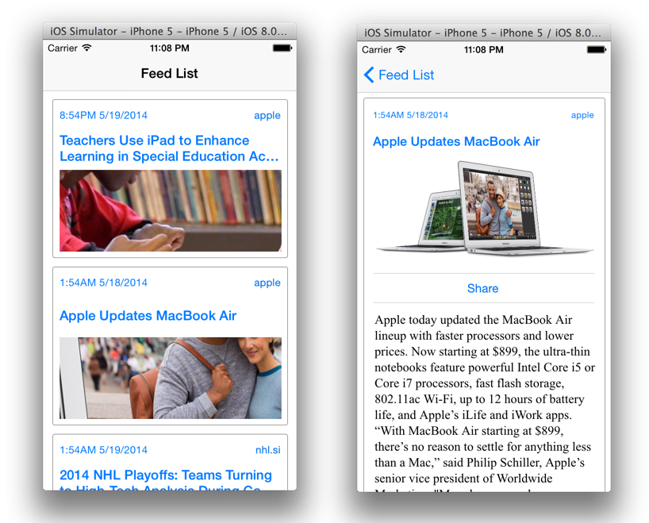
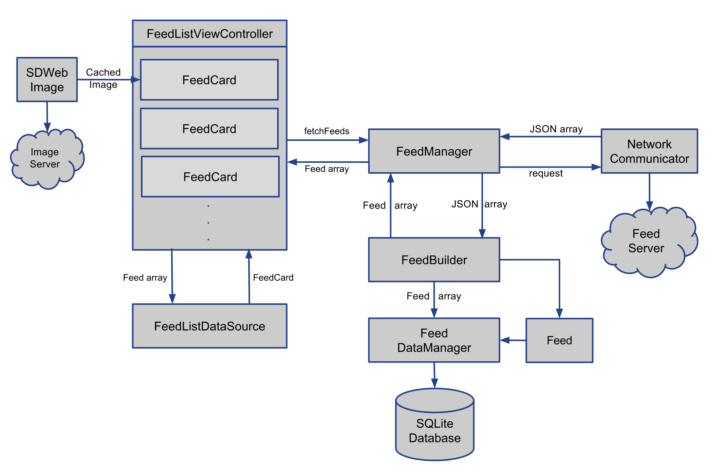
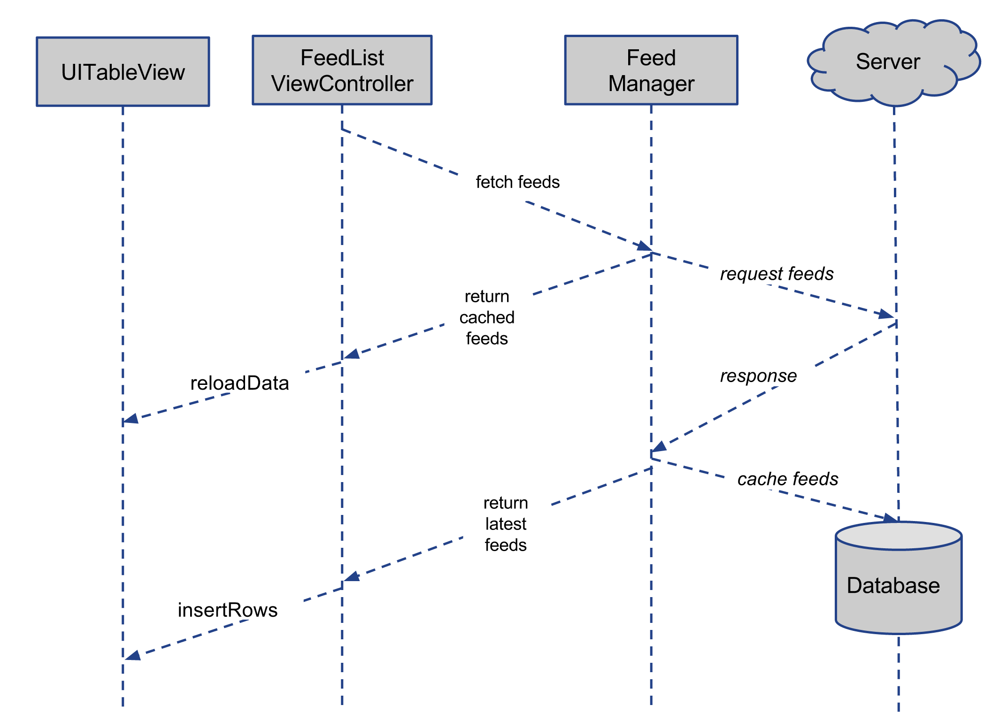
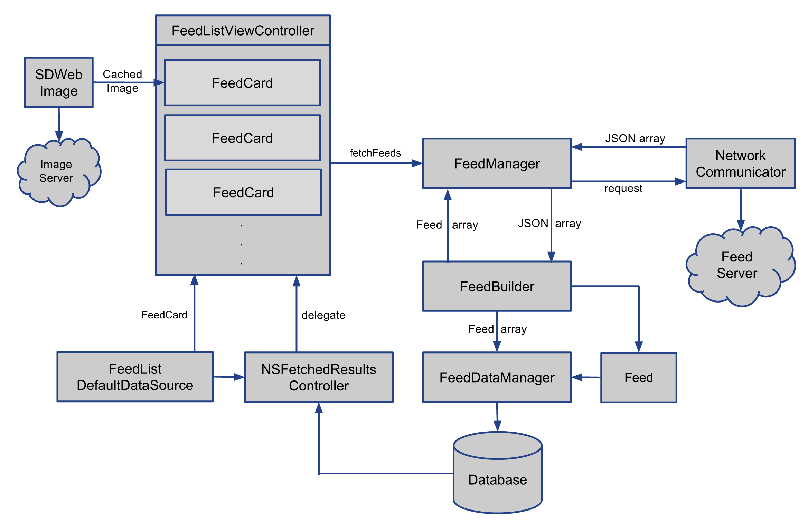

# App Design Pattern


## Lazy Loading Table View

https://pawanpoudel.svbtle.com/why-use-nsfetchedresultscontroller

 위의 링크에는 Lazy Loading Table View를 만드는 대략적인 개요가 나와있다.  LLTV는 가장 널리 사용되는 패턴이기에 매우 중요하다.  애플에서 제공하는 [LLTV 샘플](https://developer.apple.com/library/content/samplecode/LazyTableImages/Introduction/Intro.html)도 있으나 중요한 부분이 생략되어있고 너무 축약되어있어서 실제 앱 구현에 그다지 도움이 되지 않는다.

또한 이 예를 통해 NSFetchedResultsController를 사용하면 어느부분이 편리한가를 알수있다.



위와 같은 앱의 테이블뷰 컨트롤러는 다음의 구조를 갖게 된다.



이런식으로 복잡하게 구성되는 이유는 다음과같다.

리모트에서 원본 데이터를 받아야 하고, 그 데이터는 일단 로컬에 저장해서 반복적으로 다운받을필요가 없게 해야 하며, 로컬에 저장된 데이터는 DB로 구조화가 되어 뽑아내기 편리해야 한다. 

데이터의 흐름을 보면 다음과 같다.



fetchFeeds라는 함수가 있는데 이 함수는 로컬에 저장된 feed를 보여주기 시작(showFeedsSavedLocally)함과 동시에 remote에서도 JSON파일을 받아온다. 따라서 유저는 실행즉시 로컬에 저장된 데이터를 볼수있는 한편 remote에서 정보를 받고 이것이 완료되면 즉시 화면도 최신정보로 업데이트시키게 된다.  

```objective-c
- (void)fetchFeeds {
  // 리모트 데이터를 읽는 함수. 비동기함수라서 실제로는 showFeedsSavedLocally보다 늦게 실행됨.
    [self.feedFetcher fetchFeedWithCompletionHandler:^(id JSON, NSError *error) {
        if (error) {
            NSLog(@"Unable to fetch feeds.");
        }
        else {
            [self buildFeedsFromJSON:JSON];
        }
    }];
  
  // 로컬에서 데이터를 읽는 함수.
    [self showFeedsSavedLocally];
}
```


캐시는 위의 코드같은 패턴으로 사용하도록 만들자.
로컬 캐시를 로드하는 한편 비동기적으로 remote의 데이터를 다운받는다. 다운이 완료되면 현재의 캐시와 비교하여 최신상태인지를 체크 후 만약 최신이 아니라면 최신값으로 덮어씌우고 화면에 보여진 캐시데이터 또한 업데이트하도록 하는것이다. 단, 이 데이터를 다운받는 동안에는 쓰기가 안되도록 해야 할 것이다.  

// 아래의 메소드는 점진적으로 cache데이터를 늘려나가는 lazy loading효과를 준다.

```objective-c
- (void)buildFeedsFromJSON:(NSArray *)JSON {
    NSArray *newlyFetchedFeeds = [self.feedBuilder feedsFromJSON:JSON];
    
    if ([self.delegate respondsToSelector:@selector(feedManager:didReceiveFeeds:)]) {
        [self.delegate feedManager:self didReceiveFeeds:newlyFetchedFeeds];
    }
}
```


## NSFetchedResultsController

그러나 위의 예는 개념이해의 편의를 위해 한가지를 빼고 이야기 했다. 바로 메모리 캐싱을 하는 부분이다.  DB에서 뽑아내서 메모리에 올라오는 데이터는 현재 화면에 보여지는 부분만이어야 한다. 그렇지않고 전체 데이터를 메모리에 올리면 메모리부족에 시달릴수 있기 때문이다. 테이블에 노출된 셀 데이터만을 메모리에 로드해놓는것이 좋을것이다. 따라서 필요한부분만 fetch하고 필요없는 부분은 즉시 릴리즈 해버리는 것이 좋을것이다. 만약 이를 수동으로 구현하게 되면 아주 복잡하지만 자동으로 해주는 것이 NSFetchedResultsController이다. 게다가 DB 데이터가 수정되면 변화사항을 통지하는 기능도 갖고있다. 

그것을 적용시킨 다이어그램은 아래와 같다.



