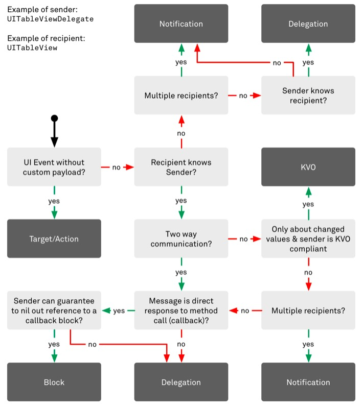

# Cocoa Touch


## [**객체간 통신 방법**](https://www.objc.io/issues/7-foundation/communication-patterns/)


### Block

작업이 끝나는 곳이 명확해야함; completion block처럼. 왜냐하면 블록은 retain cycle을 형성할 위험성을 내포하고 있기에 반드시 작업의 끝에 블록을 nil로 만드는 코드가 들어가야 하기때문이다.

만약 블록을 소유하고있는 측에서 아래와 같이 블록실행후 nil로 만들어놓는 코딩을했다면 순환참조가 되지 않으므로 블록 사용자 측에서 weak self를 만들지 않아도된다.

```swift
// This one will be called once the job is done
- (void)finishedEncoding { 
  self.completionHandler();
  self.completionHandler = nil; // <- Don't forget this! 
}
```

### Delegation

만약 tableView 딜리게이션메소드처럼 작업의 끝지점이 존재하지 않는 경우는 delegate패턴을 사용하는게 낫다. 
1:1의 쌍방향 통신. 

### Notification

1:다의 단방향 통신. 
익명통신; 서로 몰라도됨. 만약 커스텀 객체를 인자로 전달하려면 userInfo를 이용하든가  NSNotification을 서브클래싱 하는 방법이 있다.

### KVO

일대다의 단방향 통신. 특정 프로퍼티의 변화에만 관심이 있을경우. 
unregister처리를 해줘야 함. 수신자 혹은 송신자가 dealloc될때 unregister해야 됨.
CoreData의 MO객체의 경우는 폴트로 변환될때도 노티가 발생한다는점 유의하자.

### Target-Action

일대다의 단방향. 특정 이벤트에만 관심있는경우. 이벤트 혹은 송신자 참조 외에 별도의 매개변수 전달이 불가능.  
타겟을 지정해줄수도 있지만 target을 nil로 놓으면 [responder chain](https://developer.apple.com/library/prerelease/ios/documentation/EventHandling/Conceptual/EventHandlingiPhoneOS/event_delivery_responder_chain/event_delivery_responder_chain.html#//apple_ref/doc/uid/TP40009541-CH4-SW2)을 타고 움직이므로 이를 이용하면 복잡한 구조를 쉽게 해결하는 방법이 될 수 있다.


### Sending Messages

앞서 나열한 것들이 이벤트가 발생하면 받는 수동형의 코드라면 아래는 직접 메시지를 보내는 능동형 코드이다.


#### performSelector()

*ios9 이후로 performSelector군의 메소드들을 Swift에서도 사용가능해짐.*

받을 대상(obj)을 알아야 메시지를 보낼수 있다.

#### optional closure

하지만 performSelector보다는 closure를 사용하는게  일반적으로 더 안전하다.

```swift
class A {
    var selectorClosure: Optional<() -> ()> = nil
    func invoke() {
        self.selectorClosure?()
    }
}
var a = A()
a.selectorClosure = { println("Selector called") }
a.invoke()
```

#### Responder Chain을 이용

**control.sendAction(selector, to: nil, forEvent: nil)**

​	받을 대상을 몰라도 responder chain을 통해 메시지를 보낼수 있다. 단, 현재 객체가 컨트롤이어야 함. 추가정보 전달불가.

**UIApplication.shared.sendAction(selector, to: nil, from:"some data", forEvent: nil)**

​	마찬가지로 responder chain을 통해 메시지를 보낼수 있다. from 부분에 추가정보를 전달가능함. 
​	resignFirstResponder 를 할 때도 이 메소드를 사용한다.

*이유는 알수없지만 UITableViewCell 위에 놓인 Checkbox에서 TableViewController로의 responder chain은 제대로 작동하지 않음. UIView상의 Checkbox에서 UIViewController로의 작동은 잘됨. control.sendAction(…)으로 해도 잘됨.*

**performSelector와 nextResponder()의 조합**

원하는 타겟 객체를 찾아 거기에 메시지를 보내는방법. 위의 두 방법이 안될때 사용.

#### NSTimer를 이용

`var timer = NSTimer.scheduledTimerWithTimeInterval(0.1, target: obj, selector: "someSelector", userInfo: nil, repeats: false)`

원하는 시간뒤에 메시지 전달 가능. 추가정보 전달가능. 반복전달 가능.


## View

### Responder Chain

테이블뷰 셀 위에 놓인 체크박스를 기준으로 nextResponder()를 계속 실행해보니 아래와 같은 순서로 접근한다는 것을 알수 있었다.

UITableViewCellContentView 

UITableViewCell 

UITableViewWrapperView 

UITableView 

UITableViewController 

UIWindow 

UIApplication

### First Responder

UIResponder 객체는 이벤트가 발생시 이벤트를 전달할 target을 찾게 되는데 이것이 nil이면 responder  chain을 이용하여 직접 탐색을 하게된다.  becomeFirstResponder 메소드가 true를 반환하면 (최초로 반응할 기회를 얻는) first responder가 될수 있다. 하지만 예외적으로 터치 이벤트는 Hit Test를 거쳐 터치 위치의 뷰가 (First Responder인지 여부에 상관없이) 반응하게 된다.


### UIGestureRecognizer

테이블뷰에서 셀에 제스쳐를 넣고싶은경우 아래처럼 테이블뷰와 연결을 시켜야 한다.


## 앱 상태 복원

 http://aroundck.tistory.com/3910

앱의 수명은 제한돼 있다. 만약 시스템이 더 많은 메모리가 필요하고 자신의 앱이 백그라운드 상태에 있다면, iOS는 아마 그 앱을 죽여 시스템에 메모리를 반환하도록 할 것이다. 사용자는 이러한 사실을 알 필요가 없다. 항상 앱의 마지막 장면으로 돌아가야 할 것이다.

앱에 상태 복원(state restoration)을 적용해야 한다. 상태 복원은 데이터를 저장하는 데 사용했던 아카이빙과 매우 비슷하게 작동한다. 앱이 잠시 중단 상태로 들어가면 뷰 컨트롤러 계층의 스냅샷(snapshot)이 저장된다. 사용자가 다시 열기 전에 앱이 죽었다면 시작 시에 그 상태가 복원될 것이다. (만약 앱이 죽지 않았다면 모든 것은 메모리에 남아있고 상태를 복원할 필요가 없다.)

> iOS 시뮬레이터에서 홈 버튼을 눌러 앱이 백그라운드로 진입하도록 한다. 이제 시스템이 그 앱을 죽이는 것과 같이 하기 위해 Xcode 로 돌아가서 정지 버튼을 누른다. (Command + . ) 그리고 나서 앱을 다시 시작하면, Memory Kill 을 simulate 할 수 있다.


> - Encode version information along with the rest of your app’s state. During the preservation process, it is recommended that you encode a version string or number that identifies the current revision of your app’s user interface. You can encode this state in the `application:willEncodeRestorableStateWithCoder:`method of your app delegate. When your app delegate’s `application:shouldRestoreApplicationState:` method is called, you can retrieve this information from the provided coder and use it to determine if state preservation is possible.
> - Do not include objects from your data model in your app’s state. Apps should continue to save their data separately in iCloud or to local files on disk. Never use the state restoration mechanism to save that data. Preserved interface data may be deleted if problems occur during a restore operation. Therefore, any preservation-related data you write to disk should be considered purgeable.
> - The system automatically deletes an app’s preserved state when the user force quits the app. Deleting the preserved state information when the app is killed is a safety precaution. (As a safety precaution, the system also deletes preserved state if the app crashes twice during launch.) If you want to test your app’s ability to restore its state, you should not use the multitasking bar to kill the app during debugging. Instead, use Xcode to kill the app or kill the app programmatically by installing a temporary command or gesture to call exit on demand.
>
> http://limlab.io/swift/2016/02/19/swift-app-state-restoration.html


```swift
// AppDelegate.swift

// REQUIRED

func application(application: UIApplication, shouldSaveApplicationState coder: NSCoder) -> Bool {
  return true
}
  
func application(application: UIApplication, shouldRestoreApplicationState coder: NSCoder) -> Bool {
  return true
}

/// OPTIONAL

// IMPORTANT: This method is not a substitute for saving your app’s data structures persistently to disk!
func application(application: UIApplication, willEncodeRestorableStateWithCoder coder: NSCoder) {
	// 주로 버전 데이터 등을 기록할때 사용.
}

func application(application: UIApplication, didDecodeRestorableStateWithCoder coder: NSCoder) {

}


```


```swift
// 스토리보드상에 없는 ViewController가 Restoration기능을 갖게 하려면

// 1. AppDelegate에 아래를 구현
func application(application: UIApplication, viewControllerWithRestorationIdentifierPath identifierComponents: [AnyObject], coder: NSCoder) -> UIViewController? {
}

// 2. 뷰컨트롤러에 아래를 구현
override func viewDidLoad() {
    super.viewDidLoad()
    
    restorationIdentifier = "MyViewControllerRestorationId"
    restorationClass = MyViewController.self
}
```


뷰컨트롤러는 기본적으로 UIStateRestoring프로토콜을 구현하고 있다.

```swift
override func encodeRestorableStateWithCoder(coder: NSCoder) {
  // Save all the data, that you need for restoring. For instance, i need to save only one number.
  if let someNumberYouNeedForRestoring = number {
    coder.encodeInteger(someNumberYouNeedForRestoring, forKey: "number")
  }
  // It's important to call `super` because `UIKit` does a great part of restoration job for you
  super.encodeRestorableStateWithCoder(coder)
}

override func decodeRestorableStateWithCoder(coder: NSCoder) {
  someNumberYouNeedForRestoring = coder.decodeIntegerForKey("number")
  super.decodeRestorableStateWithCoder(coder)
}
```

하지만 위의 메소드들은 기본적으로 viewDidLoad가 호출된 이후에 호출된다. 뷰 위에 추가적으로 유저가 작성중이던 데이터를 복원하기 위한 것이기 때문이다. 따라서 뷰컨트롤러 인스턴스가 만들어질때 필요한 데이터를 넣는 용도로는 사용할수가 없다. 