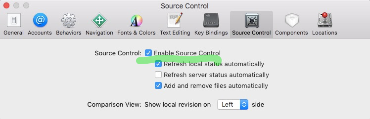

## Git FAQ

- 빈 저장소를 생성하고 싶은 경우

  git init - - bare

- 현재까지 수정한 내용들(commit은 안된)을 전부 discard하고 싶을 경우 상단 메뉴의 reset버튼을 누르자.

- 파일 하나의 수정 내용을 discard 하고 싶은 경우 : 파일 선택 후 우클릭한 후 reset을 누르자.

- 커밋 메시지만 수정하고 싶은 경우

  SourceTree: 수정을 원하는 커밋 위치에서 commit 버튼을 누름 맨 하단의 amend latest commit 체크

- 지난커밋에 깜빡잊고 넣지 않은 수정사항이 있을경우. 새로 수정한 내용이 생기긴 했는데 새로 커밋을 만들기보다는 지난 커밋에 합치고 싶을경우.

  SourceTree: 수정을 원하는 커밋 위치에서 commit 버튼을 누름 맨 하단의 amend latest commit 체크

- 과거의 커밋상태로 돌아가고 싶은경우가 있다. 의미없이 작은 단위의 커밋을 너무 많이 해서 하나의 커밋으로 합치고 싶은 경우가 있다. (단, 아직 push가 되지 않았을때 사용)

  - SourceTree: 돌아가고 싶은 커밋에 마우스 우클릭. Reset <Branch name> to this commit 메뉴를 선택.
    - Soft를 선택하면 과거커밋 특정지점으로 돌아가며 그 이후의 변경사항은 uncommited changes상태로 남아있게됨.
    - Hard를 선택하면 선택한 커밋 이후의 변경사항은 다 지워짐. 
  - 이미 push가 된 상황이라면 reset대신 revert를 써야 한다. 커밋을 선택하여 우클릭 후 reverse commit을 누르자.

- 커밋을 하다보면 실험용 브랜치를 만드는 경우가 있다. 사실 이런경우는 분기라고 하기 어렵다. 왜냐하면 코딩이 작성되는 줄기는 여전히 하나이기 때문이다. 실험이 실패했을경우 브랜치를 지워버리고 성공했을경우 이 브랜치를 master의 연장선으로 바꿔주고 싶을것이다. 이럴 때 rebase가 편리하다.

- 각 커밋에 버전을 적고 싶다면?

  Tag를 사용하자.

- 지난 커밋을 취소하고 싶긴 한데, 그 이후에 작성한 내용은 보존하고 싶을 때.

  - git revert HEAD^ 
  - 잘못된 커밋 위에 작성한 새로운 내용이 있을 경우, 잘못된 커밋은 undo하고 새로운 작성내용은 대체된 커밋에 merge 시킴.

- 작성중인 코드 변경사항을 현재 브랜치가 아닌 다른 브랜치로 커밋하고 싶을 경우

  - 현재 변경사항을 아직 커밋하지 않았다면 그냥 현재 위치에서 새브랜치를 만들고 거기에 커밋하면 된다.
  - 현재 변경사항을 커밋했다면 바로 전 커밋으로 soft reset한 후, 그 위치에서 새브랜치를 만들고 커밋하면 된다.

- 새로 브랜치를 만들어 커밋했어야 하는데 그냥 master에 커밋한 경우 이를 쉽게되돌리는 방법

  - [http://learn.github.com/p/undoing.html](http://learn.github.com/p/undoing.html)  <breaking work into a topic branch 부분 참고> 

- 현재 브랜치에서 작업도중 다른 브랜치에서 해야 할 작업이 생겼을경우가 있다. 이대로 커밋을 하자니 껄끄럽다면? 

  stash기능을 사용하자.

#### 기존의 XCode 프로젝트에 Git 수동 설치

```shell
git init
git add . 
git commit -m "Initial commit"
```

위를 실행 후 다음과 같이 xcode 세팅




#### Git 삭제

xcodeproj파일이 있는 폴더로 가서 .git 디렉토리를 폴더째로 삭제하면 됨. 
그리고 위 그림의 Enable Source Control을 체크해제 하면됨.

#### 개별파일 원복

```shell
git checkout  -- <파일> #워킹트리의 수정된 파일을 index에 있는 것으로 원복
git checkout HEAD -- <파일명> #워킹트리의 수정된 파일을 HEAD에 있는 것으로 원복(이 경우 --는 생략가능)
git checkout FETCH_HEAD -- <파일명> #워킹트리의 수정된 파일의 내용을 FETCH_HEAD에 있는 것으로 원복? merge?(이 경우 --는 생략가능)
```

#### index 추가 취소

```shell
git reset -- <파일명> # 해당 파일을 index에 추가한 것을 취소(unstage). 워킹트리의 변경내용은보존됨. (--mixed 가 default)
git reset HEAD <파일명> # 위와 동일
```

#### commit 취소

```shell
git reset HEAD^ # 최종 커밋을 취소. 워킹트리는 보존됨. (커밋은 했으나 push하지 않은 경우 유용)
git reset HEAD~2 # 마지막 2개의 커밋을 취소. 워킹트리는 보존됨.
git reset --hard HEAD~2 # 마지막 2개의 커밋을 취소. index 및 워킹트리 모두 원복됨.
git reset --hard ORIG_HEAD # 머지한 것을 이미 커밋했을 때,  그 커밋을 취소. (잘못된 머지를 이미 커밋한 경우 유용)
git revert HEAD # HEAD에서 변경한 내역을 취소하는 새로운 커밋 발행(undo commit). (커밋을 이미push 해버린 경우 유용)
```

#### 워킹트리 전체원복

```shell
git reset --hard HEAD # 워킹트리 전체를 마지막 커밋 상태로 되돌림. 마지막 커밋이후의 워킹트리와 index의 수정사항 모두 사라짐. 
                                  (변경을커밋하지 않았다면 유용)
git checkout HEAD . # ??? 워킹트리의 모든 수정된 파일의 내용을 HEAD로 원복.
git checkout -f # 변경된 파일들을 HEAD로 모두 원복(아직 커밋하지 않은 워킹트리와 index 의 수정사항 모두 사라짐. 신규추가 파일 제외)
```

#### svn checkout을 통해 웹상의 오픈소스를 받을때

이때 이미 이 소스의 예전버전을 컴퓨터에 다운받은적이 있다면 해당 버전이 너무 낮다고 에러를 표시할때가 있다. 이경우에는 svn upgrade를 해주면 되는데 해당 폴더(.svn이 있는 폴더)내로 이동후 실행해야 한다는 점을 유의하자.

물론 예전버전이 있는 폴더를 아예 삭제하고 다시 받는게 더 좋을수도 있다.


#### Remote Push 실패시

`error: failed to push some refs to ...` 와 같은  에러가 나는데 이 경우는 리모트의 수정내용이 로컬에 반영이 되지 않았기에 발생하는 에러다.
먼저 pull을 해서 merge해 줘야 한다. 그다음에 다시 push해주면 에러가 나지 않을 것이다.

#### Detached Head가 발생해버린 경우 대처법

http://sitaramc.github.com/concepts/detached-head.html

브랜치라는 것은 개념적으로 볼때 일련의 연속된 커밋을 의미하지만 사실 우리가 'git branch <브랜치명>'으로생성하는 그 <브랜치명> 자체는 일종의 head다. (git checkout master라고치면 master브랜치의 head로 이동함) 즉, 가장 마지막에 작성된 커밋을 참조하고 있는 포인터에 불과하다. detached head는 이러한포인터를 남겨두지 않고 작성된 브랜치 때문에 발생한다.

Detached Head가 발생하는 경우는 과거의 커밋으로 이동(체크아웃)을 한 상태에서 다시 커밋을 함으로써 익명의 브랜치가 생겨버린 경우에 발생한다. 익명의 브랜치는 SourceTree에서는 HEAD라는 이름의 브랜치가된다. 이 익명의 브랜치 위에서 계속 커밋을 하며 개발을 하다가 다른 브랜치로 이동을 할 경우 익명의 브랜치는 참조가 없기때문에 사라져버린다. 즉, detached head가 생긴셈이다.  

따라서 HEAD라는 브랜치가 생겨버렸다면 즉시 git branch <브랜치명>을 이용하여참조를 생성해주면 된다. 

그런데 미처 참조를 생성하지 못한 채 다른 브랜치로 이동을 해버려서 detached head가 생겼다면 다음과 같이 하자.

- $ git reflog show HEAD@{now} -10 명령을 이용하여 과거의 헤드 히스토리를 모두 알아낸다.
- 과거의 헤드 중에서 당신이 잃어버린 브랜치 헤드의 SHA값(7fdae94)을 알아냈다고 하면 다음과 같이 명령을 내리자. 
- $ git branch newBranchName 7fdae94  

#### Commit 이 제대로 안될경우 해결방법

If you'd like to simply commit all changes you made, doing so through the Terminal should fix the problem.

Open the Terminal App and cd into your project directory, once there type in the following command:

git commit -a

Enter your commit message by pressing 'i' and typing it in, then press 'Esc', then ':', and type 'wq'

All done, you're problem should be fixed.

#### 소스 충돌로 잘 안 될 경우

이클립스에서 terminal을 추가하거나 콘솔에서 해당 프로젝트 폴더로 이동한 후에,

git status

명령어로 현재 상태를 확인한다. .

그 후에 문제가 되는 파일을

git checkout - - 문제파일

명령어로 적절하게 해결한다.

그래도 안된다면 다시 돌려도 되는 파일이라는 가정아래 해당 파일을 revert 하는 등의 조치가 필요하다.

#### 이미 리모트로 Push를 한 커밋이 잘못되었다는걸 깨달았을때

revert를 한다.

#### 로컬로 커밋한 내용이 잘못일때

reset을 함. hard, mixed, soft중에 택일


#### 파일 또는 폴더 추적 멈추기 (Untrack)

간혹 저장소에 포함하지 말아야할 파일이나 폴더가 생길때가 있다. 만약 .gitignore 파일에 제외 파일/폴더 이름들을 기입하면 git은 기입 시점부터 track을 멈춘다. 이건 파일을 지우지는 않는다. 따라서 최신버전은 그대로 유지된다. Untrack 하려면 다음 명령어를 사용한다.

```shell
# .metadata 폴더를 untrack 하려는 경우
git rm -r --cached .metadata
# test.txt 파일을 untrack 하려는 경우
git rm --cached test.txt
```

파일은 지워지지 않는다. 이전 커밋 히스토리 까지는 파일이 여전히 남아있다. 만일 히스토리상에서 사라지길 원한다면 "git filter-branch"를 살펴보길 바란다. 이 명령어는 커밋 히스토리를 수정하기 위해 사용되는 것이다.


#### 파일 리스트 출력

```shell
# 현재 Tracking 중인 모든 파일명 출력
git ls-tree -r master --name-only

# 히스토리상 한번이라도 Tracking되었던 적이 있는 모든 파일명 출력 (deleted files포함) 
git log --pretty=format: --name-only --diff-filter=A | sort - | sed '/^$/d'
```

