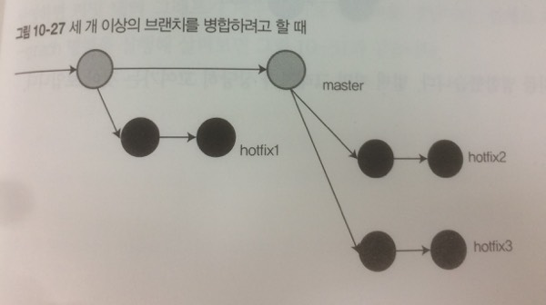

# Git

### 기본용어

모르는용어나명령어가나오면아래의네링크중에서검색해보면됨 

[http://www.kernel.org/pub/software/scm/git/docs/user-manual.html](http://www.kernel.org/pub/software/scm/git/docs/user-manual.html)

[http://www.kernel.org/pub/software/scm/git/docs/git.html](http://www.kernel.org/pub/software/scm/git/docs/git.html)

[http://git-scm.com/book](http://git-scm.com/book)

[http://www.kernel.org/pub/software/scm/git/docs/gitglossary.html](http://www.kernel.org/pub/software/scm/git/docs/gitglossary.html)

[http://www.dreamy.pe.kr/zbxe/CodeClip/95408](http://www.dreamy.pe.kr/zbxe/CodeClip/95408)

[http://learn.github.com/p/intro.html](http://learn.github.com/p/intro.html)     : 개념학습에 좋음

[http://try.github.com/levels/1/challenges/6](http://try.github.com/levels/1/challenges/6)   : git 연습할수 있음

[http://myjeeva.com/how-to-do-upgrade-git-in-mac-os-x.html](http://myjeeva.com/how-to-do-upgrade-git-in-mac-os-x.html) : git  업그레이드 방법

[http://www.letmecompile.com/git-상황별-명령어-tips/](http://www.letmecompile.com/git-%EC%83%81%ED%99%A9%EB%B3%84-%EB%AA%85%EB%A0%B9%EC%96%B4-tips/)

 

- working tree (working copy): 저장소를 바라보는 자신의 현재 시점. 또한 작업트리가 모든 파일을 갖고있음. 현재 작업중인 폴더 및 파일들을 working copy라고 하는데 그 이유는 우리가 원본은 저장소에 두고 이를 clone해서 작업하기 때문이다. 
- staging 영역: 커밋을 준비하는 영역. 이 영역에 무엇이 들어있는지 살펴보면 커밋될 파일들이 무엇인지 알 수 있음.
  - 스테이징 영역이 존재함으로 인해 프로젝트의 변화를 분류하여 커밋할수 있다. 특정한 종류의 변화들은 따로 커밋이 가능해진다. 즉, 특정 종류 변화를 취소하기도 쉽다는 의미다.
  - git add <파일명> 을 이용하여 스테이징 영역에 해당 파일의 변화내용을 등록한다. 
  - index 영역이라고도 불림. 
- checkout: 사용자의 작업트리를 저장소의 특정시점과 일치하도록 변경하는 작업
- origin:기본 원격 저장소
- patch: 이메일로 패치를 보내고 이를 적용시킬수도 있다
- cherry-pick : 다른 브랜치에서 커밋한 내용을 현재 브랜치에 적용시킨다.
- hunk: 하나의 파일 내에 차이(diff)가 발생한 영역 단위.


### [기본 명령](http://blog.outsider.ne.kr/572) 

- git status: 커밋되지 않은 변경사항을 조회합니다.

- git fetch: 원격저장소의 갱신된 브랜치를 가져옴. 단, merge는 않음.

- git pull: fetch 후 merge. 병합되면서 어떤내용이 바뀌는지 알수없다는 단점이있기에 차라리 fetch후 수동병합을 하는게 좋음. 

  - git pull origin master :  origin에서 fetch 해서 master로 merge 시킴

- git branch: 현재 존재하는 브랜치를 조회합니다. -r 옵션을 사용하면 원격저장소의 브랜치를 확인할 수 있습니다.

  - git branch 브랜치명: 브랜치를 생성

- git checkout 브랜치명: 해당 브랜치로 이동

  - git checkout -b 브랜치명:  브랜치를 생성후 이동. 이 과정은 위의 두 명령을 연속으로 실행하는 것과 같다.

- git blame 파일명 : 파일을 누가 생성하고 수정했는지 알수 있음.

- git add: 커밋할 파일들을 스테이징 영역에 올림. 즉, 삭제나 변형작업을 저장소에 반영할때도 이 명령을 쓴다. (단순히 add할때만 쓴다고 착각하기 쉽다.)

  - git add -i  : add되기 위해 스테이징영역에 들어온 파일들을 보여줌.
  - git add .     : 현재디렉토리(.) 에 있는 모든 파일을 repository에 추가
  - git add file1 file2 file3

- git diff : 마지막에 커밋한 내용과의 차이점 출력

  - git diff <branch1> <branch2> : 두 브랜치를 비교가능
  - git diff - -cached      : commit하기 직전에 이 명령을 실행해보면 무엇이 변하는지 보여줌.

- git init : 저장소 생성

  - git init - - bare : bare 저장소 생성
  - Git 은 원격 저장소를 네트워크나 로컬이나 상관없이 저장하는 것을 가능하게 한다. 단순하게 설명하기 위해서 로컬 원격 git 저장소를 시도해본다. 일반적인 git 저장소는 원격 git 저장소와 다르다. 일반적인 git 저장소는 소스코드와 git 저장소를 가지고 있다. 이 폴더에서 바로 당신은 아무 작업이나 할 수 있으며, 저장소는 소스코드의 Working Copy를 가지고 있기 때문이다.  원격 저장소는 작업 복사본(Working copy)을 가지고 있지 않다. 저장소 파일만 가지고 있다. 이러한 저장소를 생성하기 위해선 "--bare" 플래그를 사용한다.

- git log : 커밋 히스토리 출력

  - git log - -pretty=oneline : SHA1값도 출력해줌.

- gitk - - all : GUI에서 보기

- git gc  : 디스크 압축하고 메모리 소모 줄임.  대형 저장소일 경우 유용.

- git fsck : 내부 구조 체크를 함. 주로 dangling 커밋을 발견하여 지우곤 함. 하지만 많지 않을경우 굳이 지울필요는 없다. 오류발생시 이 dangling commit이 복구에 도움을 줄 수 있기 때문이다.

- git remote add origin 원격주소 : 원격저장소를 추가한다. 

- git clone 원격주소 : 원격의 저장소를 로컬로 복제한다. 이때 origin은 자동으로 생기므로 별도로 등록할 필요 없다.

- git tag : 태그 리스트 출력

  - git tag 태그명 : 태그명으로 태그 생성
  - git tag 0.1.1 : 대개 이처럼 버전을 태그명으로 함.

- rebase: [http://learn.github.com/p/rebasing.html](http://learn.github.com/p/rebasing.html)

  - rebase는 현재브랜치 헤드의 위치를 다른브랜치의 헤드 위치로 옮기는 것이다. 
  - 커밋을 하다보면 실험용 브랜치를 만드는 경우가 있다. 사실 이런경우는 분기라고 하기 어렵다. 왜냐하면 코딩이 작성되는 줄기는 여전히 하나이기 때문이다. 실험이 실패했을경우 브랜치를 지워버리고 성공했을경우 이 브랜치를 master의 연장선으로 바꿔주고 싶을것이다. 이럴 때 rebase가 편리하다. rebase과정은 아래와 같다.
    - 예를 들어 experiment 브랜치를 삭제하고 master로 rebase하고 싶다면
      - git checkout master
      - git rebase experiment      // master의 헤드가 experiment의 헤드 위치로 옮겨짐
      - git branch -d experiment
    - rebase를 통해 커밋을 합치면 하면 단순히 merge한 것과 결과물은 같다. 단, merge된 브랜치를 없앨수 있기 때문에 히스토리가 깔끔해진다.
  - rebase를 이용하여 일련의 연속된 커밋들을 하나로 묶어줄수도 있다. 하지만 이 기능은 reset을 이용하는것이 낫다.  
    - [http://dogfeet.github.io/articles/2012/how-to-github.html](http://dogfeet.github.io/articles/2012/how-to-github.html)
    - git rebase -i HEAD~3  : 마지막 3개의 커밋을 하나로 묶는다.
    - - git reset HEAD~3을 한 후 commit을 해도 동일한 결과를 얻게된다.
    - 위의 명령을 실행하면 에디터창이 뜨는데 이때 pick으로 시작되는 세 줄이 보이는데 각 줄은 커밋을 의미한다.  맨 위를 제외한 나머지줄의 pick는 squash로 수정하자. esc를 누른후 :wq를 치면 된다. 다시 메시지를 입력하는 곳이 보이는데 여기에 합쳐진 커밋을 위한 메시지도 입력하자. 마찬가지로 :wq
    - ~뒤의 숫자를 너무 크게쓰면 rebase가 실패할수 있다. 이때는 git rebase -abort를 해주자.
  - rebase는 여러사람과 공동작업을 할때는 사용시 에러를 발생시킬수 있으므로 주의해야 한다. 이미 푸시된 커밋은 rebase하지 말자.

- reset : 과거의 커밋으로 되돌린다. 히스토리 자체가 삭제된다. 이 때 적용이 취소된 변경사항을 uncommited changes로 만들지 아니면 그냥 없애버릴지 여부는 - - hard 플래그를 이용해서 선택가능하다.

  - git reset HEAD : 헤드 위치의 상태로 unstage함. 즉, 작업내용은 보존하되 이 작업내용이 staging area에 아직 올라가지 않은 상태로 됨.
  - git reset HEAD~i :  이 때, 헤드로 부터 i 번째 위치의 커밋으로 이동. 이전의 커밋 내용은 다 지워진다. 히스토리에서도 지워진다. 단, uncommited changes는 지워지지 않는다. - - hard 옵션을 추가하면 uncommited changes까지 지워진다.
    - HEAD^는 헤드 바로 전의 커밋을 의미한다. HEAD^^^ 는 HEAD~3과 같다.  

- git commit - -amend : 2단계 이전의 커밋으로 soft reset후 commit을 한 것과 마찬가지. 지난 커밋이 파일을 누락했거나 별의미가 없어서 "지난커밋의 내용+현재수정내용"을 합친 커밋으로 대체하고자 할 경우. (단, 이미 push한 커밋은 amend하면 안됨. 히스토리를 수정하기때문. 이전의 push내용을 누군가가 이미 pull했을 경우 문제가 발생할수있다.)

- git checkout HEAD 파일명 : 파일단위로 discard changes함. 

- git revert HEAD : HEAD 커밋이 이뤄질때 발생한 변화를 undo함. 즉 HEAD 바로 전단계 커밋의 상태가 됨. reset과의 차이점은 reset은 히스토리 자체를 지워버리지만 revert는 거꾸로 작업을 하여 원상복구 시키는 과정이 히스토리에 저장된다. 따라서 reset의 push가 이뤄진 커밋에서는 쓸수 없다는 단점을 극복할수 있다.


#### alias

  유용한 alias [http://oli.jp/2012/git-powerup/](http://oli.jp/2012/git-powerup/)

- git config --global alias.l "log --graph --pretty=format:'%C(yellow)%h%C(cyan)%d%Creset %s %C(white)- %an, %ar%Creset’”
- git config --global alias.s status


#### Commit

커밋을 할때는 현재까지 코딩한 내용 전체를 커밋하는게 아니다. 내용상 연관된 것끼리 묶어서 커밋해야 한다. 그것을 용이하게 해주는게 스테이징 영역(인덱스 영역)이다. 이를 잘 활용하자. 연관된 것끼리 묶어 커밋하려면 파일단위가 아니라 코드 라인 단위로 커밋하는 방법도 알아야 할 것이다.

파일내의 코드 일부만 커밋하려면 

- git add --patch filename

이를 SourceTree내에서 하려면 우하단의 창에서 원하는 라인을 선택후 'Stage lines' 버튼을 클릭하여 해당 코드만 스테이징 영역으로 올릴수 있다. 

#### Commit Message

커밋은 Save가 아니다. 한 단위의 작업을 끝냈을때 커밋을 해야 한다.  (점심먹으러 갈때 커밋을 하는게 아니다. 그렇게 되면 "오전작업 끝. 점심먹으러간다" 라는 식의 일기형 커밋메시지를 작성하게 되니 쓸모없는 메시지가 되어버린다.)

##### 올바른 커밋 메시지

- 코드를 짤 때는 우선 todo를 만들고 이를 해결하는 순서로 코딩을 한다.
- 코딩을 마치면 코드 내의 todo 코멘트를 cut n paste 해서 커밋메시지로 바꾼다. 


#### git ignore

- repo에 올라온 파일중에 더이상 신경쓰고싶지 않은 파일이 있다면 ignore를 해야한다. 하지만 그 전에 repo로부터 제거를 해야 한다. `git rm --cached `  명령을 통해 가능하다. SourceTree에서는 우클릭하여 stop tracking을 하면 동일한 기능이 된다.
- [[git\] gitignore로 tracking 제외할 수 없는 파일 (UserInterfaceState.xcuserstate) 제외하기](http://kyejusung.com/2016/06/git-gitignore%EB%A1%9C-tracking-%EC%A0%9C%EC%99%B8%ED%95%A0-%EC%88%98-%EC%97%86%EB%8A%94-%ED%8C%8C%EC%9D%BC-%EC%A0%9C%EC%99%B8%ED%95%98%EA%B8%B0/)


### 주요 파일들

- .gitignore : 저장소 차원에서 무시

- .git/info/exclude : 자신의 컴퓨터에서만 무시

- .gitconfig : Git은 ".gitconfig" 파일에 전역 환경설정내용을 저장하고 있다. 이 파일은 사용자의 홈 디렉토리에 있으며 사용자와 비밀번호 혹은 소스코드 글자색상등을 수정할 수 있다.

  ```shell
  git config --global user.name "Lars Vogel"
  git config --global user.email "Lars.Vogel@gmail.com"
  git config --list  # 모든 설정사항 확인
  ```

### 

#### 과거로 되돌리는데 있어 Reset, Checkout, Revert의 차이

딱 한개의파일만 과거시점으로 되돌릴 경우

```shell
$ git checkout -- filename       # 해당 인덱스의 위치의 파일상태로 되돌림. discard changes됨.
$ git checkout HEAD filename     # 헤드 위치의 파일상태로 되돌림. 즉 해당 파일이 HEAD 커밋 시점이었을때의 상태가 됨.
```

2단계 전 과거 상태로 커밋을 되돌리기

```shell
1. $ git revert -n HEAD         # 헤드를 되돌림. -n 옵션은 자동으로 이뤄지는 커밋을 안하게 하는것. 여러개의 커밋을 한꺼번에 되돌릴때는 -n을 이용하자.
2. $ git revert -n 540ecb7      # 헤드를 되돌린 후 커밋 하나를 추가로 되돌렸다. 이제 2단계 이전의 커밋상태로 돌아간 셈이다.
3. $ git commit -m "reverted HEAD and 540ecb7"      # 이제 커밋만 하면 된다.
```


#### 서브버전과 용어의차이 

프로젝트의 카피본(working copy)을 만드는 것을 

Git 에서는clone이라 하고 Subversion 에서는 checkout이라함.

Subversion은 원격서버에만저장한다. 이를 commit이라 한다.

Git는 서버와로컬 모두에 저장 가능하다. 로컬에 저장하는 것을 commit, 서버에 저장하는 것을 push라고 구분한다.

 

원격서버의 최신변경사항을 가져오는 것을

Git에서는pull이라 하고, Subversion에서는 update라 한다.

(local Git 저장소에서 가져오는 커맨드는 굳이 필요가없다.) 

  

#### [특정파일의 변경 히스토리를 보는 법](http://www.shellhacks.com/en/Git-The-Change-History-of-a-Specific-File) 
- 소스트리에서 해당 파일을 우클릭후 `Log Selected..`를 선택하면 해당 파일의 history가 나온다.


### 서브모듈(submodule)

 

- [http://git-scm.com/book/ko/Git-%EB%8F%84%EA%B5%AC-%EC%84%9C%EB%B8%8C%EB%AA%A8%EB%93%88](http://git-scm.com/book/ko/Git-%EB%8F%84%EA%B5%AC-%EC%84%9C%EB%B8%8C%EB%AA%A8%EB%93%88)
- [http://git-scm.com/book/ch6-6.html](http://git-scm.com/book/ch6-6.html)
- 하나의 프로젝트 내에 다른 프로젝트(대개 오픈소스)를 삽입한경우 하나의 git으로 다루기 곤란하다. 따라서 git저장소 내부에 다른 git저장소를 서브모듈로서 소유할수 있게 하는 방법이다. 각 저장소는 서로 독립적으로 관리할수 있다.
- 기존의 프로젝트에 github의 프로젝트를 서브모듈로 추가하기
  - .git 이 있는 위치로 이동하여 아래와 같이 입력한다. github에서 클론된 프로젝트가 하위폴더에 submodule로 생성될 것이다.
  - $ git submodule add git://github.com/xxxxx.git <하위폴더명>
- 서브모듈 삭제 ??
- 서브모듈이 있는 github의 프로젝트를 클론받기 (SourceTree의 경우 Repository > Add Submodule…를 클릭하면 된다.)
  - $ git clone git://github.com/xxxxxx.git 
  - 서브모듈을 쓰는 프로젝트의 경우 위와 같이 클론을 하면 비어있는 하위폴더가 보일것이다. 여기에 서브모듈의 파일이 클로닝되어야 한다.
  - $ git submodule init
  - $ git submodule update
  - 위와 같이 서브모듈을 초기화 후 업데이트 해주자.
- github에 새 커밋이 올라온 경우 이를 적용시키기: 두 가지 방법이 있다.
  - 첫번째 방법
    - 서브모듈의 디렉토리로 이동해서, 
    - $ git checkout <타겟 브랜치명> 
    - $ git pull
  - 두번째 방법
    - 수퍼모듈의 디렉토리에서 다음과 같이 실행.
    - $ git submodule foreach git pull origin master
  - 주의 : 위의 어느방법을 쓰건 서브모듈을 pull하고 난 후 수퍼모듈을 반드시 커밋해야 한다. 왜냐하면 수퍼모듈에는 서브모듈의 commit의 SHA1값이 저장되는데 pull할때마다 이 값이 수정되어야 하기 때문이다.
- 주의
  - 서브모듈의 코드를 수정할경우 항상 작업브랜치를 만들어줘야 한다. 그렇지 않으면 detached head가 발생할수 있다. 위의 링크 참조


### SourceTree

 주요 사용법 (해당 앱의 도움말 참조)

- 프로젝트 추가: 처음 시작하면 나오는 화면에 프로젝트 폴더를 드래그앤 드랍하자.(git가 없으면 자동으로 생성해주므로 수동으로 생성할 필요 없다.)

- ⚠️ 하나의 워크스페이스 내에 프로젝트가 여러개면 프로젝트마다 별도의 remote git파일을 생성해야 한다.

- 특정 commit시점으로 가는 방법: SourceTree에서 그냥 더블클릭하면 됨. 경고창이 뜨지만 그냥 확인 누르자. (단, 이때 uncommitted changes가 없어야 함. 커밋을 하던가 변경한것을 버려야 함.)

- 과거의 파일을 보려면 굳이 체크아웃할 필요 없음. SourceTree를 보고 따라가며 좌하단에 나오는 파일들을 보면 됨. 파일선택 후 우클릭하여 Quick Look으로 보자.

- 체크아웃하고 실행시킬때 에러가 나면 xcode를 재시작하던가 build clear를 해주자.

- 특정 파일의 변화를 staging영역으로 올리려면 우클릭하고 add to index하면 된다.

- 현재의 커밋을 삭제하며 과거로 돌리기: 

- - 돌아가고자 하는 목표 시점 과거의 commit을 선택 후 우클릭. reset <master> to this commit을 클릭함. 
  - 이 때, soft, mixed, hard 세 방식중 하나를 선택하게 되는데
    - soft를 선택할 경우: 삭제되는 커밋내용은 staging영역으로 돌려진다. uncommited changes는 그대로 유지된다.
    - mixed를 선택할 경우: soft와는 달리 staging영역이 비어있다. uncommited changes는 유지된다. 
    - hard를 선택할 경우: 둘 다 지워진다.

- 과거상태로 돌리고 싶긴 한데 그 커밋자체가 삭제되기를 원하지는 않는 경우, 우클릭후 reverse commit

- 주의: 단순히 현재 브랜치의 과거 commit을 더블클릭하여 checkout하게 되면 detached HEAD를 만들고만다. 따라서 복구가 어렵다. 이렇게 dangling pointer가 되어버린 커밋의 경우 기본적으로 2주간은 유지되지만 그 기간이 지나면 garbage collection으로 제거된다.

- 좌상단의 Jump to Commit SHA-1: 특정 커밋으로 checkout을 해준다. 여기에는 커밋 해시코드를 넣으면 된다. 앞의 몇자리 숫자만 넣어도 작동함.

- stash : 임시저장소. 한 브랜치에서 일을 하고 있는데 중간에 다른 브랜치의 일을 먼저 해결해야 하는 경우가 있다. 이때 완료하지 않은 일을 커밋하는 것은 껄끄럽다. stash는 modified이면서 tracked된 파일들과 staging area에 있는 파일들을 잠시 저장해놓는 스택이다. 

  - [http://aroundck.tistory.com/1181](http://aroundck.tistory.com/1181)
  - [http://www.letmecompile.com/git-상황별-명령어-tips/](http://www.letmecompile.com/git-%EC%83%81%ED%99%A9%EB%B3%84-%EB%AA%85%EB%A0%B9%EC%96%B4-tips/)


###[Merge](https://git-scm.com/book/ko/v2/Git-%EB%B8%8C%EB%9E%9C%EC%B9%98-%EB%B8%8C%EB%9E%9C%EC%B9%98%EC%99%80-Merge-%EC%9D%98-%EA%B8%B0%EC%B4%88#_basic_merge_conflicts)

일단SourceTree의 All Branches 탭이 선택되어 있는지 확인하자. 그래야 모든 브랜치가 보이기 때문이다.  merge의 목적지가 될 브랜치로 이동(checkout)해야 한다. 해당 브랜치를 더블클릭하여 이동한 후, 이번에는 merge시킬 브랜치를 선택후 우클릭하여 메뉴에서 merge를 누르면 된다. 

#### 다수의 브랜치 병합하기 (rebase 사용)



위처럼 브랜치들이 존재할때 이를 마스터로 병합하려면 우선 hotfix1부터 차례로 rebase해야한다.


이때 충돌이 발생하면 수작업으로 이를 해결해주자.

>충돌을 쉽게 수정하려면 [Atom 에디터](https://atom.io)를 이용하는게 좋다. [merge-conflicts](https://atom.io/packages/merge-conflicts)라는 패키지를 깔면된다.


rebase를 하면 fast-foward 옵션이 자동으로 적용되어 병합 브랜치가 삭제된다.

하지만 리베이스 대신에 아래처럼 merge를 하면 no fast-foward로 병합의 흔적을 남겨둘수있다.

```shell
> git merge hotfix1 --no-ff
```


### Git-flow

 SourceTree의 Git-Flow는 branch들을 체계화하여 효과적으로 사용할수 있게 해주는 툴이다. (⚠️이때 각 플로우의 명칭에는 공백문자가 없어야 한다. 그렇지 않으면 flags:FATAL the available getopt does not support spaces in options와 같은 에러가 발생한다.)

#### development branch

차기 릴리즈를 위한 주 브랜치다. 프로그램의 근간이 되는 작업들은 대부분 여기서 한다.

#### master branch

가장 최근에 릴리즈/배포 된 코드를 이곳에 놓는다. 따라서 master에서는 직접 commit이 이뤄지지는 않고 오로지 다른 브랜치의 merge만 이뤄진다.

#### feature branch

기능 단위의 브랜치다. 실험적인코드를 작성할때 만드는 experiment branch도이것의일종이다. 여기서 완성된 기능은 develop에 merge한다. 이 때 git의 rebase기능을 이용하면 편하다. merge와 해당브랜치 삭제 까지 동시에 한다.

#### release branch

master branch가 있는데 왜 릴리즈 브랜치가 따로 필요한 걸까? 소프트웨어의 개발과정은 릴리즈의 반복이다. 완성품을 내놓고 끝이 아니라 미완성품을 내놓고 반복적으로 업데이트를 하는 식으로 서비스가 제공되는 것이다. 따라서 미완성품을 완성품처럼 보이게 다듬어서 릴리즈해야 한다. 또, 다듬는 와중에 다른 누군가가 이 브랜치에 새 기능을 넣어버리면 안될것이다. 따라서 릴리즈 브랜치는 별도로 분리시킨것이다.  이 브랜치에서 코딩하는 동안 발견한 버그 등은 master 및 develop브랜치로 merge시킬수 있다. 

#### hotfix branch

릴리즈 버전에 대한 특별한 개선을 위한 브랜치다. 핫픽스는 특정 고객을 위한 업데이트를 의미한다. 특정 소프트웨어와 연동하여 작업하는 경우에만 버그가 발생한다던지 하는 경우 그 고객만을 위하여 선택적으로 업데이트할 필요가 있다. 핫픽스는 일반적인 업데이트와는 달리 언인스톨이 가능한 경우가 많다. 또한, 핫픽스를 긴급 업데이트라는 의미로 사용하기도 한다. 정식 업데이트를 기다리기에는 시간이 너무 오래 걸리는 경우 이 핫픽스를 배포한다.


### 드롭박스를 원격저장소로사용하기 

 

 (여기서는task를 이름으로 사용했지만 해당프로젝트에 맞게 이름변경해주자)

1. 먼저 드롭박스 폴더(로컬에 존재하는)로 가서 [gitrepo/task.git](undefined) 를 하위폴더로 만들어줘야 한다.
2. task.git폴더로 들어가서 $ git init --bare 를 실행하여 빈 저장소를 생성하자.
3. (프로젝트 폴더로 돌아가서) $ git remote add Dropbox [file:///Users/monadis/Dropbox/gitrepo/task.git](undefined)
4. $ git push Dropbox master

위의 3,4번은 Xcode 또는 SourceTree에서 해도됨.

Xcode

Source Control > (원하는 프로젝트 선택) > Configure ... > remotes tab > Add Remote... > 

Name에Dropbox입력, Path에 [file:///Users/monadis/Dropbox/gitrepo/task.git](undefined) 입력 후 확인.

SourceTree

Repository>Repository Settings> Add 클릭

Name에Dropbox입력, Path에 [file:///Users/monadis/Dropbox/gitrepo/task.git](undefined) 입력 후 확인.

조금 기다리면 좌측에 remote가 나타난다.(안보이면 Remotes메뉴를 펼쳐야 함) 이 때 해당 리모트를 우클릭한후 push를 누르고 브랜치를 선택후 확인누르면 됨. 

이와같이 Dropbox 를 활용하는건 개인적인 프로젝트를 할경우 유용하다.

만약 배포나 다른작업자와의 공동작업을 위해 원격 저장소가 필요한경우는 웹호스팅에 하나의 Git 저장소를 만든후 ssh 이용해서 remote 저장소로 등록하면 된다.


###Naming 규칙
#### commit message naming

[카테고리] - [간단한 메시지]
카테고리에는 fix, add, mod, rm 가 있음. 버그수정, 기능추가, 기능변경, 기능제거 등을 의미함.

####branch naming
슬래시 기호를 이용
feat/foo  : foo라는 이름의 새 기능을 추가
fix/critical-thing   : critical-thing에 대한 버그를 수정
test/awesome-new-library    : awesome-new-library를 테스트

####버전
버전의 숫자가 x.y.z 일때
x는 기존 버전과 호환이 되지않는 변경
y는 호환이 되며 새로운기능 추가일때
z는 버그수정


## 기타

- /usr/bin/git은 xcode가 쓰는 버전의 git이다. 이것은 오래된 버전이다.  /usr/local/git/bin/git  위치에 새버전의 git이 있다.
- github는 원격저장소로 쓰기엔 소스가 다 공개되어버려서 힘들다. bitbucket에서는 5개까지의 비공개 repository를 허용하므로 이를 사용해도 된다. 단, 개인프로젝트는 드롭박스가 좋다.
- 다른 버전컨트롤 시스템과는 달리 Git는 커밋한다고 해서 모든 코드를 복사하여 저장소에 넣지 않는다. index를 이용하여 갱신된 부분만을 넣게 된다. 
- UserInterfaceState.xcuserstate를 ignore 하는 법
  http://stackoverflow.com/a/24746250
- ​


## ⚠️필독 사항

- master branch에서 작업하지 말자. 개발코드의 주된 줄기를 저장하는 곳을 trunk(혹은 master branch)라 하고, 주변기능을 개발하는 동안 줄기 코드의 변형을 피하기 위해 복사본을 저장하는 곳을 branch라고 한다.  master branch는 가장 안정버전의 branch를 merge하는 용도로 써라.
- 불확실한 작업을 하려한다면 해당 위치에서 브랜치를 만들어 놓자. 그러면 언제든 해당 브랜치로 돌아올수 있기 때문이다.
- 커밋을 할때는 현재까지의 변경사항을 전부 커밋할게 아니라 기능적 변화 단위로 묶어서 커밋하자. 기능적으로 관련있는 변화들을 묶어서 커밋을 하면 차후 수정을 할때도 편하다. staging영역은 그러한 작업을 위해 존재한다. staging영역에 넣고 빼는것을 통해 무엇을 커밋하고 무엇을 안할지 결정할수 있다.


- storyboard나 xib파일과 같은 복잡한 파일은 과거의 상태로 revert를 하면 버그가 발생할 수 있다. 이 때는 차라리 그 파일을 지워버리고 그 파일만 체크아웃을 하여 재생성하자.
  - rm something.xib
  - git checkout something.xib


- xcode상에서 파일명을 변경하지 말자.

```shell
> git mv 원본파일명 새파일명
```

의 명령으로 파일명을 바꾸자. 그래야 git상에서 파일의 동일성이 유지됨. 


## [Git FAQ](file:///Users/monadis/Documents/iOS_Dev/Github Repo Clone/monadis.github.io/git FAQ.md)

## [Github](file:///Users/monadis/Documents/iOS_Dev/Github Repo Clone/monadis.github.io/github.md)


