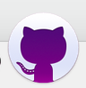
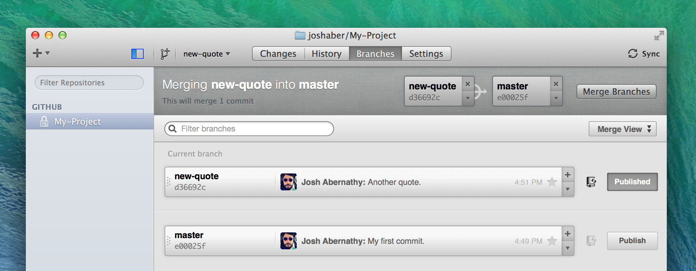

## Github

- [http://dogfeet.github.io/articles/2012/how-to-github.html](http://dogfeet.github.io/articles/2012/how-to-github.html)    
- [http://blog.outsider.ne.kr/865](http://blog.outsider.ne.kr/865)    ← 개념이 아주 쉽게 설명됨.
- github에 기존 프로젝트를 올리려면? 일단 github에서 repository를 생성하자. repo를 생성후 어떤 명령을 입력해야 하는지 설명이 나오므로 읽어보고 따라하자.
- fork 버튼의 우측의 숫자풍선을 클릭하자. network graph를 잘보고 커밋의 내용을 살펴보면서 나에게 적당한 버전을 찾아야 한다.
- safari에서는 github의 network graph가 제대로 다 보이지 않음. 크롬을 이용하자.
- issue
  - 현재 개발고려중인 이슈를 알수 있다. 
  - 여기 존재하지 않는 건에 대해 새로운 기여를 하고자한다면 이슈글을 올려보자. 개발자들로부터 조언을 받을수 있고 반복된 시행착오를 안할수있다.
- fork
  - fork의 변경사항을 오리지날 저장소에도 적용하고 싶으면 pull request를 해야하고 거절당하지 않아야 한다. 
  - fork는 복사본이 아니다. 파생본이다. clone은 원본소스에 대해 읽기권한만 주어지는 반면 fork는 쓰기도 가능하다. 이렇게 하는 이유는 함부로 서버상의 소스를 수정할수 없게 하기 위함이다. fork를 안하고 바로 clone을 하면 서버상의 소스에 대해서 read-only가 된다. 로컬에서 변경은 시킬수 있지만 이 변경내용이 리모트의 소스에 적용되지는 않는다는 의미다. 만약 소스를 수정해서 쓰고싶고 또한 수정된 소스를 모두와 공유하고 싶다면 fork를 이용하자.
- SSH 주소
  - https가 아닌 [git@github.com](mailto:git@github.com): 으로 시작되는 주소.
  - SSH 주소를 사용한 것은 git 프로토콜이 HTTPS보다 훨씬 빠르고 Github에 SSH키를 등록해 놓으면 푸시할때 암호를 입력하지 않아도 되기 때문이다.
- upstream과 downstream의 개념 : [http://stackoverflow.com/a/2749166/2047287](http://stackoverflow.com/a/2749166/2047287)
  - server와 client개념과 유사하지만 상대적인 면에 초점을 맞춘 개념이다. 상류가 하류에 영향을 미치지만 하류도 때에따라서는 상류가 되어 다른 하류에 영향을 미치게 된다.
  - upstream과 origin의 차이 : [http://stackoverflow.com/a/9257901/2047287](http://stackoverflow.com/a/9257901/2047287)


#### Github.app



- 원하는 저장소를 Fork한다.


버튼을누르면 자동으로 Github.app이 론칭되며 원하는 경로를 설정해주면 클로닝된다. 버튼을 눌러도 클로닝이 안된다면 Github앱을 다시 깔거나 업데이트를 해보자.

- Local에서 코딩작업을 하였다면 Commit을 한 후에 좌상단 Sync버튼을 누르면 Remote에도 적용된다.

좌상단 + 버튼을 눌러보자

- add : 이미 로컬에 존재하는 저장소를 github로 올릴때 사용
- create: 완전히 새로운 빈 저장소를 만듬
- clone: 리모트에 존재하는 (fork 된) 저장소를 로컬로.. “clone in desktop”버튼과 비슷한 효과

앱에서 저장소를 remove해도 삭제가 되지 않는다. 리모트에서의 삭제는 [github.com](http://github.com)의 해당 프로젝트로 들어가서 우측 메뉴 하단에 Setting에서 할수 있다.

새 브랜치를 만들려면 current branch의 + 버튼을누른다.


다른 브랜치로 이동하려면 해당 브랜치를 더블클릭 한다.


Github앱으로 Merge하는방법



위처럼 우측에 마스터를 놓고 좌측에 merge할 브랜치를 드래그해서 놓는다. 머지 후에는 Sync를 눌러야 리모트에 올라간다.


#### Github의 커밋 삭제하기

터미널창에 아래와 같이 입력하면 리모트(깃허브)의 커밋이 하나 삭제된다. (두개를 삭제하려면 HEAD^^ 로 바꾸면 된다.)

```shell
git push -f origin HEAD^:master
```


SourceTree를 이용하여 로컬에서도 해당 커밋위치로 soft reset을 해주면된다.


http://stackoverflow.com/a/449070


#####github desktop 어플을 이용하는 방법
단, 이 방법은 위와는 달리 커밋을 삭제하는게 아니다. revert를 하는것이다. 즉, 역 커밋을 넣음으로써 원상복구하는 방식으므로 이미 다른 유저가 해당코드를 포크했을때 유용하다.


