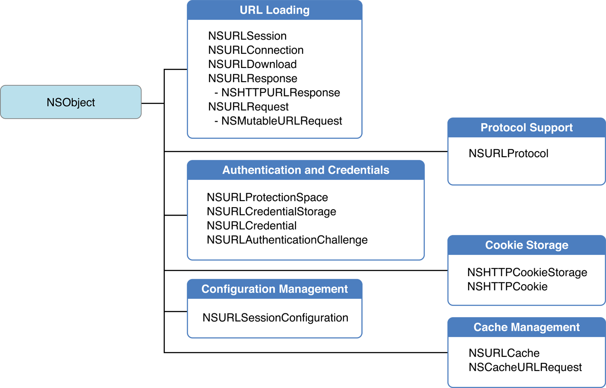

## NSURLSession

#### NSURL Loading System
프로토콜을 이용하여 리소스에 접근하는 방식

```
File Transfer Protocol (ftp://)
Hypertext Transfer Protocol (http://)
Hypertext Transfer Protocol with encryption (https://)
Local file URLs (file:///)
Data URLs (data://)
```


이 시스템은 아래와 같이 다섯 부분으로 구성됨 



데이터는 메모리로 받는(NSData 객체로) 방법이 있고 파일로 받는방법이 있다.

딜리게이트로 응답하는 방법이 있고 completion block으로 응답하는 방법이 있다. 전자는 받는 데이터가 작은 데이터 조각의 집합으로 이뤄져있을경우 받으면서 조각들을 합치는 코드를 직접 넣을수 있다. 후자는 그럴필요가 없는 단일 데이터를 받을 때 편리.

서버로 `URLRequest`를 보내면 응답은 두 개의 파트로 나뉜다 데이터를 설명하는 메타데이타 부분과 데이터 그 자체다. 메타데이터는 `NSURLResponse`객체에 담긴다. 여기에는 MIME타입, 데이터길이, 텍스트 인코딩, 상대측의 URL등이 들어있다.


#### 인증(Authentication) 과 보증서(Credentials)

서버는 컨텐츠에 대한 접근 제한을 걸기위해 유저 인증을 요구한다. 인증을 마치면 보증서(특히 certificates)를 제공하는데 이를 이용해서 매번 암호를 입력할 필요없이 컨텐츠에 접근을 할수가 있게되는 것이다. 보증서는 앱이 서버를 신뢰하는 용도로도 쓰인다.

URL 로딩 시스템은 이 보증서를 키체인에 저장해놓고 유효기간을 관리한다.

* NSURLCredential : 보증서를 나타냄
* NSURLProtectionSpace : 보증서가 접근을 보증하는 영역을 나타냄
* NSURLCredentialStorage : NSURLCredential 과 NSURLProtectionSpace 간의 매핑을 관리
* NSURLProtocol :프로토콜을 나타냄. 프로토콜이 인증을 필요로한다면 NSURLAuthenticationChallenge를 호출하여 인증함.
* NSURLAuthenticationChallenge : 인증 작업에 필요한 정보

#### 캐시 관리

URL로딩 시스템은 디스크 캐시와 메모리 캐시를 혼합해서 제공한다. 이는 cache policy에 따라 달라진다.

* NSCachedURLResponse : 웹페이지의 경우 요소들이 많아서 그런지 요청이 대량으로 이뤄지기 쉽고 받은 데이터도 조각조각 나뉘어져서 받으므로 합치는 작업이 필요하다. 그러므로 캐싱이 유용하다.  http 및 https 만 가능.

