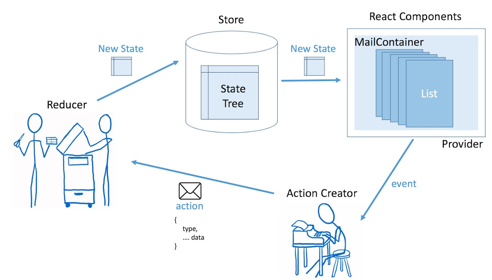

## Swift Enum State Machine


#### 어째서 상태 머신을 사용해야 하는가?

##### 상태 제어가 쉽다.

상태 변화는 다음의 두 가지가 맞물려있다.

1. The state change logic
2. The current state itself

1번은 2번에 의존한다. 2번의 상태가 적절하지 않을때 1번이 실행되면 프로그램은 에러가 난다. 따라서 어떤 함수가 실행될때 항상 현 상태를 체크하는 조건문이 들어가게 되고 프로그램은 수많은 if문과 assert문이 사용되며 복잡해진다.

이런작업들을 상태머신에 모아놓으면 편리하고 가독성이 높아진다.

##### 상태변화에 따라 로그찍기가 편하다. 

수많은 메소드에 로그 출력문을 넣지 않아도 된다.

##### 상태 자체를 저장하기 편하다. (Undo, Redo가 가능)

##### 뷰컨트롤러가 단순해진다. 

단순히 상태와 UI를 연결시키기만 한다. 상태는 더이상 뷰컨트롤러가 관리하지 않고 모델에서 관리하므로 상태를 저장하고 복원하기도 쉽다.


----


- enum을 이용해서 State 정의한다. State는 associated data를 가질수 있다.
- State객체는 항상 immutable이어야 한다.(value type) 수정하지말고 새 객체를 생성해서 리턴해야 한다.
- Reducer에는 state의 변형에 대한 코어 로직이 포함된다. 어떤 행위에 대해 VC의 상태가 어떻게 바뀌는지를 알려면 이곳을 들여다보면 된다. 이는 코드를 아주 쉽고 granular하게 만들어준다. 리듀서는 (State) → State를 표현하는 함수에 불과하다. 
  - Reducer라고 불리는 이유는 프로그램에는 무한히 많은 상태가 존재할수 있는데 그것을 카테고리화하여 몇개의 State로 환원하는 작업을 하기 때문이다.
- model은 UI액션에 반응하여 reducer를 이용하여 state를 update한다. 
- view model은 state enum을 적절한 UI에 mapping한다.
- view controller는 UI의 bind를 책임진다.

----

#### Flux

플럭스는 페이스북 개발팀이 Notification오류를 고치기위해 개발된 것이다. 원인은 비동기적인 데이터 수정으로인한 것이였다.  모델 수정이 필요할때는 중간관리자인 dispatcher를 거치도록 만들어놓았다.

플럭스는 MVC에서 이벤트 및 데이터의 흐름과 거의 차이가 없다. 뷰에서 이벤트가 발생하면 이는 중간의 컨트롤러가 이 이벤트를 받아서 적절한 모델을 수정해준다. 단, 모델이 업데이트 되면 자동으로 뷰가 업데이트된다. 즉, 컨트롤러를 거치지 않는다. 다시말하면 setter는 직접적인 접근이 안되지만 일단 설정된 getter는 자유롭게 사용가능하다는 말이다. 

#### Redux

Redux는 플럭스에 몇가지 기능이 더해진다. 하나는 hot reloading이다. 이는 상태저장기능 때문에 가능하다. 개발시 코드를 수정하고 다시 빌드해도 어플리케이션의 상태가 유지된다.  Undo, Redo를 반복할수 있다.

리덕스의 공식 문서에 있는 예제들은 순수 함수를 적극 활용한다. Dan Abramov가 함수형 프로그래밍에 영감을 받아서 리덕스를 만들었기 때문인 듯하다. 순수 함수는 아래와 같은 특징을 갖는 함수를 말한다.

1. 함수 밖에 있는 데이터나 변수를 변경해서 의도치 않은 결과를 발생시키지 않아야 한다.
2. 동일한 입력 데이터의 집합을 제공받으면 항상 동일한 연산 결과를 반환해야 한다.

특히 리듀서에 이런 철학이 강하게 묻어있다. 리듀서를 순수하게 유지하면 뭐가 좋은 걸까? 결론적으로 시스템이 복잡해져도 리듀서를 가능한 단순한게 유지할 수 있다.

입력을 받으면 입력 값을 처리하여 새로운 상태를 결과로 반환하는 게 전부다. 입력 값을 전달하는 것 외에는 함수 실행 중에 외부의 어떤 조건에도 영향을 받지 않는다. 하는 일이 단순하니 예측하기 쉽고, 테스트하기도 쉽다. 리덕스가 자랑하는 시간 여행 디버깅이 가능한 것도 리듀서의 이런 특성 덕이다.




**Reducer**


reducer는 임의의 타입을 가진 state, 와 그것의 동작을 의미하는 action을 매개로 하는 switch문을 지닌 함수다. action을 통해 state를 변경시키고 그것을 리턴한다.
```swift
// 여기서 state와 action은 associated value를 가진 enum형으로 만드는게 낫다.
func reducer<T>(state:T, action) -> T {
	switch (action.type) {
		case "do something":
			return newState
		case "do another thing":
			return anotherState
		default:
			fatalError()
    }
}
```


객체의 상태는 카테고리가 달라지기도 한다. 아래는 샘플 객체의 state를 로그로 찍은것이다. 
```
[object Object] {
  todos: [[object Object] {
  completed: false,
  id: 0,
  text: "Lean Redux"
}],
  visibilityFilter: "SHOW_ALL"
}
```
위처럼 todo list앱의 경우 todo들의 상태를 표현하는 state가 있고, visibility 필터를 나타내는 state가 있다.

상태의 종류가 매우 많고 다양하며 multi-level를 가진다면 이를 하나의 switch문에 표현하기는 매우 어렵다.
따라서 통합리듀서가 존재한다.

**하지만 Swift에서는 enum이 assocated value를 가질수 있으며  sub node로 또다른 enum값을 가질수 있기 때문에 쉽게 계층화할수 있다. 통합리듀서는 굳이 필요없어보인다.**


### 순수 함수

기본적으로 입력 데이터를 변경하지 않고 외부 상태에 의존하지 않으며 동일한 입력 값에 대해 동일한 출력 값을 일관되게 제공하는 함수를 "순수(pure)" 함수라고 한다.

리듀서 함수를 보면 이것 역시 "순수한" 함수임을 알 수 있을 것이다.


#### 그런데, 리듀서는 왜 "순수" 함수여야 할까?

mutable한 타입의 단점은 해당 객체가 변경되었는지 여부를 조사할려면 deep-compare를 해야만 하는데 이게 꽤 무거운작업이다.

반면에 **immutable한 타입은 해당 객체의 메모리 주소만 비교하면 되므로 상태변경여부의 검사가 빠르다.**


