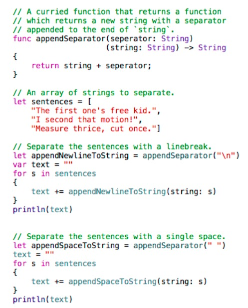

# Swift Language (2)


### Inout

포인터를 넘겨주는 기존의 C 문법 
```
void foo(int *i) {
    (*i)++;   // 내부 사용법이 복잡
}
```

```swift
func foo(inout i: Int) {
    i++ // 단순
}
```


### Description

description 프로퍼티는 해당 객체를 설명하는 역할을 한다. 주로 해당클래스의 작성자가 설명코드를 넣는다. debugDescription프로퍼티는 사용자측에서 디버깅의 편의용도로 오버라이드 할수있도록 마련한 프로퍼티다. 

객체를 문자로 출력할수 있는 방법은 print()와 dump()가 있다.

아래와 같이 String만으로 이뤄진 다차원배열은 가로로 출력하고 싶으면 print로, 세로로 출력하고 싶으면 dump를 쓰면 된다.

```swift
let a = [["가", "다"], ["마", "사"]]
print(a)  // print(a.description) 과 동일
dump(a)

// 결과
[["가", "다"], ["마", "사"]]
▿ 2 elements
  ▿ [0]: 2 elements
    - [0]: 가
    - [1]: 다
  ▿ [1]: 2 elements
    - [0]: 마
    - [1]: 사

```


```swift
let a = [["가", "다"], ["마", "사"], Task()]
```

위처럼 문자로만 이뤄진 배열이 아닌 객체가 들어가면 Array가 아닌 NSArray로 타입유추가 되어 실행되므로 한글이 제대로 출력되지 않는다. NSArray의 description메소드는 한글 대신 유니코드로 출력되기 때문이다.

print(a)  가 print(a.description) 과 동일하게 작동하는 것은 해당 클래스가 CustomStringConvertible 프로토콜을 구현하고 있을때이다. (그렇지않으면 그냥 클래스명만 출력된다.) 

CustomDebugStringConvertible 를 구현하도록 한다면 print(a) 는 print(a.debugDescription) 과 동일하게 작동한다.

만약 두 프로토콜 모두 구현하고있다면? 

print(a)는 print(a.description) 를 출력한다.

대신 디버그창에서 

```lldb) po a``` 

를 하면 a.debugDescription이 출력된다.


### attributes

**@availability(arg1, arg2, arg3)**

arg1 : 현재 사용가능한 플랫폼

​	iOS, iOSApplicationExtension, OSX, or OSXApplicationExtension

​	* 를 쓰면 any의 의미를 가짐

arg2, arg3 

(순서는 상관없음)

introduced=플랫폼 버전 넘버

​	해당 버전이후부터 사용가능함을 의미

deprecated=플랫폼 버전 넘버

​	개선된 버전이 나왔거나 나올 예정이니 더이상 해당 코드 사용한 개발을 자제할것. 

 obsoleted=플랫폼 버전 넘버

​	이버전 이후로 구식이 되어버림. 사용불가.

message=메시지

​	deprecated 또는 obsoleted의 조건을 어겼을때 나오는 경고구문

unavailable

​	arg1에서 언급한 플랫폼에서 사용불가함을 의미함

renamed

​	unavailable과 함께 사용될 경우 해당 이름이 교체되었으므로 새이름을 사용할것을 나타냄.

​	@availability(*, unavailable, renamed="MyRenamedProtocol”) ; typealias MyProtocol = 	MyRenamedProtocol

**@noreturn**

무한루프함수 또는 프로그램 종료 메소드 처럼 리턴이 없는 메소드나 함수에 쓰임. (리턴값이 nil이라는 뜻이 아님)

노리턴 함수라는것을 컴파일러에게 알려줘야 그에 맞는 처리를 해줌

**@NSCopying**

var 프로퍼티에 사용.(computed property는 안됨) 

해당 프로퍼티의 setter를 synthesize할때, 복사방식으로 구현할것을 지시함. 즉, 외부에서 프로퍼티에 값을 넘겨주면 이것이 참조를 넘겨주는게 아니라 값복사로 넘겨주게됨. 

obj-c의 copy프로퍼티랑 같은역할.

 해당 프로퍼티는 NSCopying프로토콜을 구현하고 있어야 함.

**@NSManaged**

NSManagedObject의 서브객체들을 의미. dynamic하게 생성된 접근자를 통해 코어데이터의 엔티티들과 매핑되도록 구현됨.

**@UIApplicationMain**

해당클래스가 App Delegate 클래스임을 나타내는 어트리뷰트

**@objc**

해당코드를 obj-c 코드에서도 사용가능하게 만들것을 컴파일러에게 지시함.

@objc가 붙은 클래스를 상속한 클래스에는 자동으로 @objc가 붙은걸로 간주됨.

@objc가 안붙은 프로토콜을 상속한 프로토콜은 @objc로 만들수 없다.

**인터페이스 빌더용**

@IBOutlet

@IBAction

@IBInspectable :  IB에서 선택시 해당항목을 inspector창에서 설정가능

@IBDesignable  : 해당 커스텀 뷰가 IB에서 보여짐.

```swift
@objc
class ExampleClass {
     var enabled: Bool {
          @objc(isEnabled) get {      // enabled라는 변수가 obj-c에서는 isEnabled라는 이름으로 인식된다.
               // Return the appropriate value
           }
     }
}
```


### dynamic

[http://outofbedlam.github.io/swift/2016/01/27/Swift-dynamic/](http://outofbedlam.github.io/swift/2016/01/27/Swift-dynamic/)

Objective-C에서는 클래스의 메서드를 호출하거나 프로퍼티를 참조하는 것을 “함수 호출”이라고 하지 않고 “메시지 전송” 혹은 “메시지 디스패치”라고 합니다. 이렇게 부르는 이유는 Objective-C의 런타임의 동적 바인딩 속성과 관련이 있습니다. 전통적인 “메서드 호출”이 Objective-C에서는 해당 객체에 메시지를 전달하는 과정으로 구현되어 있습니다. 호출자가 “메서드 f를 실행”이라는 메시지를 대상 객체에 전송하고 이 메시지를 수신한 객체는 요청받은 메서드의 구현체를 찾아서 실행하게 됩니다. 여기서 메시지를 수신한 후에 구현코드를 찾는다는 점이 중요합니다. 정적 디스패치의 경우에는 컴파일 타임에 이미 어떤 구현코드가 호출 되어야할지 결정되어 있고 따라서 그 상황에 적절한 코드 최적화를 적용할 수 있습니다. 하지만 동적 디스Objective-C에서는 클래스의 메서드를 호출하거나 프로퍼티를 참조하는 것을 “함수 호출”이라고 하지 않고 “메시지 전송” 혹은 “메시지 디스패치”라고 합니다. 이렇게 부르는 이유는 Objective-C의 런타임의 동적 바인딩 속성과 관련이 있습니다. 전통적인 “메서드 호출”이 Objective-C에서는 해당 객체에 메시지를 전달하는 과정으로 구현되어 있습니다. 호출자가 “메서드 f를 실행”이라는 메시지를 대상 객체에 전송하고 이 메시지를 수신한 객체는 요청받은 메서드의 구현체를 찾아서 실행하게 됩니다. 여기서 메시지를 수신한 후에 구현코드를 찾는다는 점이 중요합니다. 정적 디스패치의 경우에는 컴파일 타임에 이미 어떤 구현코드가 호출 되어야할지 결정되어 있고 따라서 그 상황에 적절한 코드 최적화를 적용할 수 있습니다. 하지만 동적 디스패치에서는 이러한 과정이 런타임에 발생하므로 컴파일 타임의 코드 최적화가 적용될 수 없는 반면에 런타임에 함수나 메서드의 구현 코드를 바꿔치기할 수 있습니다. 이런 기법은 메서드 스위즐링(Swizzling)이라고 합니다. Objective-C의 메서드 스위즐링에 대한 자세한 내용은 [여기](http://nshipster.com/method-swizzling/)를 참조하시기 바랍니다.


### [Curried Function](https://gist.github.com/monadis/12f50b36fae32a065794)




### Optional 변수

Objective-C에서의 nil이 NULL을 가리키는 객체참조를 의미하는 반면 **Swift에서의 nil은 sentinel value 즉, 범위를 벗어난 데이터를 의미**한다. Objective-C에서는 sentinel value를 표현할때 중구난방이였다. (-1, 0, NSNotFound, NSMaxInteger 등등) 하지만 swift에서는 nil로 통일된다. 따라서 어떤 변수를 옵셔널로 만드는 경우는 해당 변수가 범위를 벗어날 가능성이 있는 경우다.

[**implicitly unwrapped optionals**](http://www.drewag.me/posts/uses-for-implicitly-unwrapped-optionals-in-swift)

- 늦게 초기화될수 밖에 없는 변수라서 그때까지 nil이 필요한 경우. (예를 들어, 어떤 뷰 위에 놓인 버튼의 사이즈를 알아내어 변수에 저장하고자할 경우 init이 아닌  viewDidLoad에서 초기화할수밖에 없다.)
- 해당변수를 사용하는 시각에는 nil이 아닐것을 확신할수 있는 경우.
- NSObject를 상속받아 만든 객체의 생성자들은 IUO 형을 반환한다. 따라서 이를 저장하는 프로퍼티를 만들 경우 역시 Wrapped Optional 혹은 IUO를 사용한다.
- 늦게 초기화한다는점에서 lazy프로퍼티와 비슷한것도 같지만 lazy는 access시점에 초기화가 되기때문에    그 사이에 값이 변할수있어 예상치 못한 결과를 낳을지도 모른다.
- IUO는 App Crash의 위험을 항상 안고있으므로 신중히 사용해야 한다. 가능하면 lazy프로퍼티를 사용하자. 


```swift
var optionalInteger: Int?
var optionalInteger: Optional<Int>

var implicitlyUnwrappedString: String!
var implicitlyUnwrappedString: ImplicitlyUnwrappedOptional<String>
```

 

**implicitly unwrapped optional**

ImplicitlyUnwrappedOptional 은 Objective-C와의 호환을 위한 개념이다. 이것이 없으면 UIViewController의 subclass를 만들때 외부에서 전달받는 프로퍼티는 무조건 optional로 만들어줘야 해서 코드가 지저분해진다. (수많은 물음표와 느낌표가 쓰이게 된다.)

Objective-C의 변수들은 ImplicitlyUnwrappedOptional 이라고 보면 된다. 하지만 이 변수는 nil이 될 가능성이 존재하며 nil에 대해 어떤 명령을 내리면 프로그램이 종료된다는 단점이 있다. (변수에 명령을 내릴때마다 매번 nil을 체크해줘야 한다. )따라서 objecive-c와의 호환을 목적으로 하는게 아니라면 가능하면 이 방식으로 변수를 선언하지 않는게 좋다.

> 예외적으로 ImplicitlyUnwrappedOptional  이 요긴하게 쓰이는 곳이 하나 있다.  “nonoptional - nonoptional 순환참조관계” 부분을 참고하자.  

optional 타입은 사실 enum타입이다.  Some(T)및 .None를 멤버로 갖고있다.

optional 를 사용하지 않는 다른 언어에서는 메소드 사용시 파라미터로 nil값이 들어가는 경우에대해 매번 고려해야 하며, nil이 들어왔을때의 행위에 대해 일일이 설명해야만 했다. 왜냐하면 모든 변수가 nil값을 허용하고 있기 때문이였다. 이러한 불안요소를 안고 코딩을 해야했다.하지만 swift는 애초에 디폴트로 nil을 막아놓는다. optional 변수일때만 nil이 허용된다. 따라서 메소드 선언부만 보고도 이곳에 nil을 넣으면 되는지 여부를 쉽게 알수있다.

변수는 Non-Optional, Wrapped Optional, Implicitly Unwrapped Optional로 나뉜다.

1. var str: String = “Hello”
2. var str: String? = “Hello”       
3. var str: String! = “Hello”

**str?.uppercaseString  **

- optional chaining 참고
- 항상 wrapped된 값을 반환한다. 따라서 실행결과는 {Some “HELLO”} 
- str이 nil일 경우 해당줄은 실행이 되지않으며 nil을 반환하게 된다. (그렇다면, 실행하고 난 뒤의 리턴값이 nil인 경우와 혼동이 되지 않을까? 하지만 이런경우엔 { } 와 같은 비어있는 wrapped object를 반환하기에 구분이 가능하다.)
- str이 wrapped 이건 unwrapped이건 동일한 결과. 

**str!.uppercaseString**

- forced unwrapping
- str에 값이 존재한다고 간주한다. str이 nil일 경우 런타임 에러난다.
- unwrapped된 값을 반환한다. 즉, 실행결과는 “HELLO” 

**str.uppercaseString**

- str이 wrapped라면 컴파일타임 에러가 난다.
- str이 unwrapped라면 str!.uppercaseString와 동일한 결과가 난다.

```swift
var window: UIWindow?
var application: UIApplication!
```

UIWindow?는 wrapped optional입니다. 즉, nil이 될수있는 객체인데, 껍질이 객체를 둘러싸고있다고 보시면 됩니다. 이 껍질때문에 이 객체는 바로 내부에 접근이 안됩니다. 껍질을 깨주는 작업을 해야만 직접적인 접근이 가능합니다. 느낌표!가 껍질깨는 작업을 하라는 신호입니다. 이를 이용해서 껍질을 열게됩니다. 

UIApplication!은 unwrapped optional입니다. wrapped optional에 미리 !를 적용해서 열어둔상태입니다. 따라서 내부로 그냥 접근이 됩니다.

 

껍질이 존재하는 이유는 다이내믹한 처리가 가능해지기 때문입니다.

method call은 객체가 nil이면 에러가 납니다. 하지만 message passing은 에러가 나지않고 nil을 반환합니다.

```swift
window!.doSomething()     // method call
window?.doSomething()    // message passing
application.doSomething()     // method call    (호출시 느낌표 필요없음)
```

반대로 wrapped optional에게 !를 붙이면 unwrapped되어 method call이 됩니다.

wrapped optional에 ?를 붙여서 메소드를 호출하면 method call이 아니라 message passing이 됩니다. 즉, 객체가 껍질내부에 존재하면 메시지를 받게되고 존재하지않으면 nil을 반환합니다. 즉, 껍질이 이런판단을 하는 if-else문 역할을 합니다. 

 

```swift
class Person {
	var age = 0
	func a() { }
}

var man:Person? = Person()
var man2:Person! = Person()
man.age = 20 // 에러.
man?.age = 20 // 에러. man?.age 는 {Some 0}를 리턴할수만 있을뿐 값을 대입할수는 없다. 값을 변환하려면 unwrapped상태에서만 가능.
man!.age = 20 // 처리됨.

man.a() // 에러. 이녀석은 값을 변형시키지도 않는데 왜 에러가 날까요?
man?.a() // 처리됨. 이를 optional chaining이라 함.
man!.a() // 처리됨.

man2.age = 20 // 처리됨
man2?.age = 20 // 에러.
man2!.age = 20 // 처리됨.

man2.a() // 처리됨
man2?.a() // 처리됨. 
man2!.a() // 처리됨.
```


**wrappedOptional?.unwrappedOptional?.method() 와 같은 호출은 되지 않는다.**

unwrappedOptional에 ?를 붙이는건 규정에 어긋나기때문이다. 이럴 경우 if let문으로 해결한다.

```swift
if let obj = wrappedOptional?unwrappedOptional { obj.method() }
```


## 순환참조의 해법 : Weak, Unowned

[Apple Doc](https://developer.apple.com/library/ios/documentation/Swift/Conceptual/Swift_Programming_Language/AutomaticReferenceCounting.html)

단순히 binding을 하는것만으로도 strong reference가 생겨난다. 

```swift
let parent = myParent
```

weak reference를 만들려면 앞에 weak을 붙여야 한다. 또한 var 타입이어야 하며 optional이어야 한다. 그래야 릴리즈시 nil로 될수 있기 때문.

```swift
weak var parent : Person?
```

weak은 optional변수일 경우 사용한다. non-optional변수일 경우 nil로 만들수 없으므로 weak을 사용할수가 없게되는데 이런 경우에는 unowned를 사용한다. 그 외에는 두 키워드의 기능은 동일하다.

**optional - optional (예 : 사람과 아파트의 관계) **

아파트가 없는 사람이 있을수 있고 주인이 없는 아파트도 있을수 있다. 즉 양쪽 객체들의 lifetime이 독립적인경우 이 관계를 이을때는 weak을 사용. 따라서

```swift
// 양쪽다 wrapped optional이다. 둘중 하나에 weak을 붙여준다.
class Person {
	var apartment: Apartment?
}
class Apartment {
	weak var tenant: Person?
}
```

**optional - nonoptional (예 : 고객과 신용카드의 관계) **

신용카드에는 반드시 고객의 정보가 들어있어야 함. 고객은 신용카드가 없을수도 있음.  따라서 신용카드 객체는 고객이라는 프로퍼티를 non-optional로 갖고있어야 함.  고객 객체는 신용카드라는 프로퍼티를 wrapped optional로 갖고있어야 함. 신용카드가 고객을 소유하는 것이 아니므로 신용카드의 고객프로퍼티가 약한 결합이어야 한다. 근데 non-optional이므로 unowned라는 키워드를 붙이면 된다.

```swift
// 한쪽은 unowned non-optional, 다른한쪽은 wrapped optional이어야 한다.
class Customer {
	var card: CreditCard?
}
class CreditCard {
	unowned let customer: Customer
}
```

**nonoptional - nonoptional (예: 국가와 수도의 관계) **

국가와 수도는 순환참조 관계다. 이때, 어떤나라든 수도를 갖고있다. 어떤 도시든지 국가에 속한다. 따라서 양 객체의 참조는 둘중 어느 하나도 nil이 될수 없다. 근데 이러한 이유때문에 이 둘을 생성하는데 딜레마에 빠지게 된다. 국가라는 객체를 만들기위해서는 반드시 수도가 있어야 한다. 근데 수도 객체를 만들기위해서도 반드시 국가가 필요하다. 국가의 생성자 내에서 수도의 생성자를 호출하게 되는데 수도의 생성자에게 매개변수로 국가 자신 즉, self객체를 전달해서 생성해야 한다. 그런데 국가 생성자 내부는 아직 객체가 만들어지지 않은 상황이므로 self를 전달할수가 없다. 이런 딜레마를 해결하기 위하여 swift의 생성자는 two phases initialization 방식을 도입하였다. 이방식의 특징은 해당 클래스의 프로퍼티들이 초기화가 모두 완료된 직후(생성자가 아직 리턴이 되지 않은 상황일지라도)부터는 바로 self를 사용할수 있다는데 있다. 국가 객체는 수도 프로퍼티를 갖고있는데 이를 unwrapped-optional변수로 선언한다. 이 변수는 선언 즉시 일단 nil로 초기화가 된다. (하지만 이 변수에 접근하기 전에 nil값을 반드시 유의미한 객체로 채워야먄 런타임 에러가 안나는 특성이 있다. ) 수도 프로퍼티가 nil로 초기화 되었으므로 이제는 self를 사용할수 있다. self를 수도 생성자에 전달하여 수도객체를 생성하면 된다. 생성된 수도객체는 방금까지 nil이었던 수도프로퍼티에 넣으면 된다. 수도객체의 국가프로퍼티는 non-optional이므로 unowned로 놓으면 된다.

```swift
// 한쪽은 implicitly unwrapped optional이고, 다른한쪽은 unowned non-optional이어야 한다.
class Country {
	let name: String
	var capitalCity: City!       // implicitly unwrapped optional.
     init(name: String, capitalName: String) {
          self.name = name
          self.capitalCity = City(name: capitalName, country: self)
     }
}

class City {
     let name: String
     unowned let country: Country
     init(name: String, country: Country) {
          self.name = name
          self.country = country
     }
}
```

 

## 인스턴스와 Closure간의 순환참조

인스턴스가 클로저를 멤버로 retain하며, 클로저 내부에서 해당인스턴스를 self로 접근함으로써 순환참조가 된다. 단순히 메소드 내의 지역변수에 retain된 블록은 그 메소드가 리턴됨과 동시에 메모리해제되므로 순환참조가 발생하지 않는다. 혼동하지말자. 

***@escaping 키워드가 있는 블록인 경우 외부 변수를 사용하려면 캡처를 해야 한다.***

#### 동기 블록의 순환참조는 unowned로, 비동기 블록의 순환참조는 weak으로 끊자.


- unowned : 동기 블록에서 사용. 즉, 클로져가 원본스레드에 종속되어 있을때 사용. weak보다 더 빠르므로 확실하면 이걸 쓰는게 좋음. 객체를 unwrapped-optional로 만드는 키워드라고 보면 된다. 클로저와 self의 life-time이 같다면 self가 nil이 될 걱정을 할 필요가 없이 unowned를 사용하면된다. self가 사라지면 클로져도 사라지기 때문이다. 순환참조가 이뤄지는 클로져와 self의 life-time이 동일하다면 (즉, self가 죽을때 클로져도 같이 죽어야 한다면) unowned를 사용하자.
- weak : 비동기 블록에서 사용. 즉, 클로져가 원본스레드와 독립적으로 동작할때 사용. 원본스레드가 사라지더라도 클로저는 계속 작동할수 있음. 비동기 클로져는 쓰레드가 분리되므로 클로저와 self의 life-time이 달라진다. 따라서 실행중에 self가 릴리즈될수 있으므로 unowned를 써선 안된다. 객체를 optional로 만드는 키워드라고 볼 수 있다. 물음표 문법으로 프로그램을 실행할수 있으므로 self가 nil이 되더라도 프로그램이 비정상종료되는걸 막을수 있다.


순환참조되는 객체가 여러개라면 [unowned self, weak someInstance] 처럼 리스트를 만들어줄수 있음. 이를 capture list라고 함.

***메소드의 로컬변수는 strong으로 참조해도 괜찮다.***

escaping 블록내에서 프로퍼티를 참조할경우 self.를 앞에 붙이는것이 강제된다. 그 이유는 이것이 self를 강한참조하고있음을 명확히 보여줄수 있기 때문이다. 실수로 순환참조를 만들 가능성을 줄일수 있다.

``` swift
// Unowned capture of "self.parent" as "parent" 
myFunction { [unowned parent = self.parent] in print(parent.title) }

// Weak capture of "self.parent" as "parent" 
myFunction { [weak parent = self.parent] in print(parent?.title) }
```


#### (비동기 블록에서) 특정 구간이 실행되는 동안은 self가 릴리즈되지 못하게 하려면?

strongSelf로 묶어두자.

```swift
let action = UIAlertAction(title: title, style: style) { [weak self] _ in
if let strongSelf = self {
    handler(strongSelf)       // handler가 실행되는 동안에는 self가 릴리즈될수 없다. 
}
    self?.finish()          // self가 릴리즈 되었다면 finish는 실행되지 않는다.
}
```

#### (비동기 블록에서) self가 릴리즈될때 블록도 하던 작업을 멈추고 종료되게 하려면?  

self가 non-optional이라 곤란한 경우가 있다. 아래처럼 [weak optionalSelf = self] 를 이용하여 weak Optional로 바꿀수 있다. handler가 백그라운드 스레드에서 주기적으로 텍스트를 출력해주는데 이 도중에 self가 nil이 되면 closure는 break에 걸려서 끝나게 된다.

```swift
self.handler = { [weak optionalSelf = self] in       // dispatch async 즉, 비동기 블록으로 사용되므로 weak을 씀.
	for i in 1...7 {            
		if let str = optionalSelf?.detailDescriptionLabel.text { 
			print("\(str)")
		} else {        
			break            
		}        
	}	
}

let cQueue : dispatch_queue_t = dispatch_queue_create("customQueue", DISPATCH_QUEUE_CONCURRENT)
dispatch_async(cQueue, handler)

class TempNotifier {
     var onChange : ((Int) -> Void)!
     var currentTemp = 72
 
     init () {
          onChange = { [unowned self] x in         // 동기 블록 이므로 unowned
               self.currentTemp = x
          }
     }
}
```

아래와 같은 코드로 간단히 사용하자.
```swift
{ [weak self] in  
    if let s = self {
        // code 
    }
}
```


#### 세개 이상의 클래스 사이에서의 순환참조

두개 클래스 사이에서만 순환참조가 발생하는건 아니다. 세개의 클래스 간에도 순환참조가 가능하다.  예를 들어, 클래스 A가 B객체를 strong으로 참조하고 B가 handler블록을 strong으로 참조할때 클래스A내에서 handler를 정의하면서 self를 strong으로 참조하면 순환참조가 발생한다. [unowned self]로 해결할수 있다.


## Setter의 사용시 유의점.

```swift
struct User {
    var identifier = 1
}

struct Box {
    var user: User = User()

    var value: User {
        get {
            print("getter")
            return user
        }
        set {
            print("setter")
            user = newValue
        }
    }
}

var box = Box()
box.value.identifier = 2	// value 자체가 아닌 value.identifier 값을 변경시키더라도 value의 setter가 실행됨. 

/// 실행결과 ///
getter
setter
getter
```

