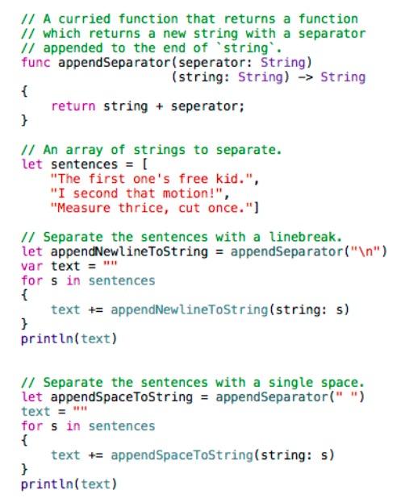

## Swift Syntax


[Apple Swift Guide Site](https://developer.apple.com/library/ios/documentation/Swift/Conceptual/Swift_Programming_Language/GuidedTour.html#//apple_ref/doc/uid/TP40014097-CH2-ID1)

#### [String and Characters](https://developer.apple.com/library/ios/documentation/Swift/Conceptual/Swift_Programming_Language/StringsAndCharacters.html#//apple_ref/doc/uid/TP40014097-CH7-ID295)

#### [Upcasting and Downcasting](https://developer.apple.com/library/ios/documentation/Swift/Conceptual/Swift_Programming_Language/TypeCasting.html)
> 업캐스팅 및 성공이 보장된 형변환은 as로 하고, 다운캐스팅은  as!  또는 as?로 한다. 

#### [if let 문법](https://gist.github.com/monadis/f8e3b9d3bb7fd16161e10666aa205fec)


#### Typealias
Swift에서는 typedef 대신 typealias 키워드를 사용합니다. 이미 존재하는 타입을 이용해서 새로운 타입을 만들수 있다. typealias를 이용하자.
```swift
	typealias AudioSample = UInt16        // UInt16 보다 더 직관적이고 버그도 방지된다.
```
typealias를 이용해서 tuple타입에 이름을 정해줄수 있다. 
```swift
	typealias Point = (Int, Int)
	let origin: Point = (0, 0)
```


#### 타입의 이해 
왜 부울타입에는 true, false를 입력할수 있을까? 왜 조건문에 부울타입이 들어갈수 있을까? 사용자 정의 타입을 만들려면 어떻게 해야 할까? 이같은 의문의 답을 알고자 한다면 아래의 링크를 보자.
https://developer.apple.com/swift/blog/?id=8

### 함수 

```swift
func aMethod(str1:String? = nil, _ str2:String? = nil) { }
```
 스위프트에서는 디폴트 값이 있는 인수는 생략이 가능. 따라서 위 메소드는 아래 세 가지 방법으로 호출 가능.
```swift
aMethod("abc", "def")      // str1 = "abc", str2 = "def"
aMethod("abc")             // str1 = "abc, str2 = nil
aMethod()                  // str1 = nil, str2 = nil
```

 첫번째 파라미터에서 외부파라미터를 생략하지않고자 한다면 둘 다 동일하게 써주어야 한다.
```swift
func aMehtod(str str:String) { }
```
함수의 파라미터는 기본적으로 let형이다. 즉, 변형불가다. 만약 변형하고 자 한다면 인수명 앞에 var를 붙여야 한다.
```swift
func aMehtod(var str:String) { }
```


#### 함수 타입
두개의 정수를 파라미터로 받고 하나의 정수를 리턴하는 함수의 함수타입은 (Int, Int) -> Int
파라미터가 없고 리턴값도 없는 함수의 함수타입은 () -> ()  

함수타입 덕분에 함수 자체를 프로퍼티화 할수 있다.
```swift
func addTwoInts(a: Int, b: Int) -> Int {
    return a + b
}
var mathFunction: (Int, Int) -> Int = addTwoInts
```
위는 addTwoInts라는 함수를 mathFunction이라는 함수타입 변수에 할당한것.


#### C언어 API와의 호환
스위프트는 C언어 API와도 긴밀하게 호환이 된다. 
immutable array는 const pointer로 바로 argument로 전달하면 되지만
mutable array의 경우 `&`연산자를 써서 전달하면 된다.
또한 `const char *`의 경우 String과 호환이 된다.
하지만 이러한 변환은 일반적은 다른 스위프트 코드에 비해 unsafe하므로 주의가 필요하다.
https://developer.apple.com/swift/blog/?id=6

#### 가변 파라미터
가변파라미터로 받아진 변수들은 해당 변수타입의 배열로 취급된다.
함수 하나당 가변파라미터는 최대 한개만 가능하며 가장 마지막 파라미터가 되어야 한다.(디폴트값이 있는 파라미터보다도 뒤쪽에 위치) 이는 파라미터들간에 혼동을 방지하기 위함이다.

#### repeat while 문
do-while문의 do 가 error handling에 쓰이게 되었으므로 대신에 repeat이라는 키워드를 사용한다.
```swift
var a :Int = 1
repeat {
	a++
} while (a < 10)
```

[Guard 와 Defer 문법](nshipster.com/guard-and-defer/) 
(delay가 아니다. defer!!)

#### guard
https://gist.github.com/monadis/524c74a3a52c2811e3a47f4482004ff3

가드문의 else블록에 들어가는 코드는 return, continue, break와 같이 해당 스코프를 빠져나가는 구문이있어야 한다. fatalError()와 같은 @noreturn함수도 가능하다.
꼭 함수의 첫부분에만 쓰이는건 아니다. 아래와 같이 루프문 내에서도 쓸수 있다.
```swift
for imageName in imageNamesList {
    guard let image = UIImage(named: imageName) 
        else { continue }
    // do something with image
}
```

#### defer
guard문의 등장으로 인해 early return 방식의 코딩이 대세가 되었다. 하지만 이 방식의 단점은 그 끝처리에 있다. 이 방식에서는 return포인트가 여러군데 발생하기 때문에 리턴되기 직전에 처리해야 하는 작업이 있을경우 그 동일한 작업을 모든 리턴포인트에서 해줘야 하는 것이다. defer는 마치 completion block처럼 코드블록을 리턴직후로 밀어서 처리할수 있게 해주므로 이문제를 해결할수 있다.
**여러개의 defer 블록을 쓴다면 각 블록들은 코드상 순서의 역순으로 실행된다는점을 유의하자. 또한 코드  가독성을 해칠수 있으니 남용하지말자. **


#### NSInvocation 및 NSMethodSignature 의 대안
Swift에서는 NSMethodSignature 나 NSInvocation 같은 클래스를 사용하지 않는데 대신에 연관타입을 이용한다.

<<Request.playground>>

아래의 코드 구조는 외워두는게 좋다. 
https://developer.apple.com/swift/blog/?id=19

https://gist.github.com/monadis/36dc47b68746815f9be95bcc22c94554

#### 연관타입과 제네릭스의 차이
http://stackoverflow.com/questions/26554987/why-dont-associated-types-for-protocols-use-generic-type-syntax-in-swift
연관타입이 훨씬 유연하다. Java 의 Scala언어로부터 차용됨. 
예들들어 ```Array<String, Int, Generator<String>>``` 는 ``` Array<String, Int, Generator<String>>``` 끼리만 호환이 되지만 연관타입을 이용하면 내부적으로 타입이 달라도 호환이 가능.

#### Reflection, Introspection

Reflection comes from the idea of "self-examination, self-modification, and self-replication", reflecting on one's self for the purpose of change.
리플렉션은 코드가 그 자체를 인식하여 스스로를 수정하는 방식이다. 자기인식, 자기변형, 자기복제를 가능케하는 자기진화적 코드 패턴이다. 인트로스펙션은 리플렉션의 한가지 요소인 self-examination 을 의미한다. 보통은 introspection과 객체지향의 다형성을 이용하면 자기변형과 복제도 가능하여 리플렉션을 구현할수있다. 하지만 그 자유도에는 한계가 있다.
클래스 이름만 전달해도 그 이름으로 클래스의 인스턴스를 생성할수 있도록 하고자 한다면 어떨까? 하지만 문자열은 오타의 가능성이 존재하므로 불안전하다. 그래서 나온것이 Meta type이다.

####Meta Type

SomeSubClass.self는 SomeSubClass의 메타타입을 가진 객체를 의미한다. 메타타입은 타입 자체를 변수에 저장할수 있다. 즉, 이덕분에 동적 타입의 객체를 생성하는것도 가능해진다. 외부에서 객체를 받아서 그 객체와 동일한 타입의 객체를 생성해서 리턴해줄수도 있다.
 이때, 메타타입을 전달하려면 메타타입 자체도 변수에 넣어야하는데 그렇다면 그 변수의 타입은 무엇일까? SomeSubClass.Type이다.
클래스에서만 메타타입객체를 얻어낼수 있는건 아니다. 인스턴스에서도 someInstance.dynamicType 의 문법으로 메타타입 객체를 얻어낼수 있다.
```swift
		class SomeBaseClass {
		    class func printClassName() {
		        print("SomeBaseClass")
		    }
		}
		class SomeSubClass: SomeBaseClass {
		    override class func printClassName() {
		        print("SomeSubClass")
		    }
		}
		let someInstance: SomeBaseClass = SomeSubClass()
		// The compile-time type of someInstance is SomeBaseClass,
		// and the runtime type of someInstance is SomeBaseClass
		someInstance.dynamicType.printClassName()
		// prints “SomeSubClass"


		// 어떤 인스턴스의 runtime 타입이 compile-time의 타입과 동일한지 알려면 
		//  === 혹은 ==! 연산자를 사용하면된다.
		if someInstance.dynamicType === someInstance.self {
		    print("The dynamic type of someInstance is SomeBaseCass")
		} else {
		    print("The dynamic type of someInstance isnt SomeBaseClass")
		}
		// prints "The dynamic type of someInstance isn't SomeBaseClass”

		// required init 생성자 메소드를 이용하면 메타타입을 통한 객체생성도 가능하다.
		
		class AnotherSubClass: SomeBaseClass {
		    let string: String 
		    required init(string: String) {
		        self.string = string
		    }
		    override class func printClassName() {
		        print("AnotherSubClass")
		    }
		}
		let metatype: AnotherSubClass.Type = AnotherSubClass.self
		let anotherInstance = metatype.init(string: "some string")
```
#### dump()
dump uses reflection recursively to print out an instance’s children, their children, and so on

```swift
dump(CGRect.zeroRect)
// ▿ (0.0, 0.0, 0.0, 0.0)
//   ▿ origin: (0.0, 0.0)
//     - x: 0.0
//     - y: 0.0
//   ▿ size: (0.0, 0.0)
//     - width: 0.0
//     - height: 0.0
```


#### Mirror Type
https://gist.github.com/monadis/e5a3b26c5b5310b30c581be5d7ba3135?ts=4
위와같은 dump()함수가 다양한 객체를 받아 유사하게 작동할수 있는것는 미러타입 때문이다.	

#### @noescape 
해당 함수의 Lifetime보다 더 오래 살 수 없는 클로져블록. 
기존의 클로져는 함수 자체보다 더 오래 살아남아서 의도치않은 작업을 하기도 하였음. 단순히 코드의 일부를 외부에서 받고자 클로저를 사용하는 경우에는 이런 부작용을 사전에 차단하기위한 장치가 필요함. 
noescape클로져는 async디스패치로 전달이 불가하며 변수로 저장도 불가함. 내부에 self키워드를 쓸필요가 없어짐.

http://stackoverflow.com/a/28428521/2047287

#### Selector

Swift에서 셀렉터는 Selector라는 타입을 가진 구조체이지만 StringLiteralConvertible 프로토콜을 구현하고 있기때문에 문자열과 호환이 된다. 다시말하면 Selector(“test:”) 할 필요 없이 그냥 “test:”해도 셀렉터로 형변환되어 인식한다는 의미다.
```swift
	let mySelector: Selector = "methodName:withParameter:"
```
 `func test(a:String,s b:String) { }` 이러한 함수의 셀렉터는 `"test:s:"`이다. 단, 이때는 반드시 매개변수 2개를 함께 전달해야만 인식한다.

#### Lazy Loading
계산 시간이 오래 걸리는 경우 사용하거나, 인스턴스 생성 시점에는 계산에 필요한 정보를 아직 다 얻을 수 없는 경우 사용한다.
늦은 초기화를 위해 **지역변수 선언부 앞에 lazy를 사용.** (글로벌 상수 및 변수를 초기화하는 initializer는 lazy initialize되며, dispatch_once가 디폴트로 적용되어 atomic이다.  즉 lazy 키워드를 생략한다.)

이때 **변수는 항상 var 타입**이어야 함. 왜냐하면 let타입은 초기화 전에 값이 정해지는 상수이기 때문이다. lazy변수는 이 변수에 접근하여 사용하기 전까지는 변수의 초기화가 이뤄지지 않는다.

https://developer.apple.com/swift/blog/?id=7
 >어떤 구조(function, class등)에도 속하지 않은 코드를 top-level code라고 한다.
 >playground에서는 어떻게 이런 코드가 실행될까? 기본적으로 swift는 order-independent하다. 즉, import문이 파일 끝부분에 있어도 해당 코드를 실행하는데 아무 문제가 없다. 반면에 Playground는 order-dependent하다. 

>swift가 order-independent하다면  프로그램의 진입점은 어디가 되어야 할지가 문제가된다.
> OSX프로그래밍에서 main.swift 파일은 플레이그라운드와 같이 order-dependent하다.  이곳에 탑레벨코드가 존재하고 여기가 프로그램의 진입점이 된다.
>그러나 iOS프로젝트에서는 이 파일을 볼수가 없는데 대신 @UIApplicationMain 지시자가 존재하는 임의의 swift파일이 진입점이 되도록 자동으로 main.swift파일을 구생성 및 구성해준다.

>var someGlobal = foo()

>그렇다면 위같은 글로벌 변수는 언제 초기화가 될까?  

>단일파일로된 프로그램이라면 대답은 간단하다. 탑다운으로 실행시키면 되므로. 하지만 파일이 많다면?

>언어에 따라 세 가지 방식의 초기화 방식이 있다.

>1. C언어: 단순한 상수형 초기화만 용납함. 싱글톤이나 딕셔너리 같은 복잡한 구조는 초기화가 안되니 너무 제한적이라 별로.
>2. C++ : static constructor 라는 것을 도입. 좀 복잡한 초기화도 가능해짐. 앱이 로드할때 각 파일들에 존재하는 글로벌 변수들이 먼저 초기화됨. 하지만 이 방식은 대형 앱일수록 로딩시간이 길어짐. 파일이 많아질수록 각 파일에 존재하는 글로벌 변수가 초기화되는 순서가 달라지는 경우의 수가 많아져서 예측이 힘듬.
>3. 자바: lazy initializer. 최초로 사용할때 비로소 초기화됨. 

>swift는 3번 방식을 채택하였다. 늦은 초기화.


#### static methods / static properties

“static” methods and properties are now allowed in classes (as an alias for “class final”).
즉, static은 오버라이딩이 불가능하다는 점을 제외하고는 class와 같은 의미다.
Objective-C에서 썼던 static method variable은 Swift에서는 존재하지 않는다. 대신 메소드 외부(클래스 내부)에 선언하면 된다.

### Singleton
In Swift, you can simply use a static type property, which is guaranteed to be lazily initialized only once, even when accessed across multiple threads simultaneously:
```swift
class Singleton {
	static let sharedInstance = Singleton()
}
```
If you need to perform additional setup beyond initialization, you can assign the result of the invocation of a closure to the global constant:
```swift
	class Singleton {
	    static let sharedInstance:  a href="" Singleton /a  = {
	        let instance = Singleton()
	        // setup code
	        return instance
	    }()
	}
```
https://developer.apple.com/library/ios/documentation/Swift/Conceptual/BuildingCocoaApps/AdoptingCocoaDesignPatterns.html


### Closure

매개변수 이름을 사용하지 않고, 인자로 넘어오는 순서대로 ```$0, $1, ...```를 사용하면 ```in```과 그 앞의 매개변수 목록도 없앨 수 있다.

```swift
let reversed = ["a", "b"].sort({ $0 > $1 })
```

이렇게 두 인자를 받아서 연산자(>)에 넘기는 경우, > 자체가 저 클로저의 타입 ``` (String, String) -> Bool ```과 타입이 같다. 이런 경우 연산자를 바로 넘겨도 된다.

```swift
let reversed2 = ["a", "b"].sort(>)
```


### Property

기본적으로 프로퍼티는 아래와 같은 형태다.
```swift
private var _document: UIDocument? 
var document: UIDocument? {
	get {        
		return _document
    }
    set {
	// 1
        _document = newValue
	//2
    }
}
```
하지만 이러한 코딩은 매우 귀찮으므로  축약을 하게된다.
위의 코드는 다음과같이 줄일수 있다.
```swift
// stored property
var document: UIDocument?
```
1 혹은 2번 위치에 코드를 넣고 싶다면 willSet이나 didSet을 쓰면 된다. 
willSet에서는 newValue가 디폴트 파라미터인 반면,
didSet에서는 oldValue가 디폴트 파라미터라는점을 주의하자. 
이때, willSet, didSet을 프로퍼티 옵저버라고 한다.
```swift
// stored property
var document: UIDocument? {
	didSet {
    	useDocument()
	}
}
```
ivar가 필요없는 computed 변수는 ivar를 지우고  `computed property`라고 한다.  오버라이드가 아닌 computed property는 `willSet, didSet`이 필요없다. 그냥 get set 블록 내에 코드를 직접 넣으면 되기 때문이다.
```swift
   var perimeter: Double {
         get {
             return 3.0 * sideLength
         }
         set {
             sideLength = newValue / 3.0
         }
    }
```
여기서 `newValue`는 새값을 받는 인자의 묵시적인 이름이다. 만약 이 이름이 싫다면 
`set(명시적 이름) { … }` 
형태로 작성해주면 된다.

lazy loading은 아래와 같이 구현할수도 있지만 
```swift
private var _value : Int?
var value: Int {
	get {
		if _value == nil {
			_value = 초기값
		}
		return _value!
	}
}
```
lazy 키워드로 축약이 가능하다.
```swift
lazy var value:Int = { return 초기값 }() 
```

위와 같은 축약된 패턴들로 구현이 불가능한 경우에는 맨 위의 원본 코드를 사용하면된다.
예를들어 lazy loading은 초기화 코드가 단 한번만 실행된다.(objective-c에서는 nil이 될때마다 실행) 따라서 Objective-C의 방식을 원할경우 직접구현해줘야 한다.

```swift
class Foo {
	var propertyWillChange : (Int) -> Void = {
		print("The storedProperty will change to \($0)")
	}
	var propertyDidChange : (Int, Int) -> Void = {
		print("The value of storedProperty has changed from \($0) to \($1)")
	}
	// stored property에는 디폴트값을 설정할수 있지만 computed property는 불가능
	var storedProperty : Int = 0 {        
		willSet { propertyWillChange(newValue)}
        didSet { propertyDidChange(oldValue, self.storedProperty) }
	}
    // 오버라이드가 아닌 computed property는 willSet, didSet이 필요없다. 그냥 get set 블록 내에 코드를 직접 넣으면 되기 때문이다.
	var computedProperty : Int {
		get {
			return 1
		}        
		set {
			// set에 괄호가 없으면 newValue가 디폴트 파라미터가 된다.
			doSomething(newValue)
		}    
	}
	func doSomething(i: Int) {
      
	}
}
let a = Foo()
a.storedProperty = 3
```

#### property override
super를 활용한다.  setter를 구현했다면 getter역시 구현해야 한다.
```swift
override var 속도: Double  {
  get {
    return super.속도
  }
  set {
   super.속도 = min(newValue, 40.0)
  }
}
```


#### dynamic modifier
```swift
class C {
	dynamic var someText: String = "" {
		didSet {
			print("changed to \(someText)")
		}
	}
}
```
Apply this modifier to any member of a class that can be represented by Objective-C. When you mark a member declaration with the dynamic modifier, access to that member is always dynamically dispatched using the Objective-C runtime. Access to that member is never inlined or devirtualized by the compiler.
Because declarations marked with the dynamic modifier are dispatched using the Objective-C runtime, they’re implicitly marked with the objc attribute.


#### Property Observers

- lazy 가 아닌 어떤 stored property에라도 옵저버를 달아놓을수 있다.
- 상속받은 프로퍼티에도 오버라이딩을 통해 옵저버를 달 수 있다.
- computed property에는 옵저버를 달 필요가 없다. 왜냐하면 그냥 세터 내부에서 처리하면 되므로.
- 처음 초기화시에는 willSet과 didSet이 작동하지 않는다. 외부에서 값을 바꾸려할때만 작동. 마찬가지로 옵저버 내부에서 값을 변경해도 옵저버가 호출되지 않는다.
- newValue, oldValue라는 디폴트 변수를 이용할수 있다.
- 기존의값과 새값이 똑같다 하더라도 willSet, didSet이 호출된다.
- 전역변수와 지역변수에도 옵저버 적용 가능하다.
- 서브클래스에서 세터와 옵저버를 동시에 오버라이드 할 수 없다.


#### Closure를 이용한 초기화

우측의 () 괄호를 주목하자. 이 때문에 해당 클로져는 바로 실행되어 리턴값이 someProperty에 저장된다. 만약 괄호가 없다면 해당 프로퍼티에는 클로져 자체가 들어가게된다. 

혼동하기 쉬운 세가지 문법을 비교해보자.

```swift
var someProperty2 = { return 2 }()	// 클로져를 이용한 값초기화
var someProperty1:Int { return 2 }  // read-only computed property
var someProperty3 = { return 2 }	// 클로져 자체를 저장하는 프로퍼티
```

 

### Type Property

 swift에서는 타입이 공용으로 소유하는 프로퍼티를 타입프로퍼티라고 부른다.   static 키워드를 사용한다. 

### Type Method

타입이 공동으로 소유하는 메소드. static 혹은 class 키워드를 붙인다. 후자의 경우 서브클래싱이 가능하다.

 타입메소드 내에서 또다른 타입메소드에 접근할때는 닷연산자가 필요없이 바로 호출이 가능하다.

타입메서드 내부에서 쓰이는 self는 그 타입 자신을 가리킨다.


###module

 코드 배포 단위. 타겟, 프레임웍, 앱번들, 어플리케이션 등이 모두 모듈로 볼수 있다. 하나의 모듈은 다른 모듈에 import될수 있다. 모듈은 객체들의 네임스페이스 역할을 한다. 따라서 표준프레임워크 내의 클래스와 동일한 이름을 사용해도 이름 충돌이 발생하지 않는다. 따라서 클래스 prefix도 더이상 필요없다. 동일한 클래스명을 구분해야 하는경우 앞에 모듈명을 붙여주면 된다. (Swift.Array 또는 MyProject.Array 와 같이)

###Access level

- public : 외부 모듈에서도 접근가능. 프레임워크를 만들고자 한다면 이를 사용. 
- internal : 모듈 내에서만 접근가능. 이것이 디폴트 상태이므로 생략가능하다.
- private : 파일 내에서만 접근가능. 모듈 내의 다른 파일의 코드로부터 격리시켜야 할 코드가 있다면 이걸로 지정.

[objective-c에 존재하던 protected는 사라졌다.](https://developer.apple.com/swift/blog/?id=11)

구성요소의 접근레벨은 그것들이 모여 이루는 전체의 접근레벨보다 크거나 같아야 한다. 예를들어 파라미터의 접근레벨이 internal인 함수는 public이 될수 없다. private인 클래스 타입의 변수는 internal이 될수 없다. tuple도 마찬가지의 룰이 적용됨.

결론: 일반적인 개발에서는 **private**만 제대로 사용하면된다.

### Tuple

**타입으로써의 튜플 **

Tuple을 이용하면 복수의 리턴값을 가질수 있다

```swift
func getGasPrices() -> (Double, Double) { return (2.3, 4.2) }
```

외부 파라미터를 이용하면 튜플에 min, max라는 멤버명을 할당할수 있고 닷연산자를 이용하여 접근이 가능하다.

```swift
func minMax(array: [Int]) -> (min: Int, max: Int) {
     var currentMin = array[0]
     var currentMax = array[0]
     for value in array[1..<array.count] {
          if value < currentMin {
               currentMin = value
          } else if value > currentMax {
               currentMax = value
          }
     }
     return (currentMin, currentMax)
}

let bounds = minMax([8, -6, 2, 109, 3, 71])

print("min is \(bounds.min) and max is \(bounds.max)") // min, max값은 bounds.0 과 bounds.1 로도 접근 가능하다.
```


튜플도 (Int, Int)? 와 같은 표기법을 통해 optional로 만들수 있다. 또한 이는 (Int?, Int?)와는 다르다는 것을 유의하자. 후자의 경우 각 멤버가 nil이 될수 있는것이고 전자는 튜플 자체가 nil이 될수 있는것이다.


**익명 구조체로써의 튜플 **

```swift
struct User {
  let name: String
  let age: Int
}

// vs.
let user = (name: "Carl", age: 40)
```


튜플은 익명의 구조체 역할을 한다. 
코딩을 하다보면 서로 연관이 있는 변수들을 여러개 선언하게 되는데 이들을 임시로 묶어서 다루면 가독성이 좋아진다. 

다차원 배열 대신 튜플을 사용할수도 있으며, 옵저버 패턴에서 Listener를 구조체 대신 튜플의 형태로 저장할수도 있다.

만약 scope 범위를 넘어 사용된다면 튜플보다는 구조체 (또는 클래스)가 낫다.

튜플은 타입으로만 사용할수 있는게 아니다. 아래 몇가지 사례를 살펴보자.

**패턴 매칭 도구로써의 튜플**

```swift
let age = 23
let job: String? = "Operator"
let payload: AnyObject = NSDictionary()

// 23살이며 직업이 있고 payload가 NSDictionary타입으로 되어있는 케이스인지 식별하는 코드
switch (age, job, payload) {
  case (let age, _?, _ as NSDictionary) where age < 30:
  print(age)
  default: ()
}
```


switch - case 문을 튜플과 조합해서 사용하면 if - else 구문보다 가독성이 좋다. 자주 사용하자.

**다수의 변수값 대입 도구로써의 튜플**

```swift
// a is "test", b is 12, c is 3, and 9.45 is ignored
var (a, _, (b, c)) = ("test", 9.45, (12, 3))

// 여러개의 함수를 한줄에 호출하여 결과값 얻기
let (a, b, c) = (a(), b(), c())

// Swap 함수 없이 변수값 스왑하기
var a = 5
var b = 4
(b, a) = (a, b)
```


배열을 대신해 튜플을 사용하는것도 가능하다.

```swift
// 짧은 배열 대신 사용하기. 
var monthValues: [Int]
var monthValues: (Int, Int, Int, Int, Int, Int, Int, Int, Int, Int, Int, Int)

// 짧은 다차원 배열 대신 사용하기
var matrix = ((1, 0, 0), (0, 1, 0), (0, 0, 1))
```

배열은 길이에 제한을 줄수 없지만 튜플은 가능하다. 배열을 쓰는경우 런타임에 guard구문을 통해 배열의 크기가 12개를 넘겼는지 여부를 체크해야 한다.  반면, 튜플을 쓰면 컴파일타임에 이 제한규정을 지켰는지 체크가 되므로 디버깅이 쉬워진다.  하지만 루프를 돌리거나 매핑을 할수 없는 등의 단점도 있다.

튜플은 컬렉션이 아니다. 따라서 Type-safe하게 멤버를 Looping하거나 Mapping할 수가 없다. 하지만 우회방법으로 Mirror를 통해 reflection하는 방법이 존재한다. [링크](appventure.me/2015/07/19/tuples-swift-advanced-usage-best-practices/) 참조.


하나의 함수에 1개 밖에 쓸수없는 가변인자의 한계를 튜플로 극복하자.

```swift
func batchUpdate(updates: (String, Int)...) -> Bool {
    self.db.begin()
    for (key, value) in updates {
    self.db.set(key, value)
    }
    self.db.end()
}

// We're imagining a weird database
batchUpdate(("tk1", 5), ("tk7", 9), ("tk21", 44), ("tk88", 12))
```
typealias와 사용해보자.

```swift
typealias Example = (num:Int, age:Int, name:String)

// 이렇게만든 타입을 이용하여 캐스팅하면 순서가 뒤바뀐 튜플도 올바른순서로 reordering이 가능하다.
let e = (name:"choi", age:19, num:89) as Example

// 배열도 마찬가지로 자동 캐스팅된다.
let array:[Example] = [(name:”choi”, age:19, num:89)] 

// Function Header는 튜플과 호환된다.
func foo(a: Int, _ b: Int, _ name: String) -> Int {
    return a
}

let arguments = (4, 3, "hello")
foo(arguments) // returns 4

// 단, 레이블을 일치시켜야 한다.
func foo2(a a: Int, b: Int, name: String) -> Int {
    return a
}

let arguments = (4, 3, "hello")
foo2(arguments) // fails to work
let arguments2 = (a: 4, b: 3, name: "hello")
foo2(arguments2) // works! (4)
```


### [Pattern Matching](https://gist.github.com/monadis/e6c7e660b786283e8534de28d5a38343)

### [Type Matching](pastebin.com/MBX1YxZA)

### [Nested Function](https://gist.github.com/monadis/d098d918bddae5abef405cce5a6bc570)


### Description

description 프로퍼티는 해당 객체를 설명하는 역할을 한다. 주로 해당클래스의 작성자가 설명코드를 넣는다. debugDescription프로퍼티는 사용자측에서 디버깅의 편의용도로 오버라이드 할수있도록 마련한 프로퍼티다. 

객체를 문자로 출력할수 있는 방법은 print()와 dump()가 있다.

아래와 같이 String만으로 이뤄진 다차원배열은 가로로 출력하고 싶으면 print로, 세로로 출력하고 싶으면 dump를 쓰면 된다.

```swift
let a = [["가", "다"], ["마", "사"]]
print(a)  // print(a.description) 과 동일
dump(a)

// 결과
[["가", "다"], ["마", "사"]]
▿ 2 elements
  ▿ [0]: 2 elements
    - [0]: 가
    - [1]: 다
  ▿ [1]: 2 elements
    - [0]: 마
    - [1]: 사

```


```swift
let a = [["가", "다"], ["마", "사"], Task()]
```

위처럼 문자로만 이뤄진 배열이 아닌 객체가 들어가면 Array가 아닌 NSArray로 타입유추가 되어 실행되므로 한글이 제대로 출력되지 않는다. NSArray의 description메소드는 한글 대신 유니코드로 출력되기 때문이다.

print(a)  가 print(a.description) 과 동일하게 작동하는 것은 해당 클래스가 CustomStringConvertible 프로토콜을 구현하고 있을때이다. (그렇지않으면 그냥 클래스명만 출력된다.) 

CustomDebugStringConvertible 를 구현하도록 한다면 print(a) 는 print(a.debugDescription) 과 동일하게 작동한다.

만약 두 프로토콜 모두 구현하고있다면? 

print(a)는 print(a.description) 를 출력한다.

대신 디버그창에서 

```lldb) po a``` 

를 하면 a.debugDescription이 출력된다.


### attributes

**@availability(arg1, arg2, arg3)**

arg1 : 현재 사용가능한 플랫폼

​	iOS, iOSApplicationExtension, OSX, or OSXApplicationExtension

​	* 를 쓰면 any의 의미를 가짐

arg2, arg3 

(순서는 상관없음)

introduced=플랫폼 버전 넘버

​	해당 버전이후부터 사용가능함을 의미

deprecated=플랫폼 버전 넘버

​	개선된 버전이 나왔거나 나올 예정이니 더이상 해당 코드 사용한 개발을 자제할것. 

 obsoleted=플랫폼 버전 넘버

​	이버전 이후로 구식이 되어버림. 사용불가.

message=메시지

​	deprecated 또는 obsoleted의 조건을 어겼을때 나오는 경고구문

unavailable

​	arg1에서 언급한 플랫폼에서 사용불가함을 의미함

renamed

​	unavailable과 함께 사용될 경우 해당 이름이 교체되었으므로 새이름을 사용할것을 나타냄.

​	@availability(*, unavailable, renamed="MyRenamedProtocol”) ; typealias MyProtocol = 	MyRenamedProtocol

**@noreturn**

무한루프함수 또는 프로그램 종료 메소드 처럼 리턴이 없는 메소드나 함수에 쓰임. (리턴값이 nil이라는 뜻이 아님)

노리턴 함수라는것을 컴파일러에게 알려줘야 그에 맞는 처리를 해줌

**@NSCopying**

var 프로퍼티에 사용.(computed property는 안됨) 

해당 프로퍼티의 setter를 synthesize할때, 복사방식으로 구현할것을 지시함. 즉, 외부에서 프로퍼티에 값을 넘겨주면 이것이 참조를 넘겨주는게 아니라 값복사로 넘겨주게됨. 

obj-c의 copy프로퍼티랑 같은역할.

 해당 프로퍼티는 NSCopying프로토콜을 구현하고 있어야 함.

**@NSManaged**

NSManagedObject의 서브객체들을 의미. dynamic하게 생성된 접근자를 통해 코어데이터의 엔티티들과 매핑되도록 구현됨.

**@UIApplicationMain**

해당클래스가 App Delegate 클래스임을 나타내는 어트리뷰트

**@objc**

해당코드를 obj-c 코드에서도 사용가능하게 만들것을 컴파일러에게 지시함.

@objc가 붙은 클래스를 상속한 클래스에는 자동으로 @objc가 붙은걸로 간주됨.

@objc가 안붙은 프로토콜을 상속한 프로토콜은 @objc로 만들수 없다.

**인터페이스 빌더용**

@IBOutlet

@IBAction

@IBInspectable :  IB에서 선택시 해당항목을 inspector창에서 설정가능

@IBDesignable  : 해당 커스텀 뷰가 IB에서 보여짐.

```swift
@objc
class ExampleClass {
     var enabled: Bool {
          @objc(isEnabled) get {      // enabled라는 변수가 obj-c에서는 isEnabled라는 이름으로 인식된다.
               // Return the appropriate value
           }
     }
}
```


### Enum

다른 언어에서와의 enum과는 달리 그 자체로 클래스의 특성을 지님. 현재 값에 대한 부가정보를 제공할수있는 프로퍼티를 소유할수 있으며, 값정보를 표현하는 메소드와 값의 초기화메소드 등을 포함하기도 한다. 기능을 entend할수 있으며 프로토콜을 상속할수도 있다.

특별히 명시하지 않으면 디폴트값이 자동으로 0,1,2… 로 주어지는 다른 언어와는 달리 swift에서는 임의의 값이 주어진다.

enum형으로 만든 타입명은 대문자로 시작해야 하며, 단수형으로 이름짓자.

case를 이용해서 멤버들을 그룹화할수 있다.

````swift
enum CompassPoint {
  case North
  case South
  case East
  case West 
}

var directionToHead = CompassPoint.West
directionToHead = .East

// 한줄로 표현가능.

enum Planet: Int {
  case Mercury = 1, Venus, Earth, Mars, Jupiter, Saturn, Uranus, Neptune
}

let earthsOrder = Planet.Mercury.rawValue
// earthsOrder is 3

// rawValue를 이용해 enum값을 생성할수 있다.
let possiblePlanet = Planet(rawValue: 7)
// print(directionToHead)를 하면 해당 enum의 내용을 출력해볼수 있다.
````


3상태 스위치를 만들수 있음.

```swift
    enum TriStateSwitch {
        case Off, Low, High

        mutating func next() {
            switch self {
            case Off:
                self = Low
            case Low:
                self = High
            case High:
                self = Off
            }
        }
    }
    var ovenLight = TriStateSwitch.Low
    ovenLight.next() // .High로 변함
    ovenLight.next() // .Off로 변함
```


**Raw Value**

앞에서 Planet은 Int타입이였는데 다음과 같이 문자로도 가능하다.

```swift
// 열거형 뒤에 :로 타입을 지정하고, 각 case 식별자마다 기본값(raw 값)을 지정 가능. 로우값으로 지정가능한 타입은 문자열, 문자, 정수 또는 부동소수 타입 뿐임. 연관값은 case 식별자마다 다 타입을 다르게 부여할 수 있고, 어떤 타입이건 가능하지만, 로우값은 그렇지 않음에 유의할 것.
enum ASCIIControlCharacter: Character {
  case Tab = "\t"
  case LineFeed = "\n"
  case CarriageReturn = "\r"
}

// raw값으로부터 case를 생성하기.
let ascii = ASCIIControlCharacter(rawValue: "\r") // ASCIIControlCharacter? 타입
```


**Associated Value**

enum의 case에 값을 연결할수 있음(연관값, associated value라 부름)

```swift
enum Barcode {
  case UPCA(Int, Int, Int)
  case QRCode(String)
}
var productCode = Barcode.UPCA(8, 85909_51226,3)

// switch로 매치시 case 이름을 사용해 각 성분을 분리해 낼 수 있음
switch productCode {
  case .UPCA(let numberSystem, let identifier, let check):
    print("UPC-A with value of (numberSystem), (identifier), (check).")
  case .QRCode(let productCode):
    print("QR code with value of (productCode).")
}

// 연관값의 enum은 튜플의 확장판에 가깝다. 어떤 연관된 데이터들을 묶고 각 데이터들에 이름을 붙이고 패턴을 분류할수 있게 해준다.

// 각 아이템에 라벨을 붙일수도 있다.  
  case UPCA(a:Int, b:Int, c:Int)
```


**enum을 이용한 함수의 조직화**

데이터뿐만 아니라 함수도 enum을 이용하여 그룹화 할수 있다. 아래 계산기의 예를 보자.

```swift
enum Operator {
  case ADD((Int,Int)->Int)
  case SUB((Int,Int)->Int)
  case MUL((Int,Int)->Int)
  case DIV((Int,Int)->Int)
}
// recursive enum을 구현하려면 indirect를 써줘야 한다.
enum Expr {
  indirect case BINOP(Operator, Expr, Expr)
  case NUMBER(Int)
}
let ADDOP = Operator.ADD(+)
let SUBOP = Operator.SUB(-)
let MULOP = Operator.MUL(*)
let DIVOP = Operator.DIV(/)
func calc(e:Expr) -> Int {
  switch(e) {
  case .BINOP(let op, let e1, let e2):
    switch(op) {
    case .ADD(let f):
      return f(calc(e1), calc(e2))
    case .SUB(let f):
      return f(calc(e1), calc(e2))
    case .MUL(let f):
      return f(calc(e1), calc(e2))
    case .DIV(let f):
      return f(calc(e1), calc(e2))
    }
  case .NUMBER(let v):
    return v
  }
}

// (1*3) + (6/2)
let testExp = Expr.BINOP(ADDOP,
  Expr.BINOP(MULOP,.NUMBER(1),.NUMBER(3)),
  Expr.BINOP(DIVOP,.NUMBER(6),.NUMBER(2))
)
print("(1 * 3) + (6 / 2) = (calc(testExp))")
```

함수 내부구현중 일부만 다른 함수 여러개가 있는경우는 nested function부분을 참고하자.

**Enum 형을 AnyObject타입으로 넘겨줘야 할때는 rawValue로 넘겨줘야 한다.**

```swift
let predicate = MPMediaPropertyPredicate(value:MPMediaType.Music.rawValue, forProperty: MPMediaItemPropertyMediaType!, comparisonType:MPMediaPredicateComparison.EqualTo)
```


**값 순환**

```swift
enum TestEnum: String {
    case Test1, Test2
    mutating func flip() {
        switch self {
            case .Test1:
                self = .Test2
            case .Test2:
                self = .Test1
        }
    }
}
```


[**String을 Enum으로 대체하여 Compile-time safety를 얻자.**](https://gist.github.com/monadis/9a5234ed5093be0dc837)


### Loop


#### label

라벨 붙은 문장: 문장 앞에 라벨을 붙이고, continue, break에서 라벨을 지정해 그리로 이동 가능

라벨은 중첩된 중괄호 내부에서 흐름을 관리할때 유용하다.  

아래의 break는 switch문과 while문의 중괄호를 한번에 빠져나가야 하므로 라벨이 필요하다.

```swift
let finalSquare = 25
var board = Int
board[03] = +08; board[06] = +11; board[09] = +09; board[10] = +02
board[14] = -10; board[19] = -11; board[22] = -02; board[24] = -08
var square = 0
var diceRoll = 0
print(board)
// 아래 gameLoop: 부분이 라벨임
gameLoop: while square != finalSquare {
  if ++diceRoll == 7 { diceRoll = 1 }
  switch square + diceRoll {
  case finalSquare:
    // diceRoll을 더하니 마지막 칸으로 이동함. 끝!
    break gameLoop
  case let newSquare where newSquare > finalSquare:
    // diceRoll을 더하니 마지막 칸보다 더 뒤로 가버림. 다시던지기
    continue
  default:

    // 정상 이동. 보드 업데이트.
    print("current square : (square)   diceRoll : (diceRoll)")
    square += diceRoll
    square += board[square]
  }
}
print("Game over!")
```

#### fallthrough

switch case 문의 흐름제어는 break, continue 외에도 fallthrough라는 것이 있다.

fallthrough: case에서 다음 case로 계속 실행을 이어나가고 싶을 때 이를 명시함.

(주의: fallthrough로 제어가 넘어갈때는 다음번 case문을 체크하지 않고 그 안으로 실행이 넘어간다. 즉, C switch/case에서의 동작과 같다)


### dynamic

[http://outofbedlam.github.io/swift/2016/01/27/Swift-dynamic/](http://outofbedlam.github.io/swift/2016/01/27/Swift-dynamic/)

Objective-C에서는 클래스의 메서드를 호출하거나 프로퍼티를 참조하는 것을 “함수 호출”이라고 하지 않고 “메시지 전송” 혹은 “메시지 디스패치”라고 합니다. 이렇게 부르는 이유는 Objective-C의 런타임의 동적 바인딩 속성과 관련이 있습니다. 전통적인 “메서드 호출”이 Objective-C에서는 해당 객체에 메시지를 전달하는 과정으로 구현되어 있습니다. 호출자가 “메서드 f를 실행”이라는 메시지를 대상 객체에 전송하고 이 메시지를 수신한 객체는 요청받은 메서드의 구현체를 찾아서 실행하게 됩니다. 여기서 메시지를 수신한 후에 구현코드를 찾는다는 점이 중요합니다. 정적 디스패치의 경우에는 컴파일 타임에 이미 어떤 구현코드가 호출 되어야할지 결정되어 있고 따라서 그 상황에 적절한 코드 최적화를 적용할 수 있습니다. 하지만 동적 디스Objective-C에서는 클래스의 메서드를 호출하거나 프로퍼티를 참조하는 것을 “함수 호출”이라고 하지 않고 “메시지 전송” 혹은 “메시지 디스패치”라고 합니다. 이렇게 부르는 이유는 Objective-C의 런타임의 동적 바인딩 속성과 관련이 있습니다. 전통적인 “메서드 호출”이 Objective-C에서는 해당 객체에 메시지를 전달하는 과정으로 구현되어 있습니다. 호출자가 “메서드 f를 실행”이라는 메시지를 대상 객체에 전송하고 이 메시지를 수신한 객체는 요청받은 메서드의 구현체를 찾아서 실행하게 됩니다. 여기서 메시지를 수신한 후에 구현코드를 찾는다는 점이 중요합니다. 정적 디스패치의 경우에는 컴파일 타임에 이미 어떤 구현코드가 호출 되어야할지 결정되어 있고 따라서 그 상황에 적절한 코드 최적화를 적용할 수 있습니다. 하지만 동적 디스패치에서는 이러한 과정이 런타임에 발생하므로 컴파일 타임의 코드 최적화가 적용될 수 없는 반면에 런타임에 함수나 메서드의 구현 코드를 바꿔치기할 수 있습니다. 이런 기법은 메서드 스위즐링(Swizzling)이라고 합니다. Objective-C의 메서드 스위즐링에 대한 자세한 내용은 [여기](http://nshipster.com/method-swizzling/)를 참조하시기 바랍니다.


### [Curried Function](https://gist.github.com/monadis/12f50b36fae32a065794)




### 생성자(Initializer)

**디폴트 생성자 **

구조체 혹은 base class에만 해당. 상속을 받은 클래스의 경우는 디폴트 생성자가 생기지 않음.

모든 멤버 프로퍼티가 초기값이 제공되어있는(혹은 optional인) 클래스 또는 구조체가 아무런 initializer가 없다면 스위프트는 자동으로 디폴트 생성자를 마련해준다.

**멤버와이즈 생성자 **

구조체에만 적용됨. 각 멤버변수들을 초기화시킬수 있는 생성자가 자동으로 마련됨.

 

커스텀 생성자가 존재하는 클래스나 구조체에는 디폴트 생성자는 자동생성이 되지 않는다. 커스텀 생성자를 이용해서 생성해야 하는 객체인데 실수로 디폴트 생성자를 사용하면 안되기 때문이다.

만약 커스텀 생성자와 디폴트 생성자를 함께 쓰고싶으면 extension을 사용하자. 커스텀 생성자는 extension내에 구현하자. 

 

**생성자 체인 규칙 **

클래스를 여러가지 용도로 재사용하기 위해서는 생성자가 다양해질수밖에 없고, 생성자들이 서로를 호출함으로써 복잡하게 얽히게되는데 이로인해 각종 오류가 유발될수 있다. 이를 방지하기 위해서는 생성자를 다루는 룰이 필요하다.

생성자는 designated initializer(DI)와 convenience initializer(CI)로 나뉜다. DI는 이 클래스 객체를 생성할때 꼭 거쳐야 하는 통로다.CI는 DI를 쓸때의 복잡한 생성과정을 단축시키기 위하여 마련된 편의성 생성자다. 앞에 convenience키워드가 붙지 않은 것은 전부 DI로 보면 된다.

1. DI는 바로위의 superclass의 designated생성자를 호출한다. (물론 base class인 경우는 예외.)
2. CI는 같은 클래스 내의 다른 생성자를 호출한다.
3. CI는 결과적으로는 DI를 호출하게 되어있다.


>  위의 도식은 위임관계를 말하는것이지 상속(override) 관계가 아니다. 착각하지말자. subclass의 CI가 superclass의 DI를 override해도 상관이 없다.

위의 그림과 같이 DI는 항상 위로 위임하고, CI는 항상 옆으로 위임한다. 다시말하면 서브클래스의 DI에서는 항상 super.init(…)이 호출된다. CI에서는 항상 self.init(…)이 호출된다. 

init내에서는 먼저 프로퍼티를 초기화한 후, 다른 메소드를 사용해야 한다. 그 이유는 먼저 초기화를 마쳐야만 self가 사용가능해지고 self.를 통해 다른 메소드에 접근할수 있기 때문이다. super.init을 호출하는 것 역시 프로퍼티 초기화가 된 이후에 해야 한다. 왜냐하면 super.init내에서 다른 메소드를 호출하는 경우, 서브클래스가 오버라이드 한 버전의 메소드를 호출하도록 하기 위함이다. 초기화가 되지 않은 상태에서는 서브클래스가 생성되지 않으며 따라서 오버라이드도 안되기 때문이다. 

>  WWDC intermediate swift 동영상 initialization부분 참고

컴파일러는 init에 대해 다음의 안전체크를 한다.

- designated생성자는 superclass의 생성자에게로 딜리게이트 하기 전에 모든 그 클래스의 프로퍼티를 초기화해야 한다.
- 상속받은 프로퍼티를 커스터마이징 하기전에 superclass의 생성자에게 먼저 딜리게이트가 이뤄져야 한다. 커스터마이징 이후에 딜리게이트가 이뤄지게되면 커스터마이징한 값들이 딜리게이트 과정중에 덮어씌워지기 때문이다.
- convenience생성자는 우선 다른 생성자에게 딜리게이트를 진행후 자신의 작업을 실행해야 한다. 마찬가지로 덮어씌워짐을 방지하기 위해.
- 생성자는 첫번째 생성단계가 끝날때까지는 다른 인스턴스 메소드를 실행하지 않으며, 프로퍼티값을 읽지 않으며, self를 참조하지도 않아야 한다. 

생성자는 크게 세 부분으로 이뤄진다고 생각하면 이해가 쉽다. 

1. 고유값 초기화 : 서브클래스에만 있는 프로퍼티를 초기화함.
2. 딜리게이트 : 수퍼클래스의 프로퍼티를 초기화하도록 위임함.
3. 상속값 커스터마이징 : 상속받은 프로퍼티의 값을 수정.

딜리게이트는 다시 그 내부에서 값초기화, 딜리게이트, 커스터마이징이 순서대로 진행되므로 이를 재귀적으로 반복하면  결국은 값초기화, 커스터마이징으로 순서가 결정된다. 

이는 생성자의 2단계 룰을 완벽하게 충족시킨다.


```swift
class Vehicle {
  var numberOfWheels = 0
  var description : String { // computed property
    return "(numberOfWheels) wheels"
  }
}

class Bicycle: Vehicle {
  // hasBasket 이 초기값이 없음에도 Optional이 아닌 이유는 init()에서 value initialize부분이 있기 때문이다.
  var hasBasket : Bool
  override init() {
    hasBasket = true  // value initialize
    super.init()  // delegate
    numberOfWheels = 2  // inherited property customize
  }
}
```


**생성자 상속 규칙 **

수퍼클래스의 생성자는 기본적으로 상속되지 않도록 되어있다. 수퍼클래스의 생성자가 서브클래스에서는 쓸모없는경우가 많기 때문이다. 하지만 그렇지않은 경우도 물론 있으므로 아래의 조건 하에서만 자동으로 상속을 해준다. 

- 서브클래스에 DI가 없을경우 수퍼클래스의 모든 DI를 자동상속시킨다.
- 서브클래스가 수퍼클래스의 모든 DI를 상속받았거나 구현했을경우 수퍼클래스의 모든 CI 역시 자동상속됨(단, 서브클래스에 구현되지 않은 것만) 
- 서브클래스의 프로퍼티에 전부 디폴트값이 있고, 생성자가 하나도 없다면 자동으로 DI, CI가 모두 상속된다

>  따라서 자동상속이 되지 않은 경우, 수퍼클래스의 CI와 동일한 생성자를 서브클래스에 정의해도 override 키워드는 사용할필요가 없다. 또, requred생성자일 경우에도 마찬가지로 override가 필요없다. 


**required 생성자 **

- 위의 자동상속 조건을 충족시키지 못했지만 일부 CI생성자는 상속받고싶은경우가 있을것이다. 그때는 required를 이용하자. 
- 반드시 서브클래스가 구현해야 하는 DI생성자 역시 required를 쓰면된다.

수퍼클래스의 DI를 오버라이딩할때는 항상 override 키워드를 쓴다. 즉, 서브클래스의 override키워드를 보고 수퍼클래스의 DI가 오버라이딩 되고 있다는것을 알수 있다.  (수퍼클래스의 CI는 서브클래스에서 오버라이딩이 불가하다.)

required 생성자를 오버라이드 할때는 override 키워드를 쓰지 않는다.


**failable initializer ** 

이전까지는 어떤 객체를 생성하다가 실패할 경우 이를 통지하려면 별도의 팩토리 메소드가 필요했다.

예를 들어 enum 형에는 fromRaw 메소드가 팩토리 메소드 역할을 했다. 하지만 이는 failable initializer로 대체되었다. 

```swift
enum Color : Int {
	case Red = 0, Green = 1, Blue = 2
	// implicitly synthesized
    var rawValue: Int { /* returns raw value for current case */ }
		// implicitly synthesized
    init?(rawValue: Int) {
      switch rawValue { 
      	case 0: self = .Red
        case 1: self = .Green
        case 2: self = .Blue
        default: return nil
      }
   }
}
```


### deinit

deinit 에서는 객체를 해제할때 해야 하는 일을 한다. 객체의 메모리 해제에 관련해서는 ARC가 대부분 해주지만 다른 작업들(파일을 닫는 작업 등)은 직접 해야 한다. 꼭 메모리해제 관련일만 해야 하는건 아니다. 

superclass의 deinit은 서브클래스의 deinit이 끝나는 시점에 자동으로 실행되므로 직접 호출할 필요없다.

  

### Optional 변수

Objective-C에서의 nil이 NULL을 가리키는 객체참조를 의미하는 반면 **Swift에서의 nil은 sentinel value 즉, 범위를 벗어난 데이터를 의미**한다. Objective-C에서는 sentinel value를 표현할때 중구난방이였다. (-1, 0, NSNotFound, NSMaxInteger 등등) 하지만 swift에서는 nil로 통일된다. 따라서 어떤 변수를 옵셔널로 만드는 경우는 해당 변수가 범위를 벗어날 가능성이 있는 경우다.

[**implicitly unwrapped optionals**](http://www.drewag.me/posts/uses-for-implicitly-unwrapped-optionals-in-swift)

- 늦게 초기화될수 밖에 없는 변수라서 그때까지 nil이 필요한 경우. (예를 들어, 어떤 뷰 위에 놓인 버튼의 사이즈를 알아내어 변수에 저장하고자할 경우 init이 아닌  viewDidLoad에서 초기화할수밖에 없다.)
- 해당변수를 사용하는 시각에는 nil이 아닐것을 확신할수 있는 경우.
- NSObject를 상속받아 만든 객체의 생성자들은 IUO 형을 반환한다. 따라서 이를 저장하는 프로퍼티를 만들 경우 역시 Wrapped Optional 혹은 IUO를 사용한다.
- 늦게 초기화한다는점에서 lazy프로퍼티와 비슷한것도 같지만 lazy는 access시점에 초기화가 되기때문에    그 사이에 값이 변할수있어 예상치 못한 결과를 낳을지도 모른다.
- IUO는 App Crash의 위험을 항상 안고있으므로 신중히 사용해야 한다. 가능하면 lazy프로퍼티를 사용하자. 


```swift
var optionalInteger: Int?
var optionalInteger: Optional<Int>

var implicitlyUnwrappedString: String!
var implicitlyUnwrappedString: ImplicitlyUnwrappedOptional<String>
```

 

**implicitly unwrapped optional**

ImplicitlyUnwrappedOptional 은 Objective-C와의 호환을 위한 개념이다. 이것이 없으면 UIViewController의 subclass를 만들때 외부에서 전달받는 프로퍼티는 무조건 optional로 만들어줘야 해서 코드가 지저분해진다. (수많은 물음표와 느낌표가 쓰이게 된다.)

Objective-C의 변수들은 ImplicitlyUnwrappedOptional 이라고 보면 된다. 하지만 이 변수는 nil이 될 가능성이 존재하며 nil에 대해 어떤 명령을 내리면 프로그램이 종료된다는 단점이 있다. (변수에 명령을 내릴때마다 매번 nil을 체크해줘야 한다. )따라서 objecive-c와의 호환을 목적으로 하는게 아니라면 가능하면 이 방식으로 변수를 선언하지 않는게 좋다.

> 예외적으로 ImplicitlyUnwrappedOptional  이 요긴하게 쓰이는 곳이 하나 있다.  “nonoptional - nonoptional 순환참조관계” 부분을 참고하자.  

optional 타입은 사실 enum타입이다.  Some(T)및 .None를 멤버로 갖고있다.

optional 를 사용하지 않는 다른 언어에서는 메소드 사용시 파라미터로 nil값이 들어가는 경우에대해 매번 고려해야 하며, nil이 들어왔을때의 행위에 대해 일일이 설명해야만 했다. 왜냐하면 모든 변수가 nil값을 허용하고 있기 때문이였다. 이러한 불안요소를 안고 코딩을 해야했다.하지만 swift는 애초에 디폴트로 nil을 막아놓는다. optional 변수일때만 nil이 허용된다. 따라서 메소드 선언부만 보고도 이곳에 nil을 넣으면 되는지 여부를 쉽게 알수있다.

변수는 Non-Optional, Wrapped Optional, Implicitly Unwrapped Optional로 나뉜다.

1. var str: String = “Hello”
2. var str: String? = “Hello”       
3. var str: String! = “Hello”

**str?.uppercaseString  **

- optional chaining 참고
- 항상 wrapped된 값을 반환한다. 따라서 실행결과는 {Some “HELLO”} 
- str이 nil일 경우 해당줄은 실행이 되지않으며 nil을 반환하게 된다. (그렇다면, 실행하고 난 뒤의 리턴값이 nil인 경우와 혼동이 되지 않을까? 하지만 이런경우엔 { } 와 같은 비어있는 wrapped object를 반환하기에 구분이 가능하다.)
- str이 wrapped 이건 unwrapped이건 동일한 결과. 

**str!.uppercaseString**

- forced unwrapping
- str에 값이 존재한다고 간주한다. str이 nil일 경우 런타임 에러난다.
- unwrapped된 값을 반환한다. 즉, 실행결과는 “HELLO” 

**str.uppercaseString**

- str이 wrapped라면 컴파일타임 에러가 난다.
- str이 unwrapped라면 str!.uppercaseString와 동일한 결과가 난다.

```swift
var window: UIWindow?
var application: UIApplication!
```

UIWindow?는 wrapped optional입니다. 즉, nil이 될수있는 객체인데, 껍질이 객체를 둘러싸고있다고 보시면 됩니다. 이 껍질때문에 이 객체는 바로 내부에 접근이 안됩니다. 껍질을 깨주는 작업을 해야만 직접적인 접근이 가능합니다. 느낌표!가 껍질깨는 작업을 하라는 신호입니다. 이를 이용해서 껍질을 열게됩니다. 

UIApplication!은 unwrapped optional입니다. wrapped optional에 미리 !를 적용해서 열어둔상태입니다. 따라서 내부로 그냥 접근이 됩니다.

 

껍질이 존재하는 이유는 다이내믹한 처리가 가능해지기 때문입니다.

method call은 객체가 nil이면 에러가 납니다. 하지만 message passing은 에러가 나지않고 nil을 반환합니다.

```swift
window!.doSomething()     // method call
window?.doSomething()    // message passing
application.doSomething()     // method call    (호출시 느낌표 필요없음)
```

반대로 wrapped optional에게 !를 붙이면 unwrapped되어 method call이 됩니다.

wrapped optional에 ?를 붙여서 메소드를 호출하면 method call이 아니라 message passing이 됩니다. 즉, 객체가 껍질내부에 존재하면 메시지를 받게되고 존재하지않으면 nil을 반환합니다. 즉, 껍질이 이런판단을 하는 if-else문 역할을 합니다. 

 

```swift
class Person {
	var age = 0
	func a() { }
}

var man:Person? = Person()
var man2:Person! = Person()
man.age = 20 // 에러.
man?.age = 20 // 에러. man?.age 는 {Some 0}를 리턴할수만 있을뿐 값을 대입할수는 없다. 값을 변환하려면 unwrapped상태에서만 가능.
man!.age = 20 // 처리됨.

man.a() // 에러. 이녀석은 값을 변형시키지도 않는데 왜 에러가 날까요?
man?.a() // 처리됨. 이를 optional chaining이라 함.
man!.a() // 처리됨.

man2.age = 20 // 처리됨
man2?.age = 20 // 에러.
man2!.age = 20 // 처리됨.

man2.a() // 처리됨
man2?.a() // 처리됨. 
man2!.a() // 처리됨.
```


**wrappedOptional?.unwrappedOptional?.method() 와 같은 호출은 되지 않는다.**

unwrappedOptional에 ?를 붙이는건 규정에 어긋나기때문이다. 이럴 경우 if let문으로 해결한다.

```swift
if let obj = wrappedOptional?unwrappedOptional { obj.method() }
```


### [순환참조의 해법 : Weak, Unowned](https://developer.apple.com/library/ios/documentation/Swift/Conceptual/Swift_Programming_Language/AutomaticReferenceCounting.html)


단순히 binding을 하는것만으로도 strong reference가 생겨난다. 

```swift
let parent = myParent
```

weak reference를 만들려면 앞에 weak을 붙여야 한다. 또한 var 타입이어야 하며 optional이어야 한다. 그래야 릴리즈시 nil로 될수 있기 때문.

```swift
weak var parent : Person?
```

weak은 optional변수일 경우 사용한다. non-optional변수일 경우 nil로 만들수 없으므로 weak을 사용할수가 없게되는데 이런 경우에는 unowned를 사용한다. 그 외에는 두 키워드의 기능은 동일하다.

**optional - optional (예 : 사람과 아파트의 관계) **

아파트가 없는 사람이 있을수 있고 주인이 없는 아파트도 있을수 있다. 즉 양쪽 객체들의 lifetime이 독립적인경우 이 관계를 이을때는 weak을 사용. 따라서

```swift
// 양쪽다 wrapped optional이다. 둘중 하나에 weak을 붙여준다.
class Person {
	var apartment: Apartment?
}
class Apartment {
	weak var tenant: Person?
}
```

**optional - nonoptional (예 : 고객과 신용카드의 관계) **

신용카드에는 반드시 고객의 정보가 들어있어야 함. 고객은 신용카드가 없을수도 있음.  따라서 신용카드 객체는 고객이라는 프로퍼티를 non-optional로 갖고있어야 함.  고객 객체는 신용카드라는 프로퍼티를 wrapped optional로 갖고있어야 함. 신용카드가 고객을 소유하는 것이 아니므로 신용카드의 고객프로퍼티가 약한 결합이어야 한다. 근데 non-optional이므로 unowned라는 키워드를 붙이면 된다.

```swift
// 한쪽은 unowned non-optional, 다른한쪽은 wrapped optional이어야 한다.
class Customer {
	var card: CreditCard?
}
class CreditCard {
	unowned let customer: Customer
}
```

**nonoptional - nonoptional (예: 국가와 수도의 관계) **

국가와 수도는 순환참조 관계다. 이때, 어떤나라든 수도를 갖고있다. 어떤 도시든지 국가에 속한다. 따라서 양 객체의 참조는 둘중 어느 하나도 nil이 될수 없다. 근데 이러한 이유때문에 이 둘을 생성하는데 딜레마에 빠지게 된다. 국가라는 객체를 만들기위해서는 반드시 수도가 있어야 한다. 근데 수도 객체를 만들기위해서도 반드시 국가가 필요하다. 국가의 생성자 내에서 수도의 생성자를 호출하게 되는데 수도의 생성자에게 매개변수로 국가 자신 즉, self객체를 전달해서 생성해야 한다. 그런데 국가 생성자 내부는 아직 객체가 만들어지지 않은 상황이므로 self를 전달할수가 없다. 이런 딜레마를 해결하기 위하여 swift의 생성자는 two phases initialization 방식을 도입하였다. 이방식의 특징은 해당 클래스의 프로퍼티들이 초기화가 모두 완료된 직후(생성자가 아직 리턴이 되지 않은 상황일지라도)부터는 바로 self를 사용할수 있다는데 있다. 국가 객체는 수도 프로퍼티를 갖고있는데 이를 unwrapped-optional변수로 선언한다. 이 변수는 선언 즉시 일단 nil로 초기화가 된다. (하지만 이 변수에 접근하기 전에 nil값을 반드시 유의미한 객체로 채워야먄 런타임 에러가 안나는 특성이 있다. ) 수도 프로퍼티가 nil로 초기화 되었으므로 이제는 self를 사용할수 있다. self를 수도 생성자에 전달하여 수도객체를 생성하면 된다. 생성된 수도객체는 방금까지 nil이었던 수도프로퍼티에 넣으면 된다. 수도객체의 국가프로퍼티는 non-optional이므로 unowned로 놓으면 된다.

```swift
// 한쪽은 implicitly unwrapped optional이고, 다른한쪽은 unowned non-optional이어야 한다.
class Country {
     let name: String
     var capitalCity: City!       // implicitly unwrapped optional.
     init(name: String, capitalName: String) {
          self.name = name
          self.capitalCity = City(name: capitalName, country: self)
     }
}

class City {
     let name: String
     unowned let country: Country
     init(name: String, country: Country) {
          self.name = name
          self.country = country
     }
}
```

 

#### 인스턴스와 Closure간의 순환참조

인스턴스가 클로저를 멤버로 retain하며, 클로저 내부에서 해당인스턴스를 self로 접근함으로써 순환참조가 된다. 단순히 메소드 내의 지역변수에 retain된 블록은 그 메소드가 리턴됨과 동시에 메모리해제되므로 순환참조가 발생하지 않는다. 혼동하지말자. 

순환참조를 깨려면 아래처럼 [unowned self]를 넣어주면됨. 순환참조되는 객체가 여러개라면 [unowned self, weak someInstance] 처럼 리스트를 만들어줄수 있음. 이를 capture list라고 함.

***메소드의 로컬변수는 strong으로 참조해도 괜찮다.***

블록내에서 프로퍼티를 참조할경우 self.를 앞에 붙이는것이 강제된다. 그 이유는 이것이 self를 강한참조하고있음을 명확히 보여줄수 있기 때문이다. 실수로 순환참조를 만들 가능성을 줄일수 있다.

``` swift
// Weak capture of "self.parent" as "parent" 
myFunction { [weak parent = self.parent] in print(parent!.title) }
```


### [Error Handling](https://gist.github.com/monadis/56051d57f5fe8c7faa7641930be9658a)


### Fast Enumerator

for-in 루프에 호환이 되는 NSFastEnumerator객체 구현

여기서 EnumerableClass는 Apple이 제공하는 샘플 클래스임.

```swift
struct MyGenerator: GeneratorType {
     let enumerator: NSEnumerator
     mutating func next() -> AnyObject? {
          return enumerator.nextObject()
     }
}

class MyEnumerableClass : EnumerableClass, SequenceType {
	func generate() -> MyGenerator {
          let mg = MyGenerator(enumerator: self.objectEnumerator())
          return mg
     }
}

let myEnumerable = MyEnumerableClass(capacity: 50)
for item in myEnumerable {
     print("(item)")
}

// 물론 아래와 같이 하는게 훨씬 편하다.
let enumerable = EnumerableClass(capacity: 50)
enumerable.enumerateObjectsUsingBlock { (obj, idx, stop) -> Void in
     print("(obj)")
}
```


###[Operator 및 연산자 오버로딩](https://gist.github.com/monadis/58161905dc3bd644512d593dbe456c0e)

