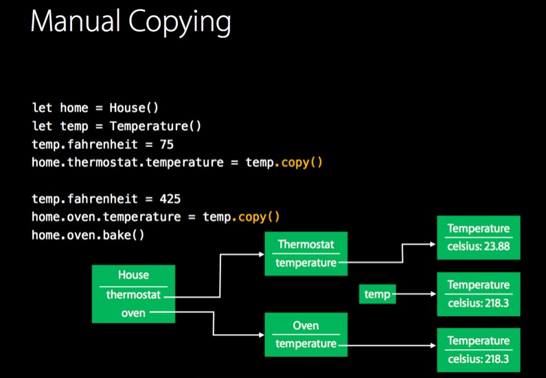
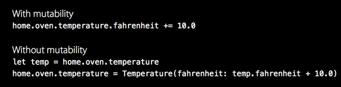

# Swift Patterns


## Memoize

동일한 입력값을 넣으면 동일한 출력이 나오는 함수일 경우, 결과값을 캐싱해놓으면 퍼포먼스 향상이 가능하다.

**피보나치 수열**

```swift
// Return the nth fibonacci number: 0, 1, 1, 2, 3, 5, 8, 13, 21, ...
func fibonacci(n: Int) -> Double {
  return n < 2 ? Double(n) : fibonacci(n - 1) + fibonacci(n - 2)
}

// 1.61803399...
let phi = fibonacci(45) / fibonacci(44)    //  빠른 컴퓨터에서도 계산에 무려 11초나 걸림
```

계산이 느린 이유는 이미 계산한 것을 반복해서 또 계산하는 recursive 계산구조 때문임.

   

fib(1)은 5번 fib(2)는 3번이나 계산됨. 

이러한 중복계산은 중간계산결과를 메모리에 저장해놓는 방식으로  해결가능함.

```swift
var fibonacciMemo = Dictionary<Int, Double>() // implementation detail !

// Return the nth fibonacci number: 0, 1, 1, 2, 3, 5, 8, 13, 21, ...

func fibonacci(n: Int) -> Double {
  if let result = fibonacciMemo[n] {
    return result
  }
  let result = n < 2 ? Double(n) : fibonacci(n - 1) + fibonacci(n - 2)
  fibonacciMemo[n] = result
  return result
}

let phi = fibonacci(45) / fibonacci(44)  //  0.1 seconds = 100x speedup
```

위처럼 바꾸니 100배나 처리속도가 증가.

하지만 붉은색의 메인 로직이 효율화 로직 사이에 가려져 가독성을 저해하는 단점이 있음.

중간계산결과를 저장해놓는다는 개념은 모든 함수의 계산에 적용시킬수 있다. 

따라서 이를 일반적인 함수 즉, 제네릭스로 구현해보면 다음과 같다.

```swift
func memoize<T: Hashable, U>( body: (T)->U ) -> (T)->U {
  var memo = Dictionary<T, U>()
  return {  x in
         if let q = memo[x] { return q }
         let r = body(x)
         memo[x] = r
         return r
     } 
}
let parsePropertyList = memoize { (s: String) in s.propertyList() }
```

이처럼 generics를 이용해서 memoize 함수를 만들어 사용하면 코드의 효율화에 편리하다.

피보나치 수열처럼 재귀적인 함수의 경우 파라미터가 하나 더 필요하다.


```swift
func memoize<T: Hashable, U>( body: ((T)->U, T)->U ) -> (T)->U { 
     var memo = Dictionary<T, U>()
     var result: ((T)->U)!
     result = { x in
     if let q = memo[x] { return q }
     let r = body(result, x)
     memo[x] = r
     return r
     }
     return result
}
```


**Factorial**

```swift
let factorial = memoize { factorial, x in x == 0 ? 1 : x * factorial(x - 1) }
```

팩토리얼 함수도 단 한줄로 표현이 가능해짐.

이처럼 제네릭 함수를 구현하면 타입을 유추하는 특징 덕분에 함수호출 코드에 타입의 표기가 사라지고 코드의 길이가 줄어든다.


## Generics

**Generic Functions**

```swift
func swapTwoStrings(inout a: String, inout b: String) {
    let temporaryA = a
    a = b
    b = temporaryA
}

func swapTwoDoubles(inout a: Double, inout b: Double) {
    let temporaryA = a
    a = b
    b = temporaryA
}

// 위 두개의 함수는 아래처럼 일반형으로 바꿀수 있다.

func swapTwoValues<T>(inout a: T, inout b: T) {
    let temporaryA = a
    a = b
    b = temporaryA
}
var a = "aa"
var b = "bb"
swapTwoValues(&a, &b)
```


 T 를 **Type Parameter**라고 한다.  T에 입력해야 할 것은 value가 아니라 type이기 때문이다.

T는 그냥 다른 문자열로 바꿔도 상관없다. 대문자로 시작하는 CamelCase로 놓는게 관례.

아래처럼 where 절을 삽입가능.

<U where U : Equatable > 은  <U : Equatable>로 간략화가 가능하다.


enum 타입도 가능


**Generic Structures**

< 일반버전 >

```swift
struct IntStack {
     var items = Int
     mutating func push(item: Int) {
          items.append(item)
     }
     mutating func pop() -> Int {
          return items.removeLast()
    }
}
```

<generic버전>

```swift
struct Stack<T> {
     var items = T
     mutating func push(item: T) {
          items.append(item)
     }
     mutating func pop() -> T {
          return items.removeLast()
     }
}
var stackOfStrings = Stack<String>()
stackOfStrings.push("uno”)
```

<generic 구조체에 extension 붙이기>

```swift
extension Stack {
     var topItem: T? {          // read-only computed property
          return items.isEmpty ? nil : items[items.count - 1]
     }
}
```


## Extension

코딩을 하다보면 이 클래스에 왜 이 메소드가 없을까 하며 아쉬운 경우가 있다. 그렇다고 메소드 하나를 추가하기 위해 상속을 한다는 것은 가독성도 떨어뜨리고 번거롭다. 익스텐션은 클래스 본체에 손대지 않고 원하는 메소드를 추가할수 있다. 

objC의 카테고리와 비슷하지만 구조체 같은 값타입까지도 확장할수 있다는 데서 더 유용함.

```swift
extension Double {
  var km: Double { return self * 1_000.0 }
  var m: Double { return self }
  var cm: Double { return self / 100.0 }
  var mm: Double { return self / 1_000.0 }
  var ft: Double { return self / 3.28084 }
}

let oneInch = 25.4.mm
println("One inch is (oneInch) meters")

// prints "One inch is 0.0254 meters"
let threeFeet = 3.ft
println("Three feet is (threeFeet) meters")
// prints "Three feet is 0.914399970739201 meters"
```

익스텐션은 새로운 computed property를 추가할수는 있지만 stored property추가는 불가. 기존의 프로퍼티에 observer를 붙이는 것도 불가. 생성자를 추가하는것은 가능.

익스텐션은 프로토콜과 함께 쓰면 편리하다. 기존의 타입에 프로토콜을 추가하면서 동시에 익스텐션으로 구현부를 완성시킬 수 있게 되므로 인터페이스와 구현이 짝을 이룰 수 있어 가독성이 높아진다. 단, 익스텐션은 computed property만을 넣을수 있기 때문에 프로토콜이 stored property를 요구할 경우 트릭이 필요하다. (아래에 기술) 


아래처럼 기본형에 함수를 붙이는것도 가능하다.

```swift
extension Int {
     func repetitions(task: () -> ()) {
          for i in 0..<self {
               task()
          }
     }
}

3.repetitions({
     print("Hello!")
})
// Hello!
// Hello!
// Hello!
```


**합성타입 만들기**

익스텐션과 프로토콜을 조합하면 두 가지 타입을 조합한 합성타입을 만들수 있다.

딕셔너리가 문자열 또는 부울만을 포함하게 하려면 아래와 같이한다.

```swift
protocol StringOrBool { }
extension Bool: StringOrBool { }
extension String: StringOrBool { }

var myDict: [String : StringOrBool] = [:]
myDict["testKey"] = "sd"   // works
myDict["testKey2"] = false // works
myDict["testKey2"] = 2     // fails
```


**Monkey-Patching : 기존의 메소드 구현을 새것으로 교체하기**

익스텐션에서 기존의 프로퍼티나 메소드를 재정의하게되면 기존의 정의를 덮어씌운다기 보다는 잠시 가로채는 방식으로 동작한다. 즉, 익스텐션의 적용범위는 모듈을 벗어나지 못한다.  모듈외부에서는 익스텐션이 적용되지 않은 코드가 그대로 동작한다.

익스텐션의 적용범위를 파일단위로 좁히고싶다면 **private**를 사용하면 된다.


### 익스텐션 활용법

https://www.natashatherobot.com/using-swift-extensions/

1. private extension을 만들어서 private코드를 몰아넣기 : 가독성 향상
2. 프로토콜 구현부를 익스텐션으로 나누기: UITableViewDataSource와 UITableViewDelegate는 모델을 공유하기에 분리시키기가 어려운데 익스텐션을 사용하면 간단히 코드를 분리시킬수 있다.  이는 가독성을 향상시켜준다.
3. ​


## Protocol과 Extension (수정중)
http://www.slideshare.net/JoSeongGyu/protocol-oriented-programming-in-swift

상속은 어미로부터 불필요한 코드까지 상속받게 되는 단점이 있고 다중상속이 안된다.
상속은 클래스만이 가능하다. 값타입인 구조체는 프로토콜도 가능하다. 따라서 상속대신 프로토콜을 사용하면 구조체를 사용할수 있게되어 퍼포먼스가 향상된다.

objective-c의 카테고리는 프로퍼티의 추가가 불가능하다.

objective-c의 카테고리의 일종으로 익스텐션이라는것이 있는데 이것은 익명 카테고리라고 불렸고 이것이 swift 의 익스텐션과 같다. swift의 익스텐션도 익명이기 때문이다.

프로토콜 익스텐션은 프로토콜에 디폴트 구현을 정해줄 수 있다. 하지만 위의 슬라이드에 따르면 Objective-C의 프로토콜을  프로토콜 익스텐션으로 디폴트구현시 적용이 제대로 안된다고 한다.

프로토콜은 사용자에게 구현을 위임할때 유용하다. 

> 프로토콜과 익스텐션을 사용하여 코드를 공유하는것은 우리가 클래스의 합성을 이용해 코드를 공유하는것과 다를게 없지 않은가? 하지만 합성을 통한 기능의 확장은 메소드 인터페이스가 클래스 내부로 숨는다는 단점이 있지만 후자는 인터페이스 자체가 프로토콜로 확장된다. 개념의 관점에서 볼때 클래스는 메모리 객체 단위라면 프로토콜은 기능집합의 단위다. 퍼포먼스 측면에서도 클래스 보다는 프로토콜과 익스텐션이 낫다.


프로토콜의 유형적 분류.

- 모델 클래스의 경우 : 모델 클래스는 데이터를 다른 형태로 변환하는 기능을 추가하는 경우가 많다.  ```CustomStringConvertible```처럼 변환가능한 것을 설명하는 프로토콜을 만든다. 어떤 클래스나 구조체를 일반적인 기능을 수행하는 코드와 특수기능을 수행하는 코드로 나누어 생각해볼때 후자의 것은 프로토콜로 별도로 만드는 것이 좋다.

- 뷰 클래스의 경우 : 뷰와 컨테이너(모델로부터 데이터를 받아놓는 저장공간)는 프로토콜로 분리해야 한다. 컨테이너 내부의 데이터는 유지한채로 뷰를 다양하게 하는 경우가 많기 때문이다. 컨테이너 프로토콜을 구현한다.  또, 어떤 컨텐트가 이미지 또는 비디오를 모두 다룰수 있도록 하고싶다면 해당 컨텐트를 프로토콜 타입으로 바꾸는게 좋다.

  ```swift
  // 아래처럼 익스텐션을 선언하면 해당 타입들을 하나의 Presentable타입으로 다룰수 있다.  
  extension UIImageView : Presentable {}
  extension AVPlayerLayer : Presentable {}
  ```

- 콘트롤러 클래스의 경우: Flyable 처럼 어떤 기능을 할수 있는지 알려주는 프로토콜을 구현한다.         


프로토콜은 인터페이스를 분리시키는 데 목적이 있고 익스텐션은 구현부를 분리시키는데 목적이 있다. 


### 다중 프로토콜로 캐스팅하기

```swift
if let o = aObject as? (AProtocol & BProtocol) {
    // object conforms to protocol
    o.someFunction() // AProtocol의 함수
    o.anyFunction() // BProtocol의 함수
}
```

단, 프로토콜 끼리만 가능함. 클래스 타입과 섞은 캐스팅은 불가능.

`if let o = aObject as? (AProtocol & BProtocol & CClass)` (x)

https://stackoverflow.com/a/24027473/2047287


## Value Type (수정중)

Use a value type when:

- Comparing instance data with == makes sense
- You want copies to have independent state
- The data will be used in code across multiple threads

Use a reference type (e.g. use a class) when:

- Comparing instance identity with === makes sense
- You want to create shared, mutable state


## Value Oriented Programming

보통은 

```swift
class Some { // 클래스는 참조타입이다.
	let a : Int = 1   // 값타입
	var image : UIImage?
}
```

이처럼 클래스 내부에 값타입이 존재하였다. 하지만 사고를 뒤집어 값타입 위주의 코딩을 하면

```swift
struct Some {  // 구조체는 값타입이다.
	let a : Int = 1
	var image : UIImage?  // 참조타입
}
```

값타입 지향 프로그래밍에서의 참조타입은 굉장히 데이터의 크기가 커서 값복사가 비효율적인 경우에 사용한다.

참조타입지향 프로그래밍에서는 기본적으로 객체가 공유된다. 그래서 스코프 외부에서 값이 수정되는 문제로 인해 디버깅을 어렵게 한다. 값타입지향에서는 반대로 기본적으로 객체는 복사된다. 따라서 동시수정문제를 막을수 있고 매번 copy라는 메소드를 사용할 필요가 없다.

http://www.slideshare.net/YongHaYoo/ss-63881606

```swift
class LineStorage { var x1, y1, x2, y2: Double } // 값타입의 데이터가 많으면 참조타입으로 감싸자.
struct Line : Drawable {
  var storage: LineStorage
  init() { storage = LineStorage(Point(), Point()}
  func draw() { ... }
  mutating func move() {
    if !isUniquelyReferencedNonObjc(&storage) {  // 다른데서 수정중이 아니면 복사본을 만들필요가 없다.
      storage = LineStorage(storage)
    }
    storage.start = ...
  }
}
```


# Value and Protocol Oriented Programming


## structure와 class

####클래스와 구조체의 공통점

- 프로퍼티, 메소드 정의 가능
- subscript문법 [] 가능
- extension 가능
- 프로토콜 가능

####클래스만 할수있는 것

- 상속
- 타입 캐스팅. 이는 런타임에 인스턴스의 타입을 체크하고 해석하는것을 가능케 함.
- Deinitializer. 이는 클래스가 리소스 메모리를 해제할수 있게 함.
- Reference Counting. 덕분에 하나의 인스턴스를 여러곳에서 사용가능.

구조체는 값타입(value type)이므로 값복사방식으로 다른 변수에 전달된다. 클래스는 참조타입(reference type)이므로 참조복사방식으로 전달된다. 구조체는 변수나 함수에 전달될때에도 복사된다. 따라서 구조체가 큰 메모리를 사용한다면 굉장히 비효율적일것이다. (하지만 이는 아래서 설명할 Copy on Write로 해결이 가능하다.)  

메모리를 많이 차지하는 인스턴스인 경우에는 참조타입을 쓰는 것이 좋다. (하지만 참조타입을 Wrapping하는 구조체를 만들면 이것 역시 극복이 가능하다.) 구조체에서 멤버의 값을 바꾸는 함수는 mutating이라는 키워드를 붙여야됨. 왜냐하면 구조체는 기본적으로 참조가 아닌 값자체를 다루기 때문.

구조체에서는 getter/setter도 필요에 따라 mutating을 붙여야 한다.

```swift
struct Photo {
   … 
   var photo1:UIImage? {
        mutating get {
           // you can set self._photo = image here
        }
    }
 }
```

클래스는 let으로 선언해도 그 프로퍼티를 바꿀수 있다.
```swift
class Dog {
  var wasFed = false
}
let dog = Dog()
dog.wasFed = true
```
하지만 구조체는 불가능. 
이처럼 참조타입은 mutability 컨트롤이 안되는 단점을 안고있고 이 때문에 스위프트는 값타입인 구조체를 선호하는것이다.

## Value Type

##### Reference Type의 한계

참조타입의 mutability는 많은 버그의 가능성을 내포한다.  

의도치 않은 객체 공유로 인해 오븐의 온도를 높이면 집의 온도까지 올라감.

copy()를 통해 이를 해결. 
참조타입이 대다수인 objective-c 에서는 수많은 defensive copy가 내부적으로 이뤄지고있음. 하지만 개발자들은 실수로 copy를 잊는경우가 많음. 
그래서 mutation 코드 자체를 없애는 방법을 생각해보았음.
하지만 아래처럼 한줄로 표현이 가능한걸 두줄이상으로 표현해야되는 불편함이있음. 

또한 잦은 객체생성과 copy로 인한 퍼포먼스문제도 있음. (에라토스테네스의 체를 이용하여 소수를 구하는 알고리즘은 mutable버전과 immutable 버전이 있는데, mutable버전이 훨씬 빠름) 그래서 나온 방법이 localized mutability임. 말그대로 필요한 곳에 필요 할때만 mutable객체로 조작하자는 것. NSMutableArray로 만들어 배열을 수정 후, NSArray형태로 리턴하는 코드 들이 바로 그러한 것이다. 

### 값타입의 특징

- 값타입에서는 copy가 디폴트다. 단, Extensible객체(배열, 딕셔너리 등)의 경우는 매번 복사하기엔 구조물이 크기때문에 copy-on-write 정책을 취한다. 즉 읽을때는 참조형처럼 하나의 객체를 공유하지만 수정할때 비로소 복사를 하는 것이다. 
- 모든 기본형 타입과 컬렉션들은 값타입이다.  tuple, struct, enum의 경우, 값타입들을 멤버로 갖고있을때 만 value type이다. 
- 값타입은 참조타입과는 달리 identity가 아니라 변수에 할당된 value에 의해 구분된다.  따라서 변수 비교시 == 오퍼레이터로 할수밖에 없다.  결국 **모든 값타입은 Equatable프로토콜을 구현해야 함**을 의미한다.
- let과 var는 localized mutability를 구현하기 위한 것이다. var로 변수를 선언하면 그 영역에서만 값을 변환할수 있으며 다른 외부값에 영향을 미치지 않는다.


### Copy-on-write

값타입의 문제는 너무 복사가 잦다는 것이다. 이는 퍼포먼스 문제를 일으킬수 있다. 따라서 참조타입의 장점을 값타입에 이용한 코드가 다음과 같다.
Ref라는 참조타입으로 무거운 값타입을 wrapping하면 해당 값들은 더이상 단순 변수할당시 자동으로 복사되지 않는다. 값이 수정될때만 값 복사가 이뤄지게 하기위해 value의 setter를 아래와 같이 만든것이다.
```swift
// https://marcosantadev.com/copy-write-swift-value-types/
final class Ref<T> {
    var value: T
    init(value: T) {
        self.value = value
    }
}

struct Box<T> {
    private var ref: Ref<T>
    init(value: T) {
        ref = Ref(value: value)
    }
     
    var value: T {
        get { return ref.value }
        set {
            guard isKnownUniquelyReferenced(&ref) else {
                ref = Ref(value: newValue)
                return
            }
            ref.value = newValue
        }
    }
}
```


**사용법**

```swift
// 값타입인 User가 굉장히 무거운 데이터를 갖고있어서 매번 복사하기 버겁다면 copy-on-write를 하는게 좋다.
// Box.value프로퍼티는 Ref클래스에 감싸져있어서 값타입인데도 참조타입처럼 유지된다.

struct User {
    var identifier = 1
}

let user = User()
let box = Box(value: user)
var box2 = box                  // box2 shares instance of box.ref
box2.value.identifier = 2       // Creates new object for box2.ref
box.value.identifier  // 이 값은 여전히 1이다. 

// 반면 ref의 private를 없애고 다음과 같이 참조타입에 직접수정을 해보자. 참조타입이 공유되는걸 볼수있다.
box2.ref.value.identifier = 2       // Creates new object for box2.ref
box.ref.value.identifier            // 2. 
```

> `box2.value.identifier = 2` 여기서 value 자체가 아닌 value.identifier가 수정되니 value의 setter가 실행되지 않는게 아닐까 하는 착각을 하기 쉽지만 그렇지 않다. 정상적으로 값복사가 이뤄진다.


### 구조체에 stored property 추가하는 방법

OOP를 하다가 VPOP를 할때 가장 불편한 점 중에 하나는 stored property를 추가하기가 쉽지않다는 점이다.  클래스는 상속을 통해 쉽게 프로퍼티 확장이 가능하지만 구조체는 상속이 불가하다. 하지만 아래와 같은 트릭이 있다.

```swift
// http://stackoverflow.com/a/38885813/2047287 이 링크의 내용을 참고하여 작성하였다.

//  익스텐션을 이용하여 struct A 에 name프로퍼티를 추가해보자.

protocol Expandable {
    var expandedComponent: ExpandedComponent? { get set }
}
protocol ExpandedComponent {}

// Expandable 프로토콜을 이용하여 구조체를 만들어 두면 차후에 프로퍼티 확장이 쉽다.
struct A : Expandable {
    var expandedComponent : ExpandedComponent? = nil
}

struct NameComponent : ExpandedComponent {
    var name = "default"
}

extension A {
    typealias T = NameComponent
    var component : T {
        mutating get {
            if let e = expandedComponent {
                return e as! T
            } else {
                expandedComponent = T()
                return expandedComponent as! T
            }
        }
        set {
            expandedComponent = newValue
        }
    }

    var name: String {
        mutating get { return component.name }
        set {
            component.name = newValue
        }
    }
}


var a = A()
var b = A()

a.name = "a"
b.name = "b"
print(a.name) // a
print(b.name) // b


```

하지만 위의 방법은 원본 타입인 구조체 A 자체를 수정해야 하는 문제때문에 상속에 비해 제약이 있다.


### 클래스에 stored property 추가하는 방법 

 `objc_[get|set]AssociatedObject()`메소드를 이용하는 방법이다. 

https://tetontech.wordpress.com/2015/11/12/adding-custom-class-properties-with-swift-extensions/


```swift
// 클래스는 아래와 같이 프로퍼티를 추가할수 있지만 구조체에서는 작동하지 않는다.
class A {
}

extension A {
    private struct Properties {
        static var name = ""
    }

    var name : String {
        get {
            return objc_getAssociatedObject(self, &Properties.name) as! String
        }

        set {
            objc_setAssociatedObject(self, &Properties.name, newValue, .OBJC_ASSOCIATION_RETAIN_NONATOMIC)
        }
    }
}

var a = A()
var b = A()

a.name = "a"
b.name = "b"
print(a.name) // a
print(b.name) // b

```


### 결론 1: 가능하면 값타입으로 만들자.

[Swift Standard Library에는 87개의 구조체와 8개의 enum과 4개의 클래스가 사용되었다.](https://krakendev.io/blog/subclassing-can-suck-and-heres-why) 즉, 클래스는 소수의 경우에 사용되며 나머지는 전부 값타입으로 만드는것이 좋다.
클래스를 사용해야 하는 경우는 다음과 같다.

- Cocoa API와 같이 기존의 참조타입 프레임워크를 상속해서 사용해야 하는 경우.
- 다음의 성향을 지닌 객체일 수록  참조타입(클래스)으로 만드는 것이 좋다. 
  - 글로벌 객체에 가까울수록 : Singleton 등
  - 여러곳에서 공유되며 :  코어데이터 등
  - 복사가 의미없는 : UIViewController 혹은 Window등

### 결론 2: 가능하면 프로토콜로 만들자.

> 로직을 액션에서 분리시켜라.


