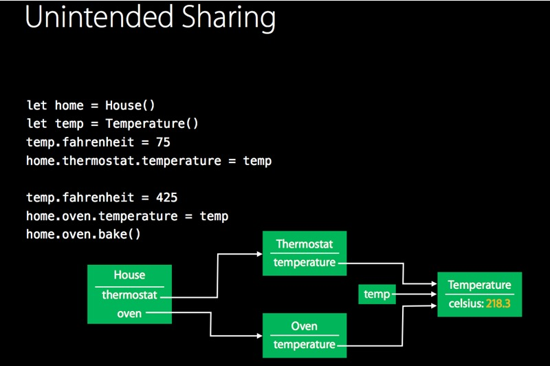
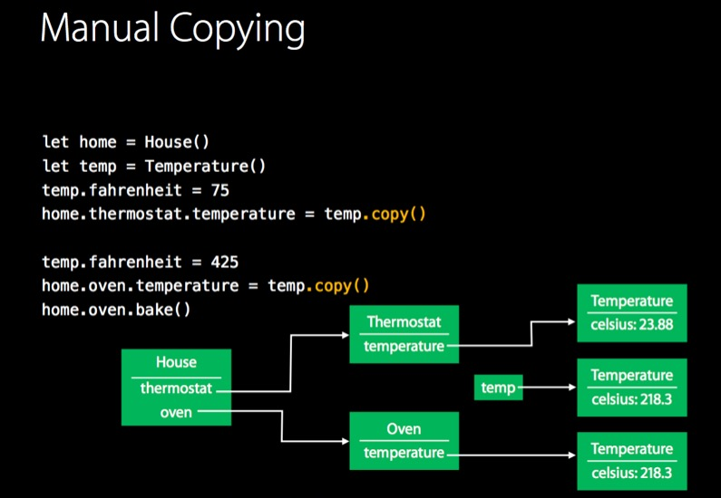
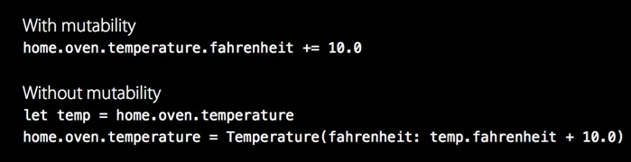

# Value and Protocol Oriented Programming


### structure와 class

#####클래스와 구조체의 공통점

- 프로퍼티, 메소드 정의 가능
- subscript문법 [] 가능
- extension 가능
- 프로토콜 가능

#####클래스만 할수있는 것

- 상속
- 타입 캐스팅. 이는 런타임에 인스턴스의 타입을 체크하고 해석하는것을 가능케 함.
- Deinitializer. 이는 클래스가 리소스 메모리를 해제할수 있게 함.
- Reference Counting. 덕분에 하나의 인스턴스를 여러곳에서 사용가능.

구조체는 값타입(value type)이므로 값복사방식으로 다른 변수에 전달된다. 클래스는 참조타입(reference type)이므로 참조복사방식으로 전달된다. 구조체는 변수나 함수에 전달될때에도 복사된다. 따라서 구조체가 큰 메모리를 사용한다면 굉장히 비효율적일것이다. (하지만 이는 아래서 설명할 Copy on Write로 해결이 가능하다.)  

메모리를 많이 차지하는 인스턴스인 경우에는 참조타입을 쓰는 것이 좋다. (하지만 참조타입을 Wrapping하는 구조체를 만들면 이것 역시 극복이 가능하다.) 구조체에서 멤버의 값을 바꾸는 함수는 mutating이라는 키워드를 붙여야됨. 왜냐하면 구조체는 기본적으로 참조가 아닌 값자체를 다루기 때문.

구조체에서는 getter/setter도 필요에 따라 mutating을 붙여야 한다.

```swift
struct Photo {
   … 
   var photo1:UIImage? {
        mutating get {
           // you can set self._photo = image here
        }
    }
 }
```


### Value Type

##### Reference Type의 한계

참조타입의 mutability는 많은 버그의 가능성을 내포한다.  

의도치 않은 객체 공유로 인해 오븐의 온도를 높이면 집의 온도까지 올라감.

copy()를 통해 이를 해결. 
참조타입이 대다수인 objective-c 에서는 수많은 defensive copy가 내부적으로 이뤄지고있음. 하지만 개발자들은 실수로 copy를 잊는경우가 많음. 
그래서 mutation 코드 자체를 없애는 방법을 생각해보았음.
하지만 아래처럼 한줄로 표현이 가능한걸 두줄이상으로 표현해야되는 불편함이있음. 

또한 잦은 객체생성과 copy로 인한 퍼포먼스문제도 있음. (에라토스테네스의 체를 이용하여 소수를 구하는 알고리즘은 mutable버전과 immutable 버전이 있는데, mutable버전이 훨씬 빠름) 그래서 나온 방법이 localized mutability임. 말그대로 필요한 곳에 필요 할때만 mutable객체로 조작하자는 것. NSMutableArray로 만들어 배열을 수정 후, NSArray형태로 리턴하는 코드 들이 바로 그러한 것이다. 

##### 값타입의 특징

- 값타입에서는 copy가 디폴트다. 단, Extensible객체(배열, 딕셔너리 등)의 경우는 매번 복사하기엔 구조물이 크기때문에 copy-on-write 정책을 취한다. 즉 읽을때는 참조형처럼 하나의 객체를 공유하지만 수정할때 비로소 복사를 하는 것이다. 
- 모든 기본형 타입과 컬렉션들은 값타입이다.  tuple, struct, enum의 경우, 값타입들을 멤버로 갖고있을때 만 value type이다. 
- 값타입은 참조타입과는 달리 identity가 아니라 변수에 할당된 value에 의해 구분된다.  따라서 변수 비교시 == 오퍼레이터로 할수밖에 없다.  결국 **모든 값타입은 Equatable프로토콜을 구현해야 함**을 의미한다.
- let과 var는 localized mutability를 구현하기 위한 것이다. var로 변수를 선언하면 그 영역에서만 값을 변환할수 있으며 다른 외부값에 영향을 미치지 않는다.