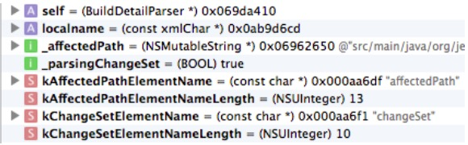
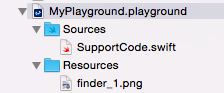

# XCode


## Debugging with Xcode


### debugging panel


- L = Local variable
- A = Argument
- S = Static variable
- V = global Variable
- R = register
- i = Instance variable
- E = Expression


### debugging 도구들

- expression commands : 함수 호출 및 값 변경에 주로 쓰임
- LLDB Python scripting : 새 디버그 기능을 만들기
- REPL : 코드 집어넣기
- playground : 코드를 실험해보기
- static analyzer : 정적 코드 오류를 검사한다. Objective-C코드를 작성할때 retain한 객체를 release를 시켜줬는지 따위를 알아내는것을 도와준다. 객체를 선언만하고 사용하지 않았을경우도 알려준다.
  -   Swift에서는 static analyzer기능을 사용할수 없다. Objective-C코드에서만 작동한다. (사실 별 필요가 없는것같기도 하다. 대부분 일반적인 빌드로 나쁜코드가 다 검출된다.)


## Playground

####[작성방법 참고 사이트](http://hiddenviewer.tistory.com/272)

####Playground Rich Comments Markup Syntax

[https://developer.apple.com/library/ios/documentation/Xcode/Reference/xcode_markup_formatting_ref/FormattingDelimiters.html#//apple_ref/doc/uid/TP40016497-CH4-SW1](https://developer.apple.com/library/ios/documentation/Xcode/Reference/xcode_markup_formatting_ref/FormattingDelimiters.html#//apple_ref/doc/uid/TP40016497-CH4-SW1)

####playground에 custom framwork import하는 법

[http://ihunter.svbtle.com/how-to-import-framework-in-playground](http://ihunter.svbtle.com/how-to-import-framework-in-playground)

중요한점은 workspace를 만들어서 framework project를 넣고 좌하단의 +버튼을 눌러서 playground를 추가하는것.


#### 소스코드 파일 넣는 법



**단, swift는 public접근자를 각 클래스와 함수 앞에 달아줘야만 플레이그라운드상에서 인식이 가능하다.**
또 하나, 플레이그라운드에서는 위에서 아래로 순차적으로 코드를 읽어들인다. 따라서 이 순서가 맞아야만 컴파일이 된다.

이미지 등의 리소스 파일은 `Resources` 폴더내에넣으면됨.


#### 시뮬레이터 사용없이 테이블뷰를 테스트하는법

WWDC2014의 swift playgrounds 영상을 보면 나오는데, 먼저 데이터소스 클래스를 구현한다. 그 다음에 테이블뷰 객체를 생성한다. 데이터소스객체를 테이블뷰 객체에 연결시키면 된다.

플레이그라운드를 이용하면 퀵뷰를 통해 결과를 즉시 알수있어서 편하다.
근데 결과값 뿐만 아니라 과정 중간의 값들도 알고싶다면 어떻게할까?

XCPlayground라는 헬퍼 프레임워크가 있다. 이를 임포트하면 몇가지 유용한 함수를 사용할수 있다.
XCPCaptureValue(value, identifier)는 값을 저장해놓는 함수다. 주기적으로 여기에 값을 저장해놓고 이 값들을 퀵뷰를 통해 출력하면 값이 변해가는 과정을 출력할수 있다.
XCPShowView(identifier, view) 를 이용하면 뷰가 작동하는 모습을 애니메이션으로 녹화하여 출력해준다. 우하단에 보면 시간을 조절할수있는 컨트롤이 있다. 


####비동기 실행 하는 법
```swift
import XCPlayground
XCPlaygroundPage.currentPage.needsIndefiniteExecution = true 
```

기본적으로 플레이그라운드는 탑레벨의 코드가 다 실행을 마치면 프로그램은 종료되도록 되어있다. 하지만 이러한 제한은 비동기 실행코드를 결과를 볼수없게 만든다. 예를들어 네트워크에서 비동기적으로 데이터를 다운받는 메소드도 미처 데이터를 받기 전에 프로그램이 종료되어 버린다. 따라서 이런 제약을 막기위하여 이 메소드가 존재한다. 이는 프로그램이 끝나지 않고 계속 실행되게 한다.XCPShowView메소드도 내부적으로 이 메소드가 실행되기때문에 애니메이션이 계속 보여지는것이다. 
*main runloop를 수동으로 돌게하거나 세마포어를 이용하는 방법도 있다.*


####Custom Quick Look

NSObject의 서브클래스만 가능. debugQuickLookObject()메소드를 구현해야 한다. 이 메소드가 리턴하는 객체가 바로 퀵룩으로 보여지게 되는데 객체는 Image, Color, Bezier Path, String 중에 하나이여야 한다. 예를 들어, 힙 구조에 들어있는 데이터들을 이진트리 형식으로 출력하고싶다면 이를 이미지에 그려넣어 리턴해주면 된다.

####플레이그라운드의 한계
유저 상호작용이 필요하거나, entitlement가 필요하거나, 디바이스에서 실행할 필요가 있는 경우 플레이그라운드는 도움이 안된다.
또한 당신이 기존에 만든 앱 소스나 프레임워크에 접근하지 못한다. 현재는 오로지 애플이 제공하는 기본 라이브러리만 가능하다.
이러한 한계에 봉착한 경우 REPL을 이용하자. 디바이스에서 실행중에 breakpoint를 걸어 REPL에 진입할수 있으며 플레이그라운드와 유사한 테스트를 할수 있다. 단, 플레이그라운드처럼 미려한 그래픽 출력은 할수 없다.

#### [Xcode7.1 Playground 변경사항](http://hiddenviewer.tistory.com/m/276)


##REPL (Read-Eval-Print-Loop)

https://developer.apple.com/swift/blog/?id=18
 디버깅중에도 자유롭게 함수를 만들어 실행시킬수 있게해줌. 즉, 테스트 코드를 만들어서 실행해볼수 있게 해주는 기술. 빌드 횟수를 줄일수 있다. Playground는 실제 런타임의 상태와 동일한 상황을 만들어 실행해보기 어렵다는 점이 가장 큰 단점인데 REPL은 이를 보완한다.

```shell
(lldb) repl         # repl 모드로 들어감.
1>  :     # 콜론으로 다시 lldb로 나올수 있음.
1> :help    # 콜론을 이용하면 빠져나오지 않고도 lldb명령을 실행시킬수 있음.
#터미널 창에서도 다음과 같이 하면 repl모드로 코드를 작성해볼수 있음.
$ xcrun swift    #(그냥 swift만 쳐도 됨. 차이가 뭔지 모르겠다)

# 종료하려면
1> :q
```


REPL에서는 동일한 변수명으로 재정의를 하는걸 (디버깅 편의상의 이유로)허용한다. 과거의 정의는 덮어씌워져서 사라진다.  함수의 재정의도 가능하다. 근데 이때 문제가 발생한다. 덮어씌울때는 overload는 어떻게 구분할 것인가?

 https://developer.apple.com/swift/blog/?id=20


## <a href="./Xcode Storyboard.md">Storyboard</a>


## Continuous Integration (작성중)

http://bigmatch.i-um.net/2014/02/xcode-bots-%EC%A0%81%EC%9A%A9/

앱은 테스트를 위해서도 일단 배포를 해야 한다. 하지만 배포도 참 귀찮은 작업이다. 일일이 컴퓨터에 연결해 깔아주기 쉽지않다.  자동으로 업로드하여 이메일로 배포를 하는 시스템이 있으면 좋을것이다. 또한 업로드가 제대로 되었는지 확인도 해야 할것이다. 즉, 업로드한 코드를 다시 빌드해서 테스트 하는 작업이 필요해졌다.  결국 정적분석, 빌드, 유닛테스트, 아카이브까지를 이 과정에 넣어버리는게 효율적이라는 결론에 도달했다. 이것이 CI가 되었다.


## ⚠️유의점

- 개발 폴더는 한글이나 공백문자는 들어가지 않게 하자. framework path를 인식못하는 버그가 있다.
  예: `iOS Dev`라는 폴더의 하위에 프로젝트를 만들어서 잘못된 결과가 되었다.