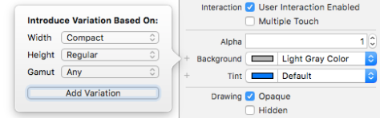

# 스토리 보드

IBOutlet에서 로드되는 객체는 init도중에는 아직 nil 상태다. 따라서 awakeFromNib에서 커스터마이징해야 한다.

내가 테스트 하길 원하는 뷰컨트롤러가 스토리보드의 깊숙한 부위에 있다면 매우 번거롭다. 이 때 스토리보드 레퍼런스를 이용하자. 


### User Defined Runtime Attributes


@IBInspectable을 이용하면 대부분의 값들은 IB에서 세팅이 가능하지만  런타임어트리뷰트를 이용하면 layer.borderWith처럼 IB상에서 세팅하기 어려운 값들도 세팅할수 있다. 
단, 세팅 가능한 값들은 Bool, NSNumber, UIColor등의 특정한 타입으로 한정되어있다.

이때문에 layer.borderColor는 CGColor이므로 여기서 세팅하기 힘든데, 아래와 같은 트릭을 이용하여 세팅이 가능해진다.

```objective-c
@implementation CALayer (Additions)
- (void)setBorderColorFromUIColor:(UIColor *)color {
  self.borderColor = color.CGColor;
}
@end
```


` UIEdgeInsetsFromString(NSString *string);` 메소드처럼 문자열을 다른 타입으로 만들어주는 기존의 메소드들도 잘 활용하자. 


### [@IBInspectable](http://nshipster.com/ibinspectable-ibdesignable/)

User Defined Runtime Attributes를 조금더 사용하기 편하게 하고자 나온것이 바로 IBInspectable이다.

이 키워드로 지정한 프로퍼티는 IB상에서 값조절이 가능해진다. 단, keyPath가 깊은 경우는 아래와 같이 별도의 computed property를 만들어주어야 한다. 

```swift
extension UIView {
    @IBInspectable var cornerRadius: CGFloat {
        get {
            return layer.cornerRadius
        }
        set {
            layer.cornerRadius = newValue
            layer.masksToBounds = newValue > 0
        }
    }
}
```


### [@IBDesignable](http://nshipster.com/ibinspectable-ibdesignable/)

이 키워드를 사용하면 해당 뷰클래스의 객체가 IB상에서 그래픽으로 보여진다. 따라서 더 수정이 편리하다. 

```swift
@IBDesignable
class MyCustomView: UIView {
    ...
}
```

앱 실행없이 뷰 코드의 디버깅도 가능하다. 해당 뷰 코드의 특정부분에 Break Point를 찍은 후 **Editor** ➔ **Debug Selected Views** 메뉴를 선택하면 된다. 물론 이 때는 맥락이 되는 코드들이 없이 실행되므로 수동으로 넣어줄 필요가 있는데 아래의 두 가지 방법중 하나를 사용하면 된다.    

- `prepareForInterfaceBuilder()`: This method compiles with the rest of your code but is only executed when your view is being prepared for display in Interface Builder.
- `TARGET_INTERFACE_BUILDER`: The `#if TARGET_INTERFACE_BUILDER`preprocessor macro will work in either Objective-C or Swift to conditionally compile the right code for the situation:

```swift
#if !TARGET_INTERFACE_BUILDER
    // this code will run in the app itself
#else
    // this code will execute only in IB
#endif
```


#### 화면의 Size Class 에 따라 어트리뷰트가 달라지도록 할수도 있다. 

(예를 들어 Portrait, Landscape모드에 따라 달라지도록)



위처럼 + 버튼을 누르면 된다.


### UIStackView

https://www.raywenderlich.com/114552


하나의 StackView에는 여러개의 서브뷰들이 들어가야 한다는 고정관념을 버려라. 때로는 단일한 뷰를 스택뷰로 감싸는것이 문제해결에 도움이 된다.

